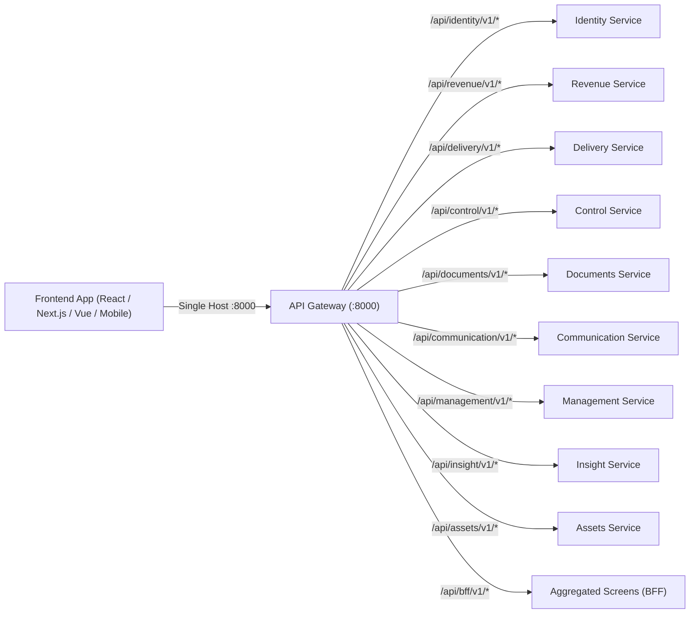
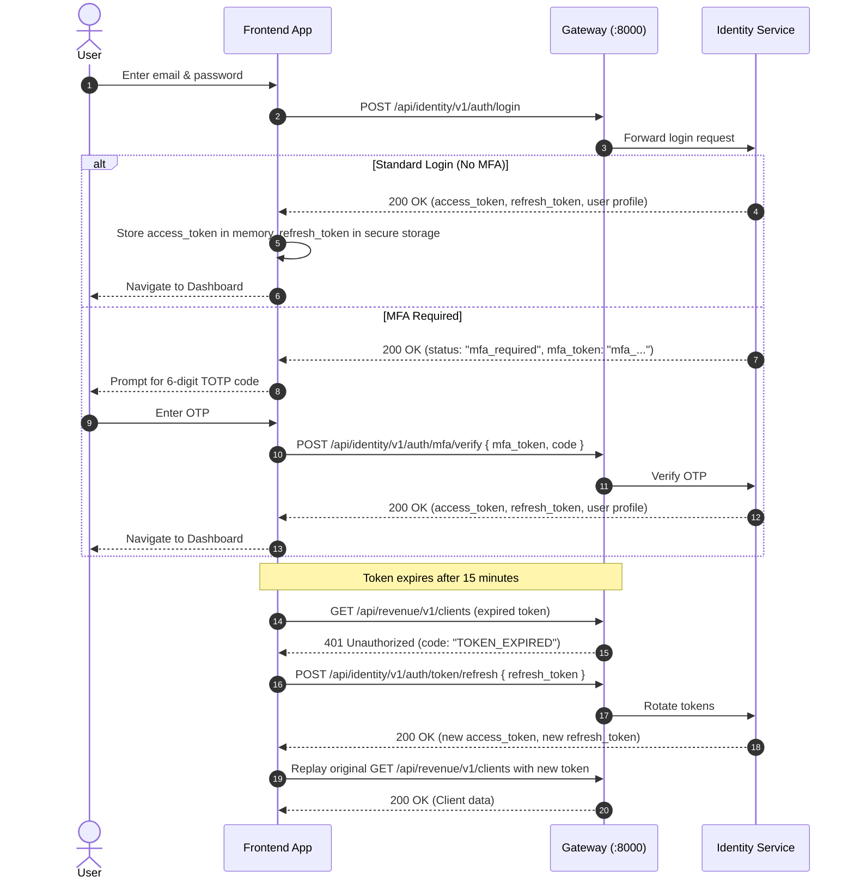
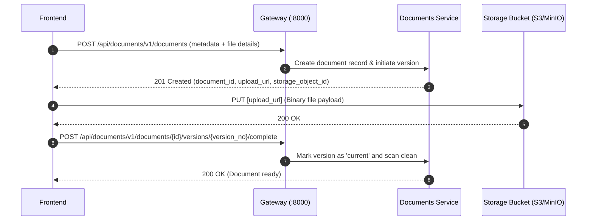

# FBOS Platform — Frontend Integration & API Guide

> **Audience**: Frontend Engineers (Web, Mobile, Desktop)  
> **Gateway Base URL**: `http://localhost:8000` (Local Dev) / `https://api.yourdomain.com` (Production)  
> **API Versioning**: URL path prefix `/api/<service>/v1/...`  
> **Auth Scheme**: Bearer JWT (Access Token 15 min + Refresh Token 30 days)

---

## 1. Architecture & Gateway Routing

The FBOS platform consists of multiple specialized backend microservices unified behind a **single API Gateway**. 

The frontend connects **only** to the Gateway (`http://localhost:8000`). You do **not** need to manage separate ports or URLs for individual microservices.



### Routing Table

| Prefix | Target Microservice | Primary Domain Function |
|---|---|---|
| `/api/bff/v1/*` | **Gateway / BFF** | Aggregated screens (e.g. Home Dashboard summary) |
| `/api/identity/v1/*` | **Identity** | Auth (login, refresh, MFA), Users, Org units, Roles, JWKS |
| `/api/revenue/v1/*` | **Revenue** | Clients, Contacts, Offerings, Leads, Opportunities, Invoices |
| `/api/delivery/v1/*` | **Delivery** | Work Units, Tasks, Checklists, Reviews, Time tracking |
| `/api/control/v1/*` | **Control** | Approvals, SLA clocks, Policy enforcement |
| `/api/documents/v1/*` | **Documents** | File uploads, Document versions, Links to business objects |
| `/api/communication/v1/*` | **Communication**| In-app inbox, Notification preferences, Realtime events |
| `/api/management/v1/*` | **Management** | KPI tracking, Resource allocations, Planning |
| `/api/insight/v1/*` | **Insight** | Audit logs, Dashboards, Metric series |
| `/api/assets/v1/*` | **Assets** | Hardware/Software assets, Licenses, Assignments |

---

## 2. Core Request & Response Conventions

### 2.1 Standard Headers

Every outgoing request from the frontend should follow these headers:

```http
Content-Type: application/json
Accept: application/json
Authorization: Bearer <access_token>
X-Request-Id: <uuidv4>           # Highly recommended for client-to-backend request tracing
X-Idempotency-Key: <unique-key>  # Required for critical mutating POST/PUT requests
```

> **Note**: For public endpoints (e.g. `POST /api/identity/v1/auth/login`), omit the `Authorization` header.

### 2.2 Standard Success Envelope (List & Pagination)

List endpoints return data inside a structured paginated envelope:

```json
{
  "data": [
    { "id": "0191f3a2-...", "name": "Item 1" }
  ],
  "page": {
    "next_cursor": "eyJpZCI6ICIwMTkxZi4uLiJ9",
    "has_more": true,
    "limit": 25
  }
}
```

- When `has_more` is `true`, pass `?cursor=<next_cursor>` in the query string of the next request.
- Default limit is `25`, max limit is `100` (`?limit=50`).

### 2.3 Standard Error Envelope (RFC 7807 Problem Details)

All error responses (4xx and 5xx) strictly follow the RFC 7807 Problem Details specification:

```json
{
  "type": "https://docs.fbos.example.com/errors/INVALID_CREDENTIALS",
  "title": "Email or password is incorrect",
  "status": 401,
  "code": "INVALID_CREDENTIALS",
  "detail": "Invalid email or password",
  "instance": "/api/identity/v1/auth/login",
  "request_id": "aeb0eead-e941-4037-a862-0f506a6b4f9f",
  "retryable": false
}
```

Key fields for the frontend:
- **`code`**: Machine-readable string code to drive UI conditionals (e.g. `TOKEN_EXPIRED`, `ORGANIZATION_AMBIGUOUS`, `VALIDATION_ERROR`).
- **`detail`**: Human-readable message suitable for toast / alert display.
- **`retryable`**: Boolean indicating whether an automatic retry is safe (e.g. `true` for 503 / 504).
- **`request_id`**: Correlation ID to display to users when prompting them to contact support.

---

## 3. Authentication & Session Lifecycle



### 3.1 Step 1: User Login
- **Endpoint**: `POST /api/identity/v1/auth/login`
- **Headers**: `Content-Type: application/json`

#### Request Body
```json
{
  "email": "aarav.sharma@example.com",
  "password": "Password@123",
  "organization_code": "FILLIP"
}
```

> **Organization Code Rule**:
> - `organization_code` is **optional** if the user belongs to only 1 organization.
> - `organization_code` is **required** if the email is associated with multiple client accounts. If omitted in that case, the API returns `400` with code `ORGANIZATION_AMBIGUOUS`.

#### Response (Success — MFA Not Enforced)
```json
{
  "status": "ok",
  "mfa_token": null,
  "mfa_methods": null,
  "access_token": "eyJhbGciOiJIUzI1NiIs...",
  "token_type": "bearer",
  "expires_in": 900,
  "refresh_token": "eyJhbGciOiJIUzI1NiIs...",
  "user": {
    "id": "0191f3a2-0015-7015-8093-000000218f0d",
    "name": "Aarav Sharma",
    "email": "aarav.sharma@example.com",
    "organization": {
      "id": "0191f3a2-0011-7011-8077-0000001b2aa9",
      "code": "FILLIP",
      "name": "Fillip Technologies Pvt Ltd"
    },
    "home_unit": {
      "id": "0191f3a2-0020-7020-80a0-000000234a10",
      "name": "Software Engineering",
      "unit_type": "department"
    },
    "roles": [
      {
        "role_code": "admin",
        "scope_unit": null,
        "scope_vertical": null,
        "self_only": false
      }
    ],
    "permissions": [
      "document.read",
      "document.upload",
      "identity.user.create",
      "identity.user.read",
      "revenue.deal.create",
      "revenue.deal.read"
    ],
    "mfa_enabled": false,
    "timezone": "Asia/Kolkata",
    "locale": null
  }
}
```

#### Response (When MFA is Required)
```json
{
  "status": "mfa_required",
  "mfa_token": "mfa_01J8Z3K4Q7R9T2V5X8",
  "mfa_methods": ["totp"],
  "access_token": null,
  "token_type": null,
  "expires_in": null,
  "refresh_token": null,
  "user": null
}
```

---

### 3.2 Step 2: Complete MFA Verification (If Prompted)
- **Endpoint**: `POST /api/identity/v1/auth/mfa/verify`
- **Request Body**:
  ```json
  {
    "mfa_token": "mfa_01J8Z3K4Q7R9T2V5X8",
    "code": "582194",
    "remember_device": false
  }
  ```
- **Response**: Standard Token Response returning `access_token` and `refresh_token`.

---

### 3.3 Step 3: Silent Token Refresh
- **Endpoint**: `POST /api/identity/v1/auth/token/refresh`
- **When to call**: Triggered automatically by the HTTP interceptor when receiving a `401 TOKEN_EXPIRED`, or periodically before `expires_in` (900 seconds / 15 minutes) elapses.
- **Request Body**:
  ```json
  {
    "refresh_token": "eyJhbGciOiJIUzI1NiIs..."
  }
  ```
- **Response**:
  ```json
  {
    "access_token": "eyJhbGciOiJIUzI1NiIs...",
    "token_type": "bearer",
    "expires_in": 900,
    "refresh_token": "eyJhbGciOiJIUzI1NiIs..."
  }
  ```
  *(Always replace the stored refresh token with the newly returned one due to rotation).*

---

### 3.4 Step 4: Logout
- **Endpoint**: `POST /api/identity/v1/auth/logout`
- **Headers**: `Authorization: Bearer <access_token>`
- **Request Body**:
  ```json
  {
    "refresh_token": "eyJhbGciOiJIUzI1NiIs..."
  }
  ```
- Revokes the refresh token family and invalidates current server-side sessions.

---

## 4. Key Endpoints by Microservice

### 4.1 Aggregated Home Screen (BFF)
Fetches summary cards (pending tasks, open approvals, unread alerts) in a single request with non-blocking graceful degradation.
- **Endpoint**: `GET /api/bff/v1/home`
- **Headers**: `Authorization: Bearer <access_token>`
- **Response**:
  ```json
  {
    "tasks": {
      "assigned_open": 5,
      "due_today": 2,
      "overdue": 0
    },
    "approvals_pending": 1,
    "escalations_open": 0,
    "unread_notifications": 4,
    "degraded": []
  }
  ```
  *(If a downstream service like `control` is temporarily down, its metrics return `0` and `"control"` appears in `degraded`, preventing the entire page from breaking).*

---

### 4.2 Revenue (CRM & Clients)

#### List Clients
- **Endpoint**: `GET /api/revenue/v1/clients?limit=25`
- **Headers**: `Authorization: Bearer <access_token>`
- **Response**:
  ```json
  {
    "data": [
      {
        "id": "0191f3a2-0030-7030-8150-0000004cb4b0",
        "code": "CLI-ACME",
        "name": "Acme Global Technologies",
        "legal_name": "Acme Global Technologies Pvt Ltd",
        "client_type": "enterprise",
        "pan": "AAACA1234A",
        "gstin": "27AAACA1234A1Z5",
        "status": "active",
        "contacts": [
          {
            "id": "f90b88a2-09e7-476e-a791-6fd8d3172165",
            "name": "John Doe",
            "designation": "VP of Engineering",
            "email": "john.doe@acme.example.com",
            "phone": "+91-9876543210",
            "is_primary": true
          }
        ]
      }
    ],
    "page": {
      "next_cursor": null,
      "has_more": false,
      "limit": 25
    }
  }
  ```

#### Create a Client
- **Endpoint**: `POST /api/revenue/v1/clients`
- **Headers**: `Authorization: Bearer <access_token>`, `X-Idempotency-Key: <unique-uuid>`
- **Body**:
  ```json
  {
    "code": "CLI-CORP",
    "name": "Corp International",
    "client_type": "enterprise",
    "pan": "ABCDE1234F",
    "gstin": "29ABCDE1234F1Z5",
    "status": "active"
  }
  ```

#### List Offerings / Services
- **Endpoint**: `GET /api/revenue/v1/offerings`

#### List Deals / Opportunities
- **Endpoint**: `GET /api/revenue/v1/deals`

---

### 4.3 Documents (Direct-to-Storage Flow)

Document upload does **not** send large binary files through the microservices. Instead, it uses a secure 2-step direct-to-storage architecture.



#### List Documents
- **Endpoint**: `GET /api/documents/v1/documents`
- **Headers**: `Authorization: Bearer <access_token>`
- **Response**:
  ```json
  {
    "data": [
      {
        "id": "0191f3a2-0055-7055-8175-0000006ea6e0",
        "code": "DOC-2026-00001",
        "title": "Master Services Agreement - Acme Global",
        "category": { "code": "contract", "name": "Signed Contract" },
        "classification": "confidential",
        "status": "active",
        "current_version": {
          "id": "e088ce6d-096f-401e-97ca-1d8e599ec051",
          "version_no": 1,
          "file_name": "Acme_MSA_Executed_2026.pdf",
          "mime_type": "application/pdf",
          "size_bytes": 245760,
          "scan_status": "clean"
        }
      }
    ],
    "page": { "next_cursor": null, "has_more": false, "limit": 25 }
  }
  ```

#### Download a Document
- **Endpoint**: `GET /api/documents/v1/documents/{document_id}/versions/{version_no}/download`
- **Response**:
  ```json
  {
    "download_url": "https://storage.example.com/buckets/docs/...",
    "expires_at": "2026-09-28T12:00:00Z"
  }
  ```
  *(Frontend opens or downloads this signed URL directly).*

---

### 4.4 Delivery (Tasks & Work Units)

#### List Assigned Tasks
- **Endpoint**: `GET /api/delivery/v1/tasks?assignee_id=me&status=in_progress`
- **Headers**: `Authorization: Bearer <access_token>`

#### Update Task Status
- **Start Task**: `POST /api/delivery/v1/tasks/{task_id}/start`
- **Submit for Review**: `POST /api/delivery/v1/tasks/{task_id}/submit`
- **Block Task**: `POST /api/delivery/v1/tasks/{task_id}/block` with `{ "reason": "Waiting on client credentials" }`

---

### 4.5 Control (Approvals)

#### List Pending Approvals
- **Endpoint**: `GET /api/control/v1/approval-requests?status=pending`
- **Approve Request**: `POST /api/control/v1/approval-requests/{request_id}/approve` with `{ "comments": "Budget approved." }`
- **Reject Request**: `POST /api/control/v1/approval-requests/{request_id}/reject` with `{ "comments": "Requires revision." }`

---

## 5. Complete Frontend Implementation Kit (TypeScript & Axios)

Here is a drop-in TypeScript integration kit including typed API definitions and an Axios HTTP client featuring **silent token refresh** and **request queuing**.

### 5.1 TypeScript Type Definitions (`src/types/api.ts`)

```typescript
// Standard API Envelope Interfaces
export interface ApiPage<T> {
  data: T[];
  page: {
    next_cursor: string | null;
    has_more: boolean;
    limit: number;
  };
}

export interface ApiProblemDetails {
  type: string;
  title: string;
  status: number;
  code: string;
  detail: string;
  instance: string;
  request_id: string;
  retryable: boolean;
}

// User & Auth Interfaces
export interface UserRole {
  role_code: string;
  scope_unit: string | null;
  scope_vertical: string | null;
  self_only: boolean;
}

export interface UserProfile {
  id: string;
  name: string;
  email: string;
  organization: {
    id: string;
    code: string;
    name: string;
  };
  home_unit: {
    id: string;
    name: string;
    unit_type: string;
  } | null;
  roles: UserRole[];
  permissions: string[];
  mfa_enabled: boolean;
  timezone: string;
  locale: string | null;
}

export interface LoginResponse {
  status: 'ok' | 'mfa_required';
  mfa_token: string | null;
  mfa_methods: string[] | null;
  access_token: string | null;
  token_type: string | null;
  expires_in: number | null;
  refresh_token: string | null;
  user: UserProfile | null;
}

export interface TokenRefreshResponse {
  access_token: string;
  token_type: string;
  expires_in: number;
  refresh_token: string;
}
```

---

### 5.2 Axios Client with Token Auto-Refresh (`src/services/apiClient.ts`)

```typescript
import axios, { AxiosError, InternalAxiosRequestConfig } from 'axios';
import { ApiProblemDetails, TokenRefreshResponse } from '../types/api';

const API_BASE_URL = process.env.NEXT_PUBLIC_API_BASE_URL || 'http://localhost:8000';

export const apiClient = axios.create({
  baseURL: API_BASE_URL,
  headers: {
    'Content-Type': 'application/json',
    Accept: 'application/json',
  },
  timeout: 15000,
});

// Local token management helpers (or use your state management store)
export const tokenStorage = {
  getAccessToken: () => localStorage.getItem('fbos_access_token'),
  setAccessToken: (token: string) => localStorage.setItem('fbos_access_token', token),
  getRefreshToken: () => localStorage.getItem('fbos_refresh_token'),
  setRefreshToken: (token: string) => localStorage.setItem('fbos_refresh_token', token),
  clear: () => {
    localStorage.removeItem('fbos_access_token');
    localStorage.removeItem('fbos_refresh_token');
  },
};

// 1. Request Interceptor: Attach Bearer Token & Request Tracing ID
apiClient.interceptors.request.use((config: InternalAxiosRequestConfig) => {
  const token = tokenStorage.getAccessToken();
  if (token && !config.headers.Authorization) {
    config.headers.Authorization = `Bearer ${token}`;
  }

  // Generate unique client-side request correlation ID
  if (!config.headers['X-Request-Id']) {
    config.headers['X-Request-Id'] = crypto.randomUUID();
  }

  return config;
});

// 2. Response Interceptor: Catch 401 & Perform Silent Refresh Queue
let isRefreshing = false;
let failedQueue: Array<{
  resolve: (token: string) => void;
  reject: (err: unknown) => void;
}> = [];

const processQueue = (error: unknown, token: string | null = null) => {
  failedQueue.forEach((prom) => {
    if (token) {
      prom.resolve(token);
    } else {
      prom.reject(error);
    }
  });
  failedQueue = [];
};

apiClient.interceptors.response.use(
  (response) => response,
  async (error: AxiosError<ApiProblemDetails>) => {
    const originalRequest = error.config as InternalAxiosRequestConfig & { _retry?: boolean };

    // If 401 Unauthorized occurs on a non-auth endpoint
    if (
      error.response?.status === 401 &&
      !originalRequest.url?.includes('/api/identity/v1/auth/login') &&
      !originalRequest.url?.includes('/api/identity/v1/auth/token/refresh')
    ) {
      if (originalRequest._retry) {
        tokenStorage.clear();
        window.location.href = '/login';
        return Promise.reject(error);
      }

      if (isRefreshing) {
        // Queue concurrent requests while token is refreshing
        return new Promise((resolve, reject) => {
          failedQueue.push({
            resolve: (token: string) => {
              originalRequest.headers.Authorization = `Bearer ${token}`;
              resolve(apiClient(originalRequest));
            },
            reject: (err) => reject(err),
          });
        });
      }

      originalRequest._retry = true;
      isRefreshing = true;

      const currentRefreshToken = tokenStorage.getRefreshToken();
      if (!currentRefreshToken) {
        tokenStorage.clear();
        window.location.href = '/login';
        return Promise.reject(error);
      }

      try {
        const { data } = await axios.post<TokenRefreshResponse>(
          `${API_BASE_URL}/api/identity/v1/auth/token/refresh`,
          { refresh_token: currentRefreshToken },
          { headers: { 'Content-Type': 'application/json' } }
        );

        tokenStorage.setAccessToken(data.access_token);
        tokenStorage.setRefreshToken(data.refresh_token);

        apiClient.defaults.headers.common.Authorization = `Bearer ${data.access_token}`;
        processQueue(null, data.access_token);

        originalRequest.headers.Authorization = `Bearer ${data.access_token}`;
        return apiClient(originalRequest);
      } catch (refreshErr) {
        processQueue(refreshErr, null);
        tokenStorage.clear();
        window.location.href = '/login';
        return Promise.reject(refreshErr);
      } finally {
        isRefreshing = false;
      }
    }

    return Promise.reject(error);
  }
);
```

---

## 6. Seeded Test Credentials for Frontend Development

Use these credentials to test frontend login and data rendering immediately:

| Field | Value | Notes |
|---|---|---|
| **API Base URL** | `http://localhost:8000` | Gateway (proxies all `/api/*` routes) |
| **Organization Code** | `FILLIP` | Fillip Technologies Pvt Ltd |
| **Admin User** | `aarav.sharma@example.com` | Has all admin & management permissions |
| **Sales User** | `sarah.connor@example.com` | Has revenue & client permissions |
| **Password** | `Password@123` | Default seed password for all test accounts |

---

## 7. Interactive API Documentation (Swagger UI)

Frontend developers can also interactively test payloads, inspect JSON schemas, and trigger live requests directly via Swagger UI:

- **Gateway Documentation**: [http://localhost:8000/docs](http://localhost:8000/docs)
- **Identity Documentation**: [http://localhost:8001/docs](http://localhost:8001/docs)
- **Revenue Documentation**: [http://localhost:8002/docs](http://localhost:8002/docs)
- **Delivery Documentation**: [http://localhost:8003/docs](http://localhost:8003/docs)
- **Control Documentation**: [http://localhost:8004/docs](http://localhost:8004/docs)
- **Documents Documentation**: [http://localhost:8005/docs](http://localhost:8005/docs)
- **Communication Documentation**: [http://localhost:8006/docs](http://localhost:8006/docs)
- **Management Documentation**: [http://localhost:8007/docs](http://localhost:8007/docs)
- **Insight Documentation**: [http://localhost:8008/docs](http://localhost:8008/docs)
- **Assets Documentation**: [http://localhost:8009/docs](http://localhost:8009/docs)
