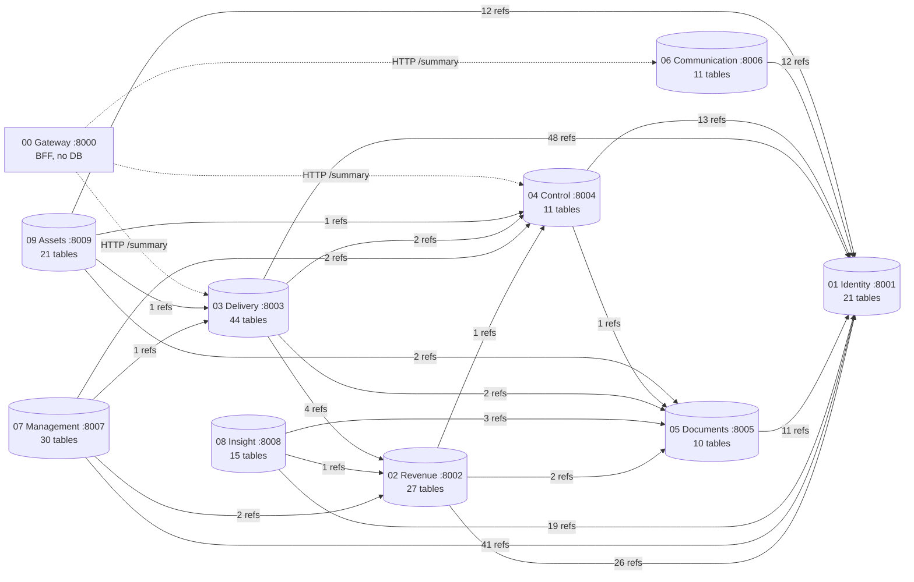
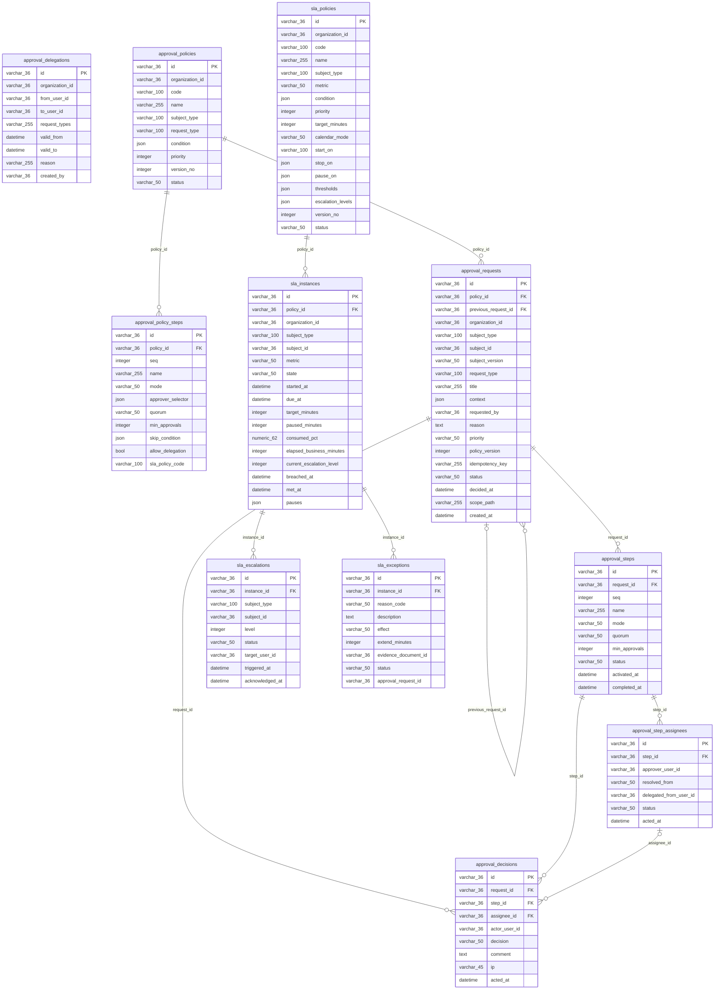
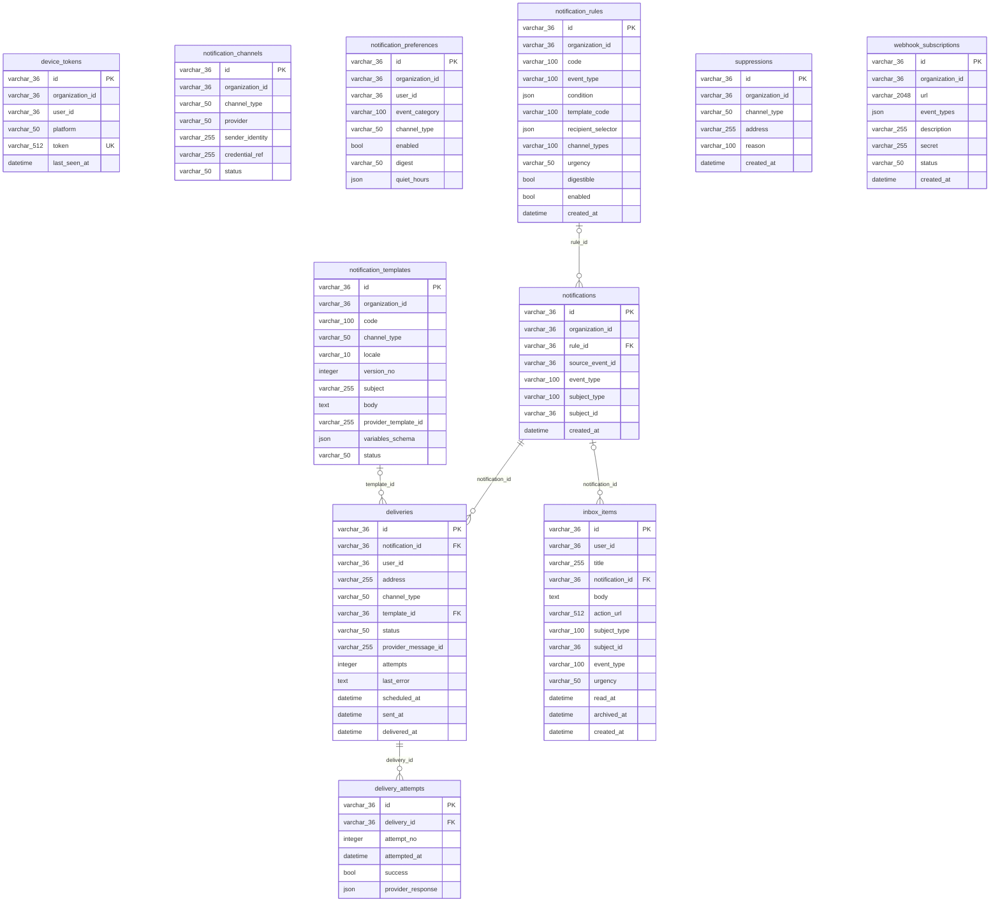

# FBOS Database Schema

Generated from the SQLAlchemy models in `src/v1/*/models` (MySQL, one database per service). The full DDL is in [`schema.sql`](schema.sql).

## Contents

1. [Service dependency map](#service-dependency-map)
2. [Summary](#summary)
3. [01_identity — Identity](#01identity--identity)
4. [02_revenue — Revenue](#02revenue--revenue)
5. [03_delivery — Delivery](#03delivery--delivery)
6. [04_control — Control](#04control--control)
7. [05_documents — Documents](#05documents--documents)
8. [06_communication — Communication](#06communication--communication)
9. [07_management — Management](#07management--management)
10. [08_insight — Insight](#08insight--insight)
11. [09_assets — Assets](#09assets--assets)
12. [Cross-service references](#cross-service-references)
13. [Schema notes](#schema-notes)

## Service dependency map

Solid arrows mean: *the source service stores IDs that point into the target service's tables* (logical references with no FK constraint). The dotted arrows are HTTP calls the gateway makes. Every service reads `organization_id` and user IDs from the gateway's `X-FBOS-Org-Id` / `X-FBOS-User-Id` headers.



## Summary

| Service | Port | Database | Tables | Models |
|---|---|---|---|---|
| 01_identity Identity | 8001 | `fbos_identity` | 21 | audit, auth, calendar, legal, membership, org_unit, organization, rbac, user, vertical |
| 02_revenue Revenue | 8002 | `fbos_revenue` | 27 | accounting, activity, billing, client, collection, contract, deal, invoice, invoice_series, lead, offering, opportunity, payment, quotation, renewal, webhook |
| 03_delivery Delivery | 8003 | `fbos_delivery` | 44 | control_register, delivery, financial, task, task_assignment, task_template, task_tracking, work_unit, work_unit_template, work_unit_tracking, workflow_definition, workflow_execution, workflow_instance, workflow_stage |
| 04_control Control | 8004 | `fbos_control` | 11 | decision, policy, request, sla |
| 05_documents Documents | 8005 | `fbos_documents` | 10 | document |
| 06_communication Communication | 8006 | `fbos_communication` | 11 | notification |
| 07_management Management | 8007 | `fbos_management` | 30 | performance, planning, resource |
| 08_insight Insight | 8008 | `fbos_insight` | 15 | analytics, audit |
| 09_assets Assets | 8009 | `fbos_assets` | 21 | asset, platform |
| **Total** | | | **190** | |

## 01_identity — Identity

Database `fbos_identity`, port 8001, 21 tables.

```mermaid
erDiagram
    object_types {
        varchar_200 code PK
        varchar_100 owning_service
        varchar_255 display_name
        varchar_512 access_endpoint
    }
    organizations {
        varchar_36 id PK
        varchar_255 name
        varchar_100 code UK
        varchar_10 base_currency
        varchar_5 fiscal_year_start
        varchar_100 timezone
        varchar_50 status
        datetime created_at
    }
    permissions {
        varchar_200 code PK
        varchar_100 service
        text description
    }
    security_audit_logs {
        varchar_36 id PK
        varchar_36 organization_id
        varchar_36 user_id
        varchar_50 category
        varchar_100 event_type
        varchar_50 action
        varchar_100 ip_address
        varchar_512 user_agent
        varchar_50 status
        json details
        datetime created_at
    }
    verticals {
        varchar_36 id PK
        varchar_255 name
        varchar_100 code UK
        varchar_50 status
    }
    api_clients {
        varchar_36 id PK
        varchar_36 organization_id FK
        varchar_100 client_id UK
        varchar_255 client_secret_hash
        varchar_255 name
        varchar_255 allowed_owner_hash
        text allowed_scopes
        varchar_50 status
    }
    calendars {
        varchar_36 id PK
        varchar_36 organization_id FK
        varchar_255 name
        varchar_100 timezone
        json weekly_hours
        integer version
    }
    field_definitions {
        varchar_36 id PK
        varchar_36 vertical_id FK
        varchar_36 organization_id FK
        varchar_200 object_type FK
        integer version_no
        json json_schema
        json ui_schema
        varchar_50 status
    }
    roles {
        varchar_36 id PK
        varchar_36 organization_id FK
        varchar_100 code
        varchar_255 name
        bool is_system
        integer version
    }
    vertical_packs {
        varchar_36 id PK
        varchar_36 vertical_id FK
        varchar_36 organization_id FK
        varchar_100 pack_code
        integer version_no
        json manifest
        varchar_50 status
        json import_results
        datetime activated_at
    }
    calendar_holidays {
        varchar_36 id PK
        varchar_36 calendar_id FK
        date holiday_date
        varchar_255 name
        bool is_half_day
    }
    org_units {
        varchar_36 id PK
        varchar_36 organization_id FK
        varchar_100 code
        varchar_255 name
        varchar_50 unit_type
        varchar_36 parent_id FK
        varchar_2048 path
        varchar_36 head_user_id FK
        varchar_36 calendar_id FK
        varchar_50 status
        integer version
        datetime created_at
        datetime updated_at
    }
    role_permissions {
        varchar_36 role_id PK,FK
        varchar_200 permission_code PK,FK
    }
    legal_entities {
        varchar_36 id PK
        varchar_36 organization_id FK
        varchar_36 mg_unit_id FK
        varchar_512 legal_name
        varchar_20 pan
    }
    org_unit_verticals {
        varchar_36 id PK
        varchar_36 org_unit_id FK
        varchar_36 vertical_id FK
    }
    users {
        varchar_36 id PK
        varchar_36 organization_id FK
        varchar_36 manager_user_id FK
        varchar_36 home_unit_id FK
        varchar_100 employee_code
        varchar_255 email UK
        varchar_255 name
        varchar_50 phone
        varchar_50 user_type
        varchar_50 status
        datetime last_login_at
        datetime created_at
        integer version
    }
    refresh_tokens {
        varchar_36 id PK
        varchar_36 user_id FK
        varchar_36 family_id
        datetime issued_at
        datetime revoked_at
        varchar_512 user_agent
    }
    role_assignments {
        varchar_36 id PK
        varchar_36 organization_id FK
        varchar_36 user_id FK
        varchar_36 role_id FK
        varchar_36 scope_unit_id FK
        varchar_36 scope_vertical_id FK
        varchar_2048 scope_path
        bool self_only
        datetime valid_from
        datetime valid_to
        varchar_36 granted_by_id FK
        varchar_500 reason
    }
    tax_registrations {
        varchar_36 id PK
        varchar_36 legal_entity_id FK
        varchar_36 branch_unit_id FK
        varchar_50 pin
        varchar_50 regime_code
        text registered_address
        date valid_from
    }
    unit_memberships {
        varchar_36 id PK
        varchar_36 user_id FK
        varchar_36 unit_id FK
        varchar_100 member_role
        datetime valid_to
    }
    user_credentials {
        varchar_36 user_id PK,FK
        varchar_255 password_hash
        text otp_secret_enc
        bool otp_enabled
        text recovery_codes
        integer failed_attempts
        datetime locked_until
        datetime password_changed_at
        varchar_255 reset_token
        datetime reset_token_expires_at
        varchar_255 invitation_token
        datetime invitation_token_expires_at
    }
    organizations ||--o{ api_clients : "organization_id"
    organizations ||--o{ calendars : "organization_id"
    verticals |o--o{ field_definitions : "vertical_id"
    organizations ||--o{ field_definitions : "organization_id"
    object_types ||--o{ field_definitions : "object_type"
    organizations ||--o{ roles : "organization_id"
    verticals ||--o{ vertical_packs : "vertical_id"
    organizations ||--o{ vertical_packs : "organization_id"
    calendars ||--o{ calendar_holidays : "calendar_id"
    organizations ||--o{ org_units : "organization_id"
    org_units |o--o{ org_units : "parent_id"
    users |o--o{ org_units : "head_user_id"
    calendars |o--o{ org_units : "calendar_id"
    roles ||--o{ role_permissions : "role_id"
    permissions ||--o{ role_permissions : "permission_code"
    organizations ||--o{ legal_entities : "organization_id"
    org_units |o--o{ legal_entities : "mg_unit_id"
    org_units ||--o{ org_unit_verticals : "org_unit_id"
    verticals ||--o{ org_unit_verticals : "vertical_id"
    organizations ||--o{ users : "organization_id"
    users |o--o{ users : "manager_user_id"
    org_units |o--o{ users : "home_unit_id"
    users ||--o{ refresh_tokens : "user_id"
    organizations ||--o{ role_assignments : "organization_id"
    users ||--o{ role_assignments : "user_id"
    roles ||--o{ role_assignments : "role_id"
    org_units |o--o{ role_assignments : "scope_unit_id"
    verticals |o--o{ role_assignments : "scope_vertical_id"
    users |o--o{ role_assignments : "granted_by_id"
    legal_entities ||--o{ tax_registrations : "legal_entity_id"
    org_units |o--o{ tax_registrations : "branch_unit_id"
    users ||--o{ unit_memberships : "user_id"
    org_units ||--o{ unit_memberships : "unit_id"
    users ||--o{ user_credentials : "user_id"
```

<details><summary>ER diagram (Mermaid)</summary>



</details>

### models/audit.py

#### `security_audit_logs`

| Column | Type | Null | Keys / notes |
|---|---|---|---|
| `id` | VARCHAR(36) | no | PK |
| `organization_id` | VARCHAR(36) | yes | INDEX |
| `user_id` | VARCHAR(36) | yes | INDEX |
| `category` | VARCHAR(50) | no | INDEX, default 'security' |
| `event_type` | VARCHAR(100) | no | INDEX |
| `action` | VARCHAR(50) | no |  |
| `ip_address` | VARCHAR(100) | yes |  |
| `user_agent` | VARCHAR(512) | yes |  |
| `status` | VARCHAR(50) | no |  |
| `details` | JSON | yes |  |
| `created_at` | DATETIME | no |  |

### models/auth.py

#### `api_clients`

| Column | Type | Null | Keys / notes |
|---|---|---|---|
| `id` | VARCHAR(36) | no | PK |
| `organization_id` | VARCHAR(36) | no | FK→organizations.id ON DELETE CASCADE, INDEX |
| `client_id` | VARCHAR(100) | no | UNIQUE, INDEX |
| `client_secret_hash` | VARCHAR(255) | yes |  |
| `name` | VARCHAR(255) | no |  |
| `allowed_owner_hash` | VARCHAR(255) | yes |  |
| `allowed_scopes` | TEXT | yes |  |
| `status` | VARCHAR(50) | no | default 'active' |

#### `refresh_tokens`

| Column | Type | Null | Keys / notes |
|---|---|---|---|
| `id` | VARCHAR(36) | no | PK |
| `user_id` | VARCHAR(36) | no | FK→users.id ON DELETE CASCADE, INDEX |
| `family_id` | VARCHAR(36) | no | INDEX |
| `issued_at` | DATETIME | no |  |
| `revoked_at` | DATETIME | yes |  |
| `user_agent` | VARCHAR(512) | yes |  |

#### `user_credentials`

| Column | Type | Null | Keys / notes |
|---|---|---|---|
| `user_id` | VARCHAR(36) | no | PK, FK→users.id ON DELETE CASCADE |
| `password_hash` | VARCHAR(255) | no |  |
| `otp_secret_enc` | TEXT | yes |  |
| `otp_enabled` | BOOL | no | default False |
| `recovery_codes` | TEXT | yes |  |
| `failed_attempts` | INTEGER | no | default 0 |
| `locked_until` | DATETIME | yes |  |
| `password_changed_at` | DATETIME | yes |  |
| `reset_token` | VARCHAR(255) | yes | INDEX |
| `reset_token_expires_at` | DATETIME | yes |  |
| `invitation_token` | VARCHAR(255) | yes | INDEX |
| `invitation_token_expires_at` | DATETIME | yes |  |

### models/calendar.py

#### `calendars`

| Column | Type | Null | Keys / notes |
|---|---|---|---|
| `id` | VARCHAR(36) | no | PK |
| `organization_id` | VARCHAR(36) | no | FK→organizations.id ON DELETE CASCADE, INDEX |
| `name` | VARCHAR(255) | no |  |
| `timezone` | VARCHAR(100) | no |  |
| `weekly_hours` | JSON | yes |  |
| `version` | INTEGER | no | default 1 |

#### `calendar_holidays`

| Column | Type | Null | Keys / notes |
|---|---|---|---|
| `id` | VARCHAR(36) | no | PK |
| `calendar_id` | VARCHAR(36) | no | FK→calendars.id ON DELETE CASCADE, INDEX |
| `holiday_date` | DATE | no |  |
| `name` | VARCHAR(255) | no |  |
| `is_half_day` | BOOL | no | default False |

### models/legal.py

#### `legal_entities`

| Column | Type | Null | Keys / notes |
|---|---|---|---|
| `id` | VARCHAR(36) | no | PK |
| `organization_id` | VARCHAR(36) | no | FK→organizations.id ON DELETE CASCADE, INDEX |
| `mg_unit_id` | VARCHAR(36) | yes | FK→org_units.id ON DELETE SET NULL |
| `legal_name` | VARCHAR(512) | no |  |
| `pan` | VARCHAR(20) | yes | INDEX |

#### `tax_registrations`

| Column | Type | Null | Keys / notes |
|---|---|---|---|
| `id` | VARCHAR(36) | no | PK |
| `legal_entity_id` | VARCHAR(36) | no | FK→legal_entities.id ON DELETE CASCADE, INDEX |
| `branch_unit_id` | VARCHAR(36) | yes | FK→org_units.id ON DELETE SET NULL |
| `pin` | VARCHAR(50) | no | INDEX |
| `regime_code` | VARCHAR(50) | no |  |
| `registered_address` | TEXT | yes |  |
| `valid_from` | DATE | yes |  |

### models/membership.py

#### `unit_memberships`

| Column | Type | Null | Keys / notes |
|---|---|---|---|
| `id` | VARCHAR(36) | no | PK |
| `user_id` | VARCHAR(36) | no | FK→users.id ON DELETE CASCADE, INDEX |
| `unit_id` | VARCHAR(36) | no | FK→org_units.id ON DELETE CASCADE, INDEX |
| `member_role` | VARCHAR(100) | yes |  |
| `valid_to` | DATETIME | yes |  |

### models/org_unit.py

#### `org_units`

| Column | Type | Null | Keys / notes |
|---|---|---|---|
| `id` | VARCHAR(36) | no | PK |
| `organization_id` | VARCHAR(36) | no | FK→organizations.id ON DELETE CASCADE, INDEX |
| `code` | VARCHAR(100) | no | INDEX |
| `name` | VARCHAR(255) | no |  |
| `unit_type` | VARCHAR(50) | yes |  |
| `parent_id` | VARCHAR(36) | yes | FK→org_units.id ON DELETE RESTRICT, INDEX |
| `path` | VARCHAR(2048) | no | INDEX |
| `head_user_id` | VARCHAR(36) | yes | FK→users.id ON DELETE SET NULL |
| `calendar_id` | VARCHAR(36) | yes | FK→calendars.id ON DELETE SET NULL |
| `status` | VARCHAR(50) | no | default 'active' |
| `version` | INTEGER | no | default 1 |
| `created_at` | DATETIME | no |  |
| `updated_at` | DATETIME | no |  |

Composite unique: (organization_id, code)

#### `org_unit_verticals`

| Column | Type | Null | Keys / notes |
|---|---|---|---|
| `id` | VARCHAR(36) | no | PK |
| `org_unit_id` | VARCHAR(36) | no | FK→org_units.id ON DELETE CASCADE, INDEX |
| `vertical_id` | VARCHAR(36) | no | FK→verticals.id ON DELETE CASCADE, INDEX |

Composite unique: (org_unit_id, vertical_id)

### models/organization.py

#### `organizations`

| Column | Type | Null | Keys / notes |
|---|---|---|---|
| `id` | VARCHAR(36) | no | PK |
| `name` | VARCHAR(255) | no |  |
| `code` | VARCHAR(100) | yes | UNIQUE, INDEX |
| `base_currency` | VARCHAR(10) | no |  |
| `fiscal_year_start` | VARCHAR(5) | no |  |
| `timezone` | VARCHAR(100) | no |  |
| `status` | VARCHAR(50) | no | default 'active' |
| `created_at` | DATETIME | no |  |

### models/rbac.py

#### `permissions`

| Column | Type | Null | Keys / notes |
|---|---|---|---|
| `code` | VARCHAR(200) | no | PK |
| `service` | VARCHAR(100) | no | INDEX |
| `description` | TEXT | yes |  |

#### `roles`

| Column | Type | Null | Keys / notes |
|---|---|---|---|
| `id` | VARCHAR(36) | no | PK |
| `organization_id` | VARCHAR(36) | no | FK→organizations.id ON DELETE CASCADE, INDEX |
| `code` | VARCHAR(100) | no | INDEX |
| `name` | VARCHAR(255) | no | default '' |
| `is_system` | BOOL | no | default False |
| `version` | INTEGER | no | default 1 |

Composite unique: (organization_id, code)

#### `role_permissions`

| Column | Type | Null | Keys / notes |
|---|---|---|---|
| `role_id` | VARCHAR(36) | no | PK, FK→roles.id ON DELETE CASCADE |
| `permission_code` | VARCHAR(200) | no | PK, FK→permissions.code ON DELETE CASCADE |

#### `role_assignments`

| Column | Type | Null | Keys / notes |
|---|---|---|---|
| `id` | VARCHAR(36) | no | PK |
| `organization_id` | VARCHAR(36) | no | FK→organizations.id ON DELETE CASCADE, INDEX |
| `user_id` | VARCHAR(36) | no | FK→users.id ON DELETE CASCADE, INDEX |
| `role_id` | VARCHAR(36) | no | FK→roles.id ON DELETE CASCADE, INDEX |
| `scope_unit_id` | VARCHAR(36) | yes | FK→org_units.id ON DELETE CASCADE, INDEX |
| `scope_vertical_id` | VARCHAR(36) | yes | FK→verticals.id ON DELETE CASCADE, INDEX |
| `scope_path` | VARCHAR(2048) | yes | INDEX |
| `self_only` | BOOL | no | default False |
| `valid_from` | DATETIME | no |  |
| `valid_to` | DATETIME | yes |  |
| `granted_by_id` | VARCHAR(36) | yes | FK→users.id ON DELETE SET NULL |
| `reason` | VARCHAR(500) | yes |  |

### models/user.py

#### `users`

| Column | Type | Null | Keys / notes |
|---|---|---|---|
| `id` | VARCHAR(36) | no | PK |
| `organization_id` | VARCHAR(36) | no | FK→organizations.id ON DELETE CASCADE, INDEX |
| `manager_user_id` | VARCHAR(36) | yes | FK→users.id ON DELETE SET NULL |
| `home_unit_id` | VARCHAR(36) | yes | FK→org_units.id ON DELETE SET NULL, INDEX |
| `employee_code` | VARCHAR(100) | yes | INDEX |
| `email` | VARCHAR(255) | no | UNIQUE, INDEX |
| `name` | VARCHAR(255) | no |  |
| `phone` | VARCHAR(50) | yes |  |
| `user_type` | VARCHAR(50) | no | default 'employee' |
| `status` | VARCHAR(50) | no | INDEX, default 'invited' |
| `last_login_at` | DATETIME | yes |  |
| `created_at` | DATETIME | no |  |
| `version` | INTEGER | no | default 0 |

### models/vertical.py

#### `object_types`

| Column | Type | Null | Keys / notes |
|---|---|---|---|
| `code` | VARCHAR(200) | no | PK |
| `owning_service` | VARCHAR(100) | no | INDEX |
| `display_name` | VARCHAR(255) | no |  |
| `access_endpoint` | VARCHAR(512) | yes |  |

#### `verticals`

| Column | Type | Null | Keys / notes |
|---|---|---|---|
| `id` | VARCHAR(36) | no | PK |
| `name` | VARCHAR(255) | no |  |
| `code` | VARCHAR(100) | no | UNIQUE, INDEX |
| `status` | VARCHAR(50) | no | default 'active' |

#### `field_definitions`

| Column | Type | Null | Keys / notes |
|---|---|---|---|
| `id` | VARCHAR(36) | no | PK |
| `vertical_id` | VARCHAR(36) | yes | FK→verticals.id ON DELETE CASCADE, INDEX |
| `organization_id` | VARCHAR(36) | no | FK→organizations.id ON DELETE CASCADE, INDEX |
| `object_type` | VARCHAR(200) | no | FK→object_types.code ON DELETE RESTRICT |
| `version_no` | INTEGER | no | default 1 |
| `json_schema` | JSON | yes |  |
| `ui_schema` | JSON | yes |  |
| `status` | VARCHAR(50) | no | default 'draft' |

#### `vertical_packs`

| Column | Type | Null | Keys / notes |
|---|---|---|---|
| `id` | VARCHAR(36) | no | PK |
| `vertical_id` | VARCHAR(36) | no | FK→verticals.id ON DELETE CASCADE, INDEX |
| `organization_id` | VARCHAR(36) | no | FK→organizations.id ON DELETE CASCADE, INDEX |
| `pack_code` | VARCHAR(100) | no | default '' |
| `version_no` | INTEGER | no | default 1 |
| `manifest` | JSON | yes |  |
| `status` | VARCHAR(50) | no | default 'draft' |
| `import_results` | JSON | yes |  |
| `activated_at` | DATETIME | yes |  |

## 02_revenue — Revenue

Database `fbos_revenue`, port 8002, 27 tables.

```mermaid
erDiagram
    accounting_exports {
        varchar_36 id PK
        varchar_36 organization_id
        varchar_100 entity_type
        varchar_36 entity_id
        varchar_100 target_system
        varchar_50 status
        datetime exported_at
        text error
    }
    activities {
        varchar_36 id PK
        varchar_36 organization_id
        varchar_100 subject_type
        varchar_36 subject_id
        varchar_100 activity_type
        varchar_36 owner_user_id
        datetime occurred_at
        datetime outcome_at
        text summary
        varchar_255 outcome
    }
    billing_schedules {
        varchar_36 id PK
        varchar_36 organization_id
        varchar_36 context_id
        varchar_36 client_id
        varchar_10 currency
        varchar_50 status
    }
    clients {
        varchar_36 id PK
        varchar_36 organization_id
        varchar_100 code
        varchar_255 name
        varchar_512 legal_name
        varchar_50 client_type
        varchar_20 pan
        varchar_20 gstin
        varchar_50 status
        text billing_address
        varchar_36 owner_user_id
        varchar_100 source
        datetime closed_at
        json attributes
        datetime created_at
        integer version
    }
    collection_cases {
        varchar_36 id PK
        varchar_36 organization_id
        varchar_36 client_id
        varchar_36 owner_user_id
        varchar_50 status
        integer dunning_level
        numeric_152 total_overdue
        datetime initiated_at
        date promised_date
        numeric_152 promised_amount
    }
    deals {
        varchar_36 id PK
        varchar_36 organization_id
        varchar_255 name
        varchar_50 status
        varchar_36 owner_user_id
        datetime closed_at
    }
    invoice_series {
        varchar_36 id PK
        varchar_36 organization_id
        varchar_36 fin_registration_id
        varchar_50 doc_type
        varchar_20 prefix
        varchar_10 fiscal_year
        integer next_number
    }
    offerings {
        varchar_36 id PK
        varchar_36 organization_id
        varchar_36 vertical_id
        varchar_100 code
        varchar_255 name
        varchar_20 sac_code
        varchar_20 gst_code
        varchar_50 unit
        varchar_50 billing_model
        numeric_152 list_price
        varchar_100 default_work_template_code
        varchar_50 status
    }
    payments {
        varchar_36 id PK
        varchar_36 organization_id
        varchar_36 client_id
        varchar_100 receipt_no
        numeric_152 amount
        varchar_10 currency
        varchar_50 method
        varchar_50 gateway
        varchar_255 gateway_payment_id
        varchar_255 bank_reference
        numeric_152 charges
        numeric_152 unapplied_amount
        varchar_50 status
        varchar_36 recorded_by
        datetime received_at
        integer version
    }
    webhook_inbox {
        varchar_36 id PK
        varchar_100 provider
        varchar_255 provider_event_id UK
        json payload
        datetime received_at
        datetime processed_at
        varchar_50 status
    }
    client_contacts {
        varchar_36 id PK
        varchar_36 client_id FK
        varchar_255 name
        varchar_255 designation
        varchar_255 email
        varchar_50 phone
        bool is_primary
        datetime contact_at
    }
    collection_followups {
        varchar_36 id PK
        varchar_36 case_id FK
        varchar_50 channel
        varchar_36 by_user_id
        text notes
        varchar_255 outcome
        datetime followed_up_at
    }
    invoices {
        varchar_36 id PK
        varchar_36 organization_id
        varchar_36 series_id FK
        varchar_36 original_invoice_id FK
        varchar_100 invoice_no
        varchar_50 doc_type
        varchar_36 context_id
        varchar_36 contract_id
        varchar_36 work_unit_id
        varchar_36 client_id
        date issue_date
        date due_date
        varchar_20 supplier_gstin
        varchar_20 recipient_gstin
        varchar_100 place_of_supply
        bool reverse_charge
        varchar_10 currency
        numeric_126 exchange_rate
        numeric_152 taxable_total
        numeric_152 igst_total
        numeric_152 cgst_total
        numeric_152 sgst_total
        numeric_152 grand_total
        numeric_152 amount_settled
        numeric_152 balance_due
        varchar_50 status
        varchar_100 irn UK
        varchar_50 ack_no
        datetime signed_at
        varchar_36 pdf_document_id
        varchar_36 issued_by
        json client_snapshot
        datetime created_at
        integer version
    }
    leads {
        varchar_36 id PK
        varchar_36 organization_id
        varchar_36 vertical_id
        varchar_36 client_id FK
        varchar_255 name
        varchar_255 contact_name
        varchar_255 contact_email
        varchar_50 contact_phone
        varchar_255 company_name
        varchar_255 company_ref
        varchar_100 source
        varchar_36 owner_user_id
        varchar_50 status
        varchar_512 loss_reason
        varchar_2048 scope_path
        json attributes
        datetime created_at
        integer version
    }
    refunds {
        varchar_36 id PK
        varchar_36 payment_id FK
        numeric_152 amount
        text reason
        varchar_255 gateway_refund_id
        varchar_50 status
        datetime created_at
    }
    billing_schedule_lines {
        varchar_36 id PK
        varchar_36 schedule_id FK
        varchar_36 invoice_id FK
        integer seq
        varchar_50 milestone_type
        varchar_100 milestone_code
        date due_date
        numeric_152 amount
        text description
    }
    collection_case_invoices {
        varchar_36 case_id PK,FK
        varchar_36 invoice_id PK,FK
    }
    opportunities {
        varchar_36 id PK
        varchar_36 organization_id
        varchar_36 client_id FK
        varchar_36 deal_id FK
        varchar_36 lead_id FK
        varchar_255 name
        varchar_50 status
        integer probability
        numeric_152 expected_value
        varchar_10 currency
        date expected_close_date
        varchar_36 owner_user_id
        varchar_512 loss_reason
        varchar_2048 scope_path
        integer version
    }
    payment_allocations {
        varchar_36 id PK
        varchar_36 payment_id FK
        varchar_36 invoice_id FK
        numeric_152 amount
        datetime allocated_at
    }
    invoice_lines {
        varchar_36 id PK
        varchar_36 invoice_id FK
        varchar_36 schedule_line_id FK
        varchar_36 offering_id
        integer line_no
        text description
        varchar_20 hsn_code
        numeric_154 quantity
        numeric_152 unit_price
        numeric_152 discount
        numeric_152 taxable_value
        numeric_152 igst_amount
        numeric_152 cgst_amount
        numeric_152 sgst_amount
        numeric_152 line_total
    }
    quotations {
        varchar_36 id PK
        varchar_36 opportunity_id FK
        varchar_36 client_id FK
        varchar_36 previous_revision_id FK
        varchar_100 quote_no
        integer revision_no
        varchar_10 currency
        text summary
        varchar_255 place_of_supply
        numeric_152 subtotal
        numeric_152 discount_total
        numeric_152 tax_total
        numeric_152 grand_total
        varchar_50 status
        varchar_36 approved_request_id
        datetime created_at
        datetime completed_at
        integer version
    }
    contracts {
        varchar_36 id PK
        varchar_36 organization_id
        varchar_36 client_id FK
        varchar_36 accepted_quotation_id FK
        varchar_36 opportunity_id FK
        varchar_36 deal_id FK
        varchar_36 parent_contract_id FK
        varchar_100 contract_no
        varchar_50 contract_type
        varchar_50 status
        varchar_50 sla_tier
        date start_date
        date end_date
        numeric_152 total_value
        varchar_10 currency
        integer payment_terms_days
        numeric_152 sla_fee
        text coverage
        numeric_152 gst_fee
        datetime signed_at
        varchar_36 signed_document_id
        integer version
    }
    negotiation_notes {
        varchar_36 id PK
        varchar_36 quotation_id FK
        varchar_36 resulting_revision_id FK
        integer round_no
        varchar_255 issued_by
        text summary
        text requested_changes
        datetime created_at
    }
    quotation_items {
        varchar_36 id PK
        varchar_36 quotation_id FK
        varchar_36 offering_id FK
        integer line_no
        text description
        numeric_154 quantity
        varchar_50 unit
        numeric_152 unit_price
        numeric_84 discount_pct
        numeric_84 gst_rate
        numeric_152 net_price
        varchar_50 billing_model
        numeric_152 line_total
    }
    contract_payment_terms {
        varchar_36 id PK
        varchar_36 contract_id FK
        integer seq
        varchar_50 trigger_type
        varchar_100 milestone_code
        numeric_152 amount
        numeric_84 percent
        date end_date
        integer due_offset_days
        text description
    }
    contract_terms {
        varchar_36 id PK
        varchar_36 contract_id FK
        varchar_36 offering_id FK
        text description
        numeric_154 quantity
        numeric_152 unit_price
        varchar_50 billing_model
        varchar_50 billing_frequency
    }
    renewals {
        varchar_36 id PK
        varchar_36 contract_id FK
        varchar_36 new_opportunity_id FK
        date date
        varchar_50 status
        varchar_36 owner_user_id
        text outcome_reason
    }
    clients ||--o{ client_contacts : "client_id"
    collection_cases ||--o{ collection_followups : "case_id"
    invoice_series |o--o{ invoices : "series_id"
    invoices |o--o{ invoices : "original_invoice_id"
    clients |o--o{ leads : "client_id"
    payments ||--o{ refunds : "payment_id"
    billing_schedules ||--o{ billing_schedule_lines : "schedule_id"
    invoices |o--o{ billing_schedule_lines : "invoice_id"
    collection_cases ||--o{ collection_case_invoices : "case_id"
    invoices ||--o{ collection_case_invoices : "invoice_id"
    clients ||--o{ opportunities : "client_id"
    deals |o--o{ opportunities : "deal_id"
    leads |o--o{ opportunities : "lead_id"
    payments ||--o{ payment_allocations : "payment_id"
    invoices ||--o{ payment_allocations : "invoice_id"
    invoices ||--o{ invoice_lines : "invoice_id"
    billing_schedule_lines |o--o{ invoice_lines : "schedule_line_id"
    opportunities |o--o{ quotations : "opportunity_id"
    clients ||--o{ quotations : "client_id"
    quotations |o--o{ quotations : "previous_revision_id"
    clients ||--o{ contracts : "client_id"
    quotations |o--o{ contracts : "accepted_quotation_id"
    opportunities |o--o{ contracts : "opportunity_id"
    deals |o--o{ contracts : "deal_id"
    contracts |o--o{ contracts : "parent_contract_id"
    quotations ||--o{ negotiation_notes : "quotation_id"
    quotations |o--o{ negotiation_notes : "resulting_revision_id"
    quotations ||--o{ quotation_items : "quotation_id"
    offerings ||--o{ quotation_items : "offering_id"
    contracts ||--o{ contract_payment_terms : "contract_id"
    contracts ||--o{ contract_terms : "contract_id"
    offerings ||--o{ contract_terms : "offering_id"
    contracts ||--o{ renewals : "contract_id"
    opportunities |o--o{ renewals : "new_opportunity_id"
```

<details><summary>ER diagram (Mermaid)</summary>



</details>

### models/accounting.py

#### `accounting_exports`

| Column | Type | Null | Keys / notes |
|---|---|---|---|
| `id` | VARCHAR(36) | no | PK |
| `organization_id` | VARCHAR(36) | no | INDEX |
| `entity_type` | VARCHAR(100) | no |  |
| `entity_id` | VARCHAR(36) | no | INDEX |
| `target_system` | VARCHAR(100) | no |  |
| `status` | VARCHAR(50) | no | INDEX, default 'pending' |
| `exported_at` | DATETIME | yes |  |
| `error` | TEXT | yes |  |

### models/activity.py

#### `activities`

| Column | Type | Null | Keys / notes |
|---|---|---|---|
| `id` | VARCHAR(36) | no | PK |
| `organization_id` | VARCHAR(36) | no | INDEX |
| `subject_type` | VARCHAR(100) | no |  |
| `subject_id` | VARCHAR(36) | no | INDEX |
| `activity_type` | VARCHAR(100) | no | INDEX |
| `owner_user_id` | VARCHAR(36) | no | INDEX |
| `occurred_at` | DATETIME | no |  |
| `outcome_at` | DATETIME | yes |  |
| `summary` | TEXT | yes |  |
| `outcome` | VARCHAR(255) | yes |  |

### models/billing.py

#### `billing_schedules`

| Column | Type | Null | Keys / notes |
|---|---|---|---|
| `id` | VARCHAR(36) | no | PK |
| `organization_id` | VARCHAR(36) | no | INDEX |
| `context_id` | VARCHAR(36) | no | INDEX |
| `client_id` | VARCHAR(36) | no | INDEX |
| `currency` | VARCHAR(10) | no | default 'INR' |
| `status` | VARCHAR(50) | no | INDEX, default 'active' |

#### `billing_schedule_lines`

| Column | Type | Null | Keys / notes |
|---|---|---|---|
| `id` | VARCHAR(36) | no | PK |
| `schedule_id` | VARCHAR(36) | no | FK→billing_schedules.id ON DELETE CASCADE, INDEX |
| `invoice_id` | VARCHAR(36) | yes | FK→invoices.id ON DELETE SET NULL |
| `seq` | INTEGER | no |  |
| `milestone_type` | VARCHAR(50) | no |  |
| `milestone_code` | VARCHAR(100) | yes |  |
| `due_date` | DATE | yes |  |
| `amount` | NUMERIC(15, 2) | no |  |
| `description` | TEXT | yes |  |

### models/client.py

#### `clients`

| Column | Type | Null | Keys / notes |
|---|---|---|---|
| `id` | VARCHAR(36) | no | PK |
| `organization_id` | VARCHAR(36) | no | INDEX |
| `code` | VARCHAR(100) | no | INDEX |
| `name` | VARCHAR(255) | no |  |
| `legal_name` | VARCHAR(512) | yes |  |
| `client_type` | VARCHAR(50) | no |  |
| `pan` | VARCHAR(20) | yes | INDEX |
| `gstin` | VARCHAR(20) | yes |  |
| `status` | VARCHAR(50) | no | default 'active' |
| `billing_address` | TEXT | yes |  |
| `owner_user_id` | VARCHAR(36) | no | INDEX |
| `source` | VARCHAR(100) | yes |  |
| `closed_at` | DATETIME | yes |  |
| `attributes` | JSON | yes |  |
| `created_at` | DATETIME | no |  |
| `version` | INTEGER | no | default 0 |

#### `client_contacts`

| Column | Type | Null | Keys / notes |
|---|---|---|---|
| `id` | VARCHAR(36) | no | PK |
| `client_id` | VARCHAR(36) | no | FK→clients.id ON DELETE CASCADE, INDEX |
| `name` | VARCHAR(255) | no |  |
| `designation` | VARCHAR(255) | yes |  |
| `email` | VARCHAR(255) | yes | INDEX |
| `phone` | VARCHAR(50) | yes |  |
| `is_primary` | BOOL | no | default False |
| `contact_at` | DATETIME | yes |  |

### models/collection.py

#### `collection_cases`

| Column | Type | Null | Keys / notes |
|---|---|---|---|
| `id` | VARCHAR(36) | no | PK |
| `organization_id` | VARCHAR(36) | no | INDEX |
| `client_id` | VARCHAR(36) | no | INDEX |
| `owner_user_id` | VARCHAR(36) | no | INDEX |
| `status` | VARCHAR(50) | no | INDEX, default 'open' |
| `dunning_level` | INTEGER | no | default 1 |
| `total_overdue` | NUMERIC(15, 2) | no | default 0 |
| `initiated_at` | DATETIME | no |  |
| `promised_date` | DATE | yes |  |
| `promised_amount` | NUMERIC(15, 2) | yes |  |

#### `collection_followups`

| Column | Type | Null | Keys / notes |
|---|---|---|---|
| `id` | VARCHAR(36) | no | PK |
| `case_id` | VARCHAR(36) | no | FK→collection_cases.id ON DELETE CASCADE, INDEX |
| `channel` | VARCHAR(50) | no |  |
| `by_user_id` | VARCHAR(36) | no |  |
| `notes` | TEXT | yes |  |
| `outcome` | VARCHAR(255) | yes |  |
| `followed_up_at` | DATETIME | no |  |

#### `collection_case_invoices`

| Column | Type | Null | Keys / notes |
|---|---|---|---|
| `case_id` | VARCHAR(36) | no | PK, FK→collection_cases.id ON DELETE CASCADE |
| `invoice_id` | VARCHAR(36) | no | PK, FK→invoices.id ON DELETE CASCADE |

### models/contract.py

#### `contracts`

| Column | Type | Null | Keys / notes |
|---|---|---|---|
| `id` | VARCHAR(36) | no | PK |
| `organization_id` | VARCHAR(36) | no | INDEX |
| `client_id` | VARCHAR(36) | no | FK→clients.id ON DELETE RESTRICT, INDEX |
| `accepted_quotation_id` | VARCHAR(36) | yes | FK→quotations.id ON DELETE SET NULL |
| `opportunity_id` | VARCHAR(36) | yes | FK→opportunities.id ON DELETE SET NULL, INDEX |
| `deal_id` | VARCHAR(36) | yes | FK→deals.id ON DELETE SET NULL, INDEX |
| `parent_contract_id` | VARCHAR(36) | yes | FK→contracts.id ON DELETE SET NULL |
| `contract_no` | VARCHAR(100) | no | INDEX |
| `contract_type` | VARCHAR(50) | no |  |
| `status` | VARCHAR(50) | no | INDEX, default 'draft' |
| `sla_tier` | VARCHAR(50) | yes |  |
| `start_date` | DATE | no |  |
| `end_date` | DATE | yes |  |
| `total_value` | NUMERIC(15, 2) | no | default 0 |
| `currency` | VARCHAR(10) | no | default 'INR' |
| `payment_terms_days` | INTEGER | yes |  |
| `sla_fee` | NUMERIC(15, 2) | yes |  |
| `coverage` | TEXT | yes |  |
| `gst_fee` | NUMERIC(15, 2) | yes |  |
| `signed_at` | DATETIME | yes |  |
| `signed_document_id` | VARCHAR(36) | yes |  |
| `version` | INTEGER | no | default 1 |

Composite unique: (organization_id, contract_no)

#### `contract_payment_terms`

| Column | Type | Null | Keys / notes |
|---|---|---|---|
| `id` | VARCHAR(36) | no | PK |
| `contract_id` | VARCHAR(36) | no | FK→contracts.id ON DELETE CASCADE, INDEX |
| `seq` | INTEGER | no |  |
| `trigger_type` | VARCHAR(50) | no |  |
| `milestone_code` | VARCHAR(100) | yes |  |
| `amount` | NUMERIC(15, 2) | yes |  |
| `percent` | NUMERIC(8, 4) | yes |  |
| `end_date` | DATE | yes |  |
| `due_offset_days` | INTEGER | yes |  |
| `description` | TEXT | yes |  |

#### `contract_terms`

| Column | Type | Null | Keys / notes |
|---|---|---|---|
| `id` | VARCHAR(36) | no | PK |
| `contract_id` | VARCHAR(36) | no | FK→contracts.id ON DELETE CASCADE, INDEX |
| `offering_id` | VARCHAR(36) | no | FK→offerings.id ON DELETE RESTRICT |
| `description` | TEXT | yes |  |
| `quantity` | NUMERIC(15, 4) | no | default 1 |
| `unit_price` | NUMERIC(15, 2) | no |  |
| `billing_model` | VARCHAR(50) | no |  |
| `billing_frequency` | VARCHAR(50) | yes |  |

### models/deal.py

#### `deals`

| Column | Type | Null | Keys / notes |
|---|---|---|---|
| `id` | VARCHAR(36) | no | PK |
| `organization_id` | VARCHAR(36) | no | INDEX |
| `name` | VARCHAR(255) | no |  |
| `status` | VARCHAR(50) | no | INDEX, default 'open' |
| `owner_user_id` | VARCHAR(36) | no | INDEX |
| `closed_at` | DATETIME | yes |  |

### models/invoice.py

#### `invoices`

| Column | Type | Null | Keys / notes |
|---|---|---|---|
| `id` | VARCHAR(36) | no | PK |
| `organization_id` | VARCHAR(36) | no | INDEX |
| `series_id` | VARCHAR(36) | yes | FK→invoice_series.id ON DELETE RESTRICT |
| `original_invoice_id` | VARCHAR(36) | yes | FK→invoices.id ON DELETE SET NULL |
| `invoice_no` | VARCHAR(100) | yes | INDEX |
| `doc_type` | VARCHAR(50) | no | INDEX |
| `context_id` | VARCHAR(36) | yes | INDEX |
| `contract_id` | VARCHAR(36) | yes | INDEX |
| `work_unit_id` | VARCHAR(36) | yes |  |
| `client_id` | VARCHAR(36) | no | INDEX |
| `issue_date` | DATE | yes |  |
| `due_date` | DATE | yes |  |
| `supplier_gstin` | VARCHAR(20) | no |  |
| `recipient_gstin` | VARCHAR(20) | yes |  |
| `place_of_supply` | VARCHAR(100) | no |  |
| `reverse_charge` | BOOL | no | default False |
| `currency` | VARCHAR(10) | no | default 'INR' |
| `exchange_rate` | NUMERIC(12, 6) | no | default 1 |
| `taxable_total` | NUMERIC(15, 2) | no | default 0 |
| `igst_total` | NUMERIC(15, 2) | no | default 0 |
| `cgst_total` | NUMERIC(15, 2) | no | default 0 |
| `sgst_total` | NUMERIC(15, 2) | no | default 0 |
| `grand_total` | NUMERIC(15, 2) | no | default 0 |
| `amount_settled` | NUMERIC(15, 2) | no | default 0 |
| `balance_due` | NUMERIC(15, 2) | no | default 0 |
| `status` | VARCHAR(50) | no | INDEX, default 'draft' |
| `irn` | VARCHAR(100) | yes | UNIQUE |
| `ack_no` | VARCHAR(50) | yes |  |
| `signed_at` | DATETIME | yes |  |
| `pdf_document_id` | VARCHAR(36) | yes |  |
| `issued_by` | VARCHAR(36) | yes |  |
| `client_snapshot` | JSON | yes |  |
| `created_at` | DATETIME | no |  |
| `version` | INTEGER | no | default 1 |

Composite unique: (organization_id, invoice_no)

#### `invoice_lines`

| Column | Type | Null | Keys / notes |
|---|---|---|---|
| `id` | VARCHAR(36) | no | PK |
| `invoice_id` | VARCHAR(36) | no | FK→invoices.id ON DELETE CASCADE, INDEX |
| `schedule_line_id` | VARCHAR(36) | yes | FK→billing_schedule_lines.id ON DELETE SET NULL |
| `offering_id` | VARCHAR(36) | yes |  |
| `line_no` | INTEGER | no |  |
| `description` | TEXT | no |  |
| `hsn_code` | VARCHAR(20) | yes |  |
| `quantity` | NUMERIC(15, 4) | no | default 1 |
| `unit_price` | NUMERIC(15, 2) | no |  |
| `discount` | NUMERIC(15, 2) | no | default 0 |
| `taxable_value` | NUMERIC(15, 2) | no |  |
| `igst_amount` | NUMERIC(15, 2) | no | default 0 |
| `cgst_amount` | NUMERIC(15, 2) | no | default 0 |
| `sgst_amount` | NUMERIC(15, 2) | no | default 0 |
| `line_total` | NUMERIC(15, 2) | no |  |

### models/invoice_series.py

#### `invoice_series`

| Column | Type | Null | Keys / notes |
|---|---|---|---|
| `id` | VARCHAR(36) | no | PK |
| `organization_id` | VARCHAR(36) | no | INDEX |
| `fin_registration_id` | VARCHAR(36) | no | INDEX |
| `doc_type` | VARCHAR(50) | no |  |
| `prefix` | VARCHAR(20) | no |  |
| `fiscal_year` | VARCHAR(10) | no |  |
| `next_number` | INTEGER | no | default 1 |

### models/lead.py

#### `leads`

| Column | Type | Null | Keys / notes |
|---|---|---|---|
| `id` | VARCHAR(36) | no | PK |
| `organization_id` | VARCHAR(36) | no | INDEX |
| `vertical_id` | VARCHAR(36) | yes | INDEX |
| `client_id` | VARCHAR(36) | yes | FK→clients.id ON DELETE SET NULL, INDEX |
| `name` | VARCHAR(255) | no |  |
| `contact_name` | VARCHAR(255) | yes |  |
| `contact_email` | VARCHAR(255) | yes |  |
| `contact_phone` | VARCHAR(50) | yes |  |
| `company_name` | VARCHAR(255) | yes |  |
| `company_ref` | VARCHAR(255) | yes |  |
| `source` | VARCHAR(100) | yes |  |
| `owner_user_id` | VARCHAR(36) | no | INDEX |
| `status` | VARCHAR(50) | no | INDEX, default 'new' |
| `loss_reason` | VARCHAR(512) | yes |  |
| `scope_path` | VARCHAR(2048) | yes | INDEX |
| `attributes` | JSON | yes |  |
| `created_at` | DATETIME | no |  |
| `version` | INTEGER | no | default 0 |

### models/offering.py

#### `offerings`

| Column | Type | Null | Keys / notes |
|---|---|---|---|
| `id` | VARCHAR(36) | no | PK |
| `organization_id` | VARCHAR(36) | no | INDEX |
| `vertical_id` | VARCHAR(36) | yes | INDEX |
| `code` | VARCHAR(100) | no | INDEX |
| `name` | VARCHAR(255) | no |  |
| `sac_code` | VARCHAR(20) | yes |  |
| `gst_code` | VARCHAR(20) | yes |  |
| `unit` | VARCHAR(50) | yes |  |
| `billing_model` | VARCHAR(50) | no |  |
| `list_price` | NUMERIC(15, 2) | yes |  |
| `default_work_template_code` | VARCHAR(100) | yes |  |
| `status` | VARCHAR(50) | no | default 'active' |

### models/opportunity.py

#### `opportunities`

| Column | Type | Null | Keys / notes |
|---|---|---|---|
| `id` | VARCHAR(36) | no | PK |
| `organization_id` | VARCHAR(36) | no | INDEX |
| `client_id` | VARCHAR(36) | no | FK→clients.id ON DELETE RESTRICT, INDEX |
| `deal_id` | VARCHAR(36) | yes | FK→deals.id ON DELETE SET NULL, INDEX |
| `lead_id` | VARCHAR(36) | yes | FK→leads.id ON DELETE SET NULL, INDEX |
| `name` | VARCHAR(255) | no |  |
| `status` | VARCHAR(50) | no | INDEX, default 'open' |
| `probability` | INTEGER | yes |  |
| `expected_value` | NUMERIC(15, 2) | yes |  |
| `currency` | VARCHAR(10) | no | default 'INR' |
| `expected_close_date` | DATE | yes |  |
| `owner_user_id` | VARCHAR(36) | no | INDEX |
| `loss_reason` | VARCHAR(512) | yes |  |
| `scope_path` | VARCHAR(2048) | yes | INDEX |
| `version` | INTEGER | no | default 0 |

### models/payment.py

#### `payments`

| Column | Type | Null | Keys / notes |
|---|---|---|---|
| `id` | VARCHAR(36) | no | PK |
| `organization_id` | VARCHAR(36) | no | INDEX |
| `client_id` | VARCHAR(36) | no | INDEX |
| `receipt_no` | VARCHAR(100) | no | INDEX |
| `amount` | NUMERIC(15, 2) | no |  |
| `currency` | VARCHAR(10) | no | default 'INR' |
| `method` | VARCHAR(50) | no |  |
| `gateway` | VARCHAR(50) | yes |  |
| `gateway_payment_id` | VARCHAR(255) | yes | INDEX |
| `bank_reference` | VARCHAR(255) | yes |  |
| `charges` | NUMERIC(15, 2) | no | default 0 |
| `unapplied_amount` | NUMERIC(15, 2) | no | default 0 |
| `status` | VARCHAR(50) | no | INDEX, default 'pending' |
| `recorded_by` | VARCHAR(36) | no |  |
| `received_at` | DATETIME | no |  |
| `version` | INTEGER | no | default 1 |

Composite unique: (organization_id, receipt_no)

#### `refunds`

| Column | Type | Null | Keys / notes |
|---|---|---|---|
| `id` | VARCHAR(36) | no | PK |
| `payment_id` | VARCHAR(36) | no | FK→payments.id ON DELETE RESTRICT, INDEX |
| `amount` | NUMERIC(15, 2) | no |  |
| `reason` | TEXT | yes |  |
| `gateway_refund_id` | VARCHAR(255) | yes | INDEX |
| `status` | VARCHAR(50) | no | INDEX, default 'pending' |
| `created_at` | DATETIME | no |  |

#### `payment_allocations`

| Column | Type | Null | Keys / notes |
|---|---|---|---|
| `id` | VARCHAR(36) | no | PK |
| `payment_id` | VARCHAR(36) | no | FK→payments.id ON DELETE CASCADE, INDEX |
| `invoice_id` | VARCHAR(36) | no | FK→invoices.id ON DELETE RESTRICT, INDEX |
| `amount` | NUMERIC(15, 2) | no |  |
| `allocated_at` | DATETIME | no |  |

### models/quotation.py

#### `quotations`

| Column | Type | Null | Keys / notes |
|---|---|---|---|
| `id` | VARCHAR(36) | no | PK |
| `opportunity_id` | VARCHAR(36) | yes | FK→opportunities.id ON DELETE SET NULL, INDEX |
| `client_id` | VARCHAR(36) | no | FK→clients.id ON DELETE RESTRICT, INDEX |
| `previous_revision_id` | VARCHAR(36) | yes | FK→quotations.id ON DELETE SET NULL |
| `quote_no` | VARCHAR(100) | no | INDEX |
| `revision_no` | INTEGER | no | default 1 |
| `currency` | VARCHAR(10) | no | default 'INR' |
| `summary` | TEXT | yes |  |
| `place_of_supply` | VARCHAR(255) | yes |  |
| `subtotal` | NUMERIC(15, 2) | no | default 0 |
| `discount_total` | NUMERIC(15, 2) | no | default 0 |
| `tax_total` | NUMERIC(15, 2) | no | default 0 |
| `grand_total` | NUMERIC(15, 2) | no | default 0 |
| `status` | VARCHAR(50) | no | INDEX, default 'draft' |
| `approved_request_id` | VARCHAR(36) | yes |  |
| `created_at` | DATETIME | no |  |
| `completed_at` | DATETIME | yes |  |
| `version` | INTEGER | no | default 0 |

#### `negotiation_notes`

| Column | Type | Null | Keys / notes |
|---|---|---|---|
| `id` | VARCHAR(36) | no | PK |
| `quotation_id` | VARCHAR(36) | no | FK→quotations.id ON DELETE CASCADE, INDEX |
| `resulting_revision_id` | VARCHAR(36) | yes | FK→quotations.id ON DELETE SET NULL |
| `round_no` | INTEGER | no | default 1 |
| `issued_by` | VARCHAR(255) | yes |  |
| `summary` | TEXT | yes |  |
| `requested_changes` | TEXT | yes |  |
| `created_at` | DATETIME | no |  |

#### `quotation_items`

| Column | Type | Null | Keys / notes |
|---|---|---|---|
| `id` | VARCHAR(36) | no | PK |
| `quotation_id` | VARCHAR(36) | no | FK→quotations.id ON DELETE CASCADE, INDEX |
| `offering_id` | VARCHAR(36) | no | FK→offerings.id ON DELETE RESTRICT |
| `line_no` | INTEGER | no |  |
| `description` | TEXT | yes |  |
| `quantity` | NUMERIC(15, 4) | no | default 1 |
| `unit` | VARCHAR(50) | yes |  |
| `unit_price` | NUMERIC(15, 2) | no |  |
| `discount_pct` | NUMERIC(8, 4) | no | default 0 |
| `gst_rate` | NUMERIC(8, 4) | no | default 0 |
| `net_price` | NUMERIC(15, 2) | no |  |
| `billing_model` | VARCHAR(50) | no |  |
| `line_total` | NUMERIC(15, 2) | no |  |

### models/renewal.py

#### `renewals`

| Column | Type | Null | Keys / notes |
|---|---|---|---|
| `id` | VARCHAR(36) | no | PK |
| `contract_id` | VARCHAR(36) | no | FK→contracts.id ON DELETE RESTRICT, INDEX |
| `new_opportunity_id` | VARCHAR(36) | yes | FK→opportunities.id ON DELETE SET NULL |
| `date` | DATE | yes |  |
| `status` | VARCHAR(50) | no | INDEX, default 'pending' |
| `owner_user_id` | VARCHAR(36) | no | INDEX |
| `outcome_reason` | TEXT | yes |  |

### models/webhook.py

#### `webhook_inbox`

| Column | Type | Null | Keys / notes |
|---|---|---|---|
| `id` | VARCHAR(36) | no | PK |
| `provider` | VARCHAR(100) | no | INDEX |
| `provider_event_id` | VARCHAR(255) | no | UNIQUE, INDEX |
| `payload` | JSON | yes |  |
| `received_at` | DATETIME | no |  |
| `processed_at` | DATETIME | yes |  |
| `status` | VARCHAR(50) | no | INDEX, default 'pending' |

## 03_delivery — Delivery

Database `fbos_delivery`, port 8003, 44 tables.

<details><summary>ER diagram (Mermaid)</summary>

```mermaid
erDiagram
    handovers {
        varchar_36 id PK
        varchar_36 parent_handover_id FK
        varchar_36 organization_id
        varchar_100 subject_type
        varchar_36 subject_id
        varchar_36 from_unit_id
        varchar_36 to_unit_id
        varchar_36 requested_by
        varchar_255 reason
        text notes
        varchar_50 status
        varchar_36 responded_by
        datetime responded_at
        text rejection_reason
        datetime created_at
    }
    task_types {
        varchar_36 id PK
        varchar_36 organization_id
        varchar_100 code
        varchar_255 name
        varchar_100 category
        bool requires_review
        integer default_estimate_minutes
    }
    work_dependencies {
        varchar_36 id PK
        varchar_36 organization_id
        varchar_50 predecessor_type
        varchar_36 predecessor_id
        varchar_50 successor_type
        varchar_36 successor_id
        varchar_20 dependency_type
        integer lag_days
    }
    work_unit_types {
        varchar_36 id PK
        varchar_36 organization_id
        varchar_100 code
        varchar_255 name
        varchar_100 category
        bool requires_client
        varchar_100 default_template_code
    }
    workflow_definitions {
        varchar_36 id PK
        varchar_36 organization_id
        varchar_36 vertical_id
        varchar_100 code
        varchar_255 name
        varchar_100 subject_type
        varchar_36 current_version_id
        varchar_50 status
    }
    task_templates {
        varchar_36 id PK
        varchar_36 task_type_id FK
        varchar_36 organization_id
        varchar_100 code
        varchar_255 title_template
        text description
        json checklist
        integer estimate_minutes
        varchar_50 default_priority
        integer version_no
    }
    work_templates {
        varchar_36 id PK
        varchar_36 work_unit_type_id FK
        varchar_36 organization_id
        varchar_36 vertical_id
        varchar_100 code
        varchar_255 name
        varchar_50 status
    }
    workflow_versions {
        varchar_36 id PK
        varchar_36 definition_id FK
        integer version_no
        varchar_50 status
        varchar_64 checksum
        datetime published_at
        varchar_36 published_by
    }
    recurring_task_rules {
        varchar_36 id PK
        varchar_36 template_id FK
        varchar_36 organization_id
        varchar_100 subject_type
        varchar_36 subject_id
        varchar_36 owning_unit_id
        varchar_255 rrule
        varchar_100 timezone
        datetime next_run_at
        datetime ends_at
        varchar_50 status
    }
    stages {
        varchar_36 id PK
        varchar_36 version_id FK
        varchar_100 code
        varchar_255 name
        integer seq
        varchar_50 stage_type
        json owner_unit_selector
        varchar_100 sla_policy_code
        json exit_criteria
        bool allow_parallel
    }
    tasks {
        varchar_36 id PK
        varchar_36 parent_task_id FK
        varchar_36 organization_id
        varchar_100 code
        varchar_100 subject_type
        varchar_36 subject_id
        varchar_36 work_unit_id
        varchar_36 workflow_instance_id
        varchar_36 stage_run_id
        varchar_50 source
        varchar_255 title
        text description
        varchar_36 owning_unit_id
        varchar_255 scope_path
        varchar_36 assignee_user_id
        varchar_36 reviewer_user_id
        varchar_36 task_type_id FK
        varchar_50 priority
        varchar_36 template_id FK
        varchar_50 status
        integer review_round
        datetime start_at
        datetime due_at
        datetime completed_at
        integer estimate_minutes
        integer logged_minutes
        integer progress_pct
        json attributes
        varchar_36 created_by
        integer version
        datetime created_at
        datetime updated_at
    }
    work_template_versions {
        varchar_36 id PK
        varchar_36 template_id FK
        integer version_no
        json structure
        varchar_100 workflow_definition_code
        varchar_50 status
        datetime published_at
        varchar_36 published_by
    }
    workflow_instances {
        varchar_36 id PK
        varchar_36 version_id FK
        varchar_36 organization_id
        varchar_100 subject_type
        varchar_36 subject_id
        varchar_255 scope_path
        varchar_50 status
        json context
        varchar_36 started_by
        datetime started_at
        datetime completed_at
        integer version
    }
    automation_rules {
        varchar_36 id PK
        varchar_36 version_id FK
        varchar_36 stage_id FK
        varchar_100 trigger
        json condition
        json actions
        integer priority
        bool enabled
    }
    checklist_items {
        varchar_36 id PK
        varchar_36 task_id FK
        integer seq
        varchar_500 text
        bool mandatory
        varchar_36 done_by
        datetime done_at
    }
    stage_task_templates {
        varchar_36 id PK
        varchar_36 stage_id FK
        varchar_100 task_template_code
        varchar_255 title
        bool required
        json assignee_selector
        integer due_offset_minutes
    }
    task_assignments {
        varchar_36 id PK
        varchar_36 task_id FK
        varchar_36 unit_id
        varchar_36 user_id
        varchar_100 assignment_role
        varchar_36 assigned_by
        datetime assigned_at
        datetime accepted_at
        datetime ended_at
        varchar_255 end_reason
    }
    task_comments {
        varchar_36 id PK
        varchar_36 task_id FK
        varchar_36 author_id
        text body
        varchar_36 mentions
        datetime edited_at
        datetime deleted_at
        datetime created_at
    }
    task_dependencies {
        varchar_36 task_id PK,FK
        varchar_36 depends_on_task_id PK,FK
        varchar_20 dependency_type
    }
    task_reviews {
        varchar_36 id PK
        varchar_36 task_id FK
        integer round
        varchar_36 reviewer_id
        varchar_50 result
        integer rating
        text feedback
        datetime reviewed_at
    }
    task_status_history {
        varchar_36 id PK
        varchar_36 task_id FK
        varchar_50 from_status
        varchar_50 to_status
        varchar_36 changed_by
        text reason
        datetime changed_at
    }
    task_watchers {
        varchar_36 task_id PK,FK
        varchar_36 user_id PK
    }
    time_entries {
        varchar_36 id PK
        varchar_36 organization_id
        varchar_36 task_id FK
        varchar_36 user_id
        date work_date
        datetime started_at
        datetime ended_at
        integer minutes
        bool billable
        varchar_50 source
        text note
        varchar_36 approved_by
        datetime created_at
    }
    transitions {
        varchar_36 id PK
        varchar_36 version_id FK
        varchar_100 code
        varchar_255 name
        varchar_50 trigger_type
        varchar_36 from_stage_id FK
        varchar_36 to_stage_id FK
        json condition
        varchar_100 approval_policy_code
        varchar_100 allowed_permission
        integer priority
    }
    work_units {
        varchar_36 id PK
        varchar_36 parent_work_unit_id FK
        varchar_36 organization_id
        varchar_100 code
        varchar_255 name
        text objective
        varchar_36 work_unit_type_id FK
        varchar_36 template_version_id FK
        varchar_36 vertical_id
        varchar_36 owning_unit_id
        varchar_255 scope_path
        varchar_36 client_id
        varchar_36 contract_id
        varchar_36 deal_id
        varchar_36 manager_user_id
        date planned_start
        date planned_end
        date actual_start
        date actual_end
        varchar_50 status
        varchar_50 priority
        bool billable
        varchar_3 currency
        numeric_52 progress_pct
        varchar_50 health
        json attributes
        integer version
        datetime created_at
        datetime updated_at
    }
    baselines {
        varchar_36 id PK
        varchar_36 work_unit_id FK
        integer baseline_no
        json snapshot
        varchar_36 approved_by
        datetime created_at
    }
    change_requests {
        varchar_36 id PK
        varchar_36 work_unit_id FK
        varchar_100 cr_no
        varchar_255 title
        text reason
        text scope_impact
        integer schedule_impact_days
        numeric_152 cost_impact
        varchar_50 status
        varchar_36 approval_request_id
        bool amends_contract
    }
    closures {
        varchar_36 id PK
        varchar_36 work_unit_id FK,UK
        text summary
        text lessons_learned
        varchar_36 client_signoff_document_id
        varchar_36 closed_by
        datetime closed_at
    }
    cost_entries {
        varchar_36 id PK
        varchar_36 work_unit_id FK
        varchar_100 category
        numeric_152 amount
        varchar_3 currency
        date occurred_on
        varchar_50 source_type
        varchar_255 source_ref
        varchar_36 source_event_id
    }
    issues {
        varchar_36 id PK
        varchar_36 work_unit_id FK
        varchar_255 title
        varchar_50 severity
        varchar_36 owner_user_id
        varchar_50 status
        text resolution
    }
    pending_signals {
        varchar_36 id PK
        varchar_36 instance_id FK
        varchar_36 transition_id FK
        varchar_100 awaited_event_type
        varchar_255 correlation_key
        datetime expires_at
        varchar_50 status
    }
    phases {
        varchar_36 id PK
        varchar_36 work_unit_id FK
        integer seq
        varchar_255 name
        date planned_start
        date planned_end
        date actual_start
        date actual_end
        varchar_50 status
    }
    progress_snapshots {
        varchar_36 id PK
        varchar_36 work_unit_id FK
        date as_of
        numeric_52 planned_pct
        numeric_52 actual_pct
        numeric_63 spi
        numeric_63 cpi
        varchar_50 health_overall
        varchar_50 health_schedule
        varchar_50 health_cost
        varchar_50 health_resource
        varchar_50 health_risk
    }
    risks {
        varchar_36 id PK
        varchar_36 work_unit_id FK
        varchar_255 title
        integer probability
        integer impact
        integer score
        text mitigation
        varchar_36 owner_user_id
        varchar_50 status
    }
    stage_runs {
        varchar_36 id PK
        varchar_36 instance_id FK
        varchar_36 stage_id FK
        integer iteration
        varchar_50 status
        varchar_36 owner_unit_id
        datetime entered_at
        datetime exited_at
        varchar_36 entered_via_transition_id FK
        varchar_36 exited_via_transition_id FK
    }
    status_history {
        varchar_36 id PK
        varchar_36 work_unit_id FK
        varchar_50 from_status
        varchar_50 to_status
        varchar_36 changed_by
        text reason
        datetime changed_at
    }
    work_budgets {
        varchar_36 id PK
        varchar_36 work_unit_id FK
        varchar_3 currency
        numeric_152 planned_amount
        numeric_152 approved_amount
        integer version_no
    }
    work_unit_members {
        varchar_36 id PK
        varchar_36 work_unit_id FK
        varchar_36 user_id
        varchar_100 member_role
        numeric_52 allocation_pct
        date valid_from
        date valid_to
    }
    work_unit_services {
        varchar_36 id PK
        varchar_36 work_unit_id FK
        varchar_36 offering_id
        varchar_36 contract_item_id
        bool is_primary
    }
    action_executions {
        varchar_36 id PK
        varchar_36 instance_id FK
        varchar_36 rule_id FK
        varchar_36 stage_run_id FK
        varchar_100 action_type
        varchar_255 idempotency_key UK
        json input
        varchar_50 status
        integer attempts
        text last_error
        datetime executed_at
    }
    milestones {
        varchar_36 id PK
        varchar_36 work_unit_id FK
        varchar_36 phase_id FK
        varchar_100 code
        varchar_255 name
        integer seq
        numeric_52 weight
        date planned_date
        date forecast_date
        date actual_date
        bool is_billing_milestone
        bool requires_client_acceptance
        varchar_50 status
    }
    transition_log {
        varchar_36 id PK
        varchar_36 instance_id FK
        varchar_36 transition_id FK
        varchar_36 from_stage_run_id FK
        varchar_36 to_stage_run_id FK
        varchar_36 performed_by
        varchar_50 performed_by_type
        text reason
        varchar_36 approval_request_id
        datetime performed_at
    }
    work_packages {
        varchar_36 id PK
        varchar_36 work_unit_id FK
        varchar_36 phase_id FK
        varchar_255 name
        varchar_36 owner_unit_id
        numeric_102 estimated_hours
        varchar_50 status
    }
    deliverables {
        varchar_36 id PK
        varchar_36 milestone_id FK
        varchar_255 name
        varchar_36 document_id
        varchar_50 status
        varchar_255 accepted_by
        datetime accepted_at
    }
    handovers |o--o{ handovers : "parent_handover_id"
    task_types ||--o{ task_templates : "task_type_id"
    work_unit_types ||--o{ work_templates : "work_unit_type_id"
    workflow_definitions ||--o{ workflow_versions : "definition_id"
    task_templates ||--o{ recurring_task_rules : "template_id"
    workflow_versions ||--o{ stages : "version_id"
    tasks |o--o{ tasks : "parent_task_id"
    task_types ||--o{ tasks : "task_type_id"
    task_templates |o--o{ tasks : "template_id"
    work_templates ||--o{ work_template_versions : "template_id"
    workflow_versions ||--o{ workflow_instances : "version_id"
    workflow_versions ||--o{ automation_rules : "version_id"
    stages |o--o{ automation_rules : "stage_id"
    tasks ||--o{ checklist_items : "task_id"
    stages ||--o{ stage_task_templates : "stage_id"
    tasks ||--o{ task_assignments : "task_id"
    tasks ||--o{ task_comments : "task_id"
    tasks ||--o{ task_dependencies : "task_id"
    tasks ||--o{ task_dependencies : "depends_on_task_id"
    tasks ||--o{ task_reviews : "task_id"
    tasks ||--o{ task_status_history : "task_id"
    tasks ||--o{ task_watchers : "task_id"
    tasks ||--o{ time_entries : "task_id"
    workflow_versions ||--o{ transitions : "version_id"
    stages ||--o{ transitions : "from_stage_id"
    stages ||--o{ transitions : "to_stage_id"
    work_units |o--o{ work_units : "parent_work_unit_id"
    work_unit_types ||--o{ work_units : "work_unit_type_id"
    work_template_versions |o--o{ work_units : "template_version_id"
    work_units ||--o{ baselines : "work_unit_id"
    work_units ||--o{ change_requests : "work_unit_id"
    work_units ||--o{ closures : "work_unit_id"
    work_units ||--o{ cost_entries : "work_unit_id"
    work_units ||--o{ issues : "work_unit_id"
    workflow_instances ||--o{ pending_signals : "instance_id"
    transitions |o--o{ pending_signals : "transition_id"
    work_units ||--o{ phases : "work_unit_id"
    work_units ||--o{ progress_snapshots : "work_unit_id"
    work_units ||--o{ risks : "work_unit_id"
    workflow_instances ||--o{ stage_runs : "instance_id"
    stages ||--o{ stage_runs : "stage_id"
    transitions |o--o{ stage_runs : "entered_via_transition_id"
    transitions |o--o{ stage_runs : "exited_via_transition_id"
    work_units ||--o{ status_history : "work_unit_id"
    work_units ||--o{ work_budgets : "work_unit_id"
    work_units ||--o{ work_unit_members : "work_unit_id"
    work_units ||--o{ work_unit_services : "work_unit_id"
    workflow_instances ||--o{ action_executions : "instance_id"
    automation_rules ||--o{ action_executions : "rule_id"
    stage_runs |o--o{ action_executions : "stage_run_id"
    work_units ||--o{ milestones : "work_unit_id"
    phases |o--o{ milestones : "phase_id"
    workflow_instances ||--o{ transition_log : "instance_id"
    transitions ||--o{ transition_log : "transition_id"
    stage_runs |o--o{ transition_log : "from_stage_run_id"
    stage_runs |o--o{ transition_log : "to_stage_run_id"
    work_units ||--o{ work_packages : "work_unit_id"
    phases |o--o{ work_packages : "phase_id"
    milestones ||--o{ deliverables : "milestone_id"
```

</details>

### models/control_register.py

#### `change_requests`

| Column | Type | Null | Keys / notes |
|---|---|---|---|
| `id` | VARCHAR(36) | no | PK |
| `work_unit_id` | VARCHAR(36) | no | FK→work_units.id ON DELETE CASCADE, INDEX |
| `cr_no` | VARCHAR(100) | no | INDEX |
| `title` | VARCHAR(255) | no |  |
| `reason` | TEXT | yes |  |
| `scope_impact` | TEXT | yes |  |
| `schedule_impact_days` | INTEGER | no | default 0 |
| `cost_impact` | NUMERIC(15, 2) | no | default 0.0 |
| `status` | VARCHAR(50) | no | INDEX, default 'requested' |
| `approval_request_id` | VARCHAR(36) | yes |  |
| `amends_contract` | BOOL | no | default False |

#### `closures`

| Column | Type | Null | Keys / notes |
|---|---|---|---|
| `id` | VARCHAR(36) | no | PK |
| `work_unit_id` | VARCHAR(36) | no | FK→work_units.id ON DELETE CASCADE, UNIQUE, INDEX |
| `summary` | TEXT | yes |  |
| `lessons_learned` | TEXT | yes |  |
| `client_signoff_document_id` | VARCHAR(36) | yes |  |
| `closed_by` | VARCHAR(36) | yes |  |
| `closed_at` | DATETIME | no |  |

#### `issues`

| Column | Type | Null | Keys / notes |
|---|---|---|---|
| `id` | VARCHAR(36) | no | PK |
| `work_unit_id` | VARCHAR(36) | no | FK→work_units.id ON DELETE CASCADE, INDEX |
| `title` | VARCHAR(255) | no |  |
| `severity` | VARCHAR(50) | no |  |
| `owner_user_id` | VARCHAR(36) | yes |  |
| `status` | VARCHAR(50) | no | INDEX, default 'open' |
| `resolution` | TEXT | yes |  |

#### `risks`

| Column | Type | Null | Keys / notes |
|---|---|---|---|
| `id` | VARCHAR(36) | no | PK |
| `work_unit_id` | VARCHAR(36) | no | FK→work_units.id ON DELETE CASCADE, INDEX |
| `title` | VARCHAR(255) | no |  |
| `probability` | INTEGER | no |  |
| `impact` | INTEGER | no |  |
| `score` | INTEGER | no |  |
| `mitigation` | TEXT | yes |  |
| `owner_user_id` | VARCHAR(36) | yes |  |
| `status` | VARCHAR(50) | no | INDEX, default 'identified' |

### models/delivery.py

#### `work_dependencies`

| Column | Type | Null | Keys / notes |
|---|---|---|---|
| `id` | VARCHAR(36) | no | PK |
| `organization_id` | VARCHAR(36) | no | INDEX |
| `predecessor_type` | VARCHAR(50) | no |  |
| `predecessor_id` | VARCHAR(36) | no | INDEX |
| `successor_type` | VARCHAR(50) | no |  |
| `successor_id` | VARCHAR(36) | no | INDEX |
| `dependency_type` | VARCHAR(20) | no | default 'FS' |
| `lag_days` | INTEGER | no | default 0 |

#### `phases`

| Column | Type | Null | Keys / notes |
|---|---|---|---|
| `id` | VARCHAR(36) | no | PK |
| `work_unit_id` | VARCHAR(36) | no | FK→work_units.id ON DELETE CASCADE, INDEX |
| `seq` | INTEGER | no |  |
| `name` | VARCHAR(255) | no |  |
| `planned_start` | DATE | yes |  |
| `planned_end` | DATE | yes |  |
| `actual_start` | DATE | yes |  |
| `actual_end` | DATE | yes |  |
| `status` | VARCHAR(50) | no | INDEX, default 'pending' |

#### `milestones`

| Column | Type | Null | Keys / notes |
|---|---|---|---|
| `id` | VARCHAR(36) | no | PK |
| `work_unit_id` | VARCHAR(36) | no | FK→work_units.id ON DELETE CASCADE, INDEX |
| `phase_id` | VARCHAR(36) | yes | FK→phases.id ON DELETE SET NULL, INDEX |
| `code` | VARCHAR(100) | no | INDEX |
| `name` | VARCHAR(255) | no |  |
| `seq` | INTEGER | no |  |
| `weight` | NUMERIC(5, 2) | no | default 0.0 |
| `planned_date` | DATE | no |  |
| `forecast_date` | DATE | yes |  |
| `actual_date` | DATE | yes |  |
| `is_billing_milestone` | BOOL | no | default False |
| `requires_client_acceptance` | BOOL | no | default False |
| `status` | VARCHAR(50) | no | INDEX, default 'pending' |

#### `work_packages`

| Column | Type | Null | Keys / notes |
|---|---|---|---|
| `id` | VARCHAR(36) | no | PK |
| `work_unit_id` | VARCHAR(36) | no | FK→work_units.id ON DELETE CASCADE, INDEX |
| `phase_id` | VARCHAR(36) | yes | FK→phases.id ON DELETE SET NULL, INDEX |
| `name` | VARCHAR(255) | no |  |
| `owner_unit_id` | VARCHAR(36) | yes |  |
| `estimated_hours` | NUMERIC(10, 2) | no | default 0.0 |
| `status` | VARCHAR(50) | no | INDEX, default 'planned' |

#### `deliverables`

| Column | Type | Null | Keys / notes |
|---|---|---|---|
| `id` | VARCHAR(36) | no | PK |
| `milestone_id` | VARCHAR(36) | no | FK→milestones.id ON DELETE CASCADE, INDEX |
| `name` | VARCHAR(255) | no |  |
| `document_id` | VARCHAR(36) | yes |  |
| `status` | VARCHAR(50) | no | INDEX, default 'draft' |
| `accepted_by` | VARCHAR(255) | yes |  |
| `accepted_at` | DATETIME | yes |  |

### models/financial.py

#### `cost_entries`

| Column | Type | Null | Keys / notes |
|---|---|---|---|
| `id` | VARCHAR(36) | no | PK |
| `work_unit_id` | VARCHAR(36) | no | FK→work_units.id ON DELETE CASCADE, INDEX |
| `category` | VARCHAR(100) | no |  |
| `amount` | NUMERIC(15, 2) | no |  |
| `currency` | VARCHAR(3) | no | default 'INR' |
| `occurred_on` | DATE | no |  |
| `source_type` | VARCHAR(50) | no |  |
| `source_ref` | VARCHAR(255) | yes |  |
| `source_event_id` | VARCHAR(36) | yes |  |

#### `work_budgets`

| Column | Type | Null | Keys / notes |
|---|---|---|---|
| `id` | VARCHAR(36) | no | PK |
| `work_unit_id` | VARCHAR(36) | no | FK→work_units.id ON DELETE CASCADE, INDEX |
| `currency` | VARCHAR(3) | no | default 'INR' |
| `planned_amount` | NUMERIC(15, 2) | no | default 0.0 |
| `approved_amount` | NUMERIC(15, 2) | no | default 0.0 |
| `version_no` | INTEGER | no | default 1 |

### models/task.py

#### `tasks`

| Column | Type | Null | Keys / notes |
|---|---|---|---|
| `id` | VARCHAR(36) | no | PK |
| `parent_task_id` | VARCHAR(36) | yes | FK→tasks.id ON DELETE SET NULL, INDEX |
| `organization_id` | VARCHAR(36) | no | INDEX |
| `code` | VARCHAR(100) | no | INDEX |
| `subject_type` | VARCHAR(100) | yes | INDEX |
| `subject_id` | VARCHAR(36) | yes | INDEX |
| `work_unit_id` | VARCHAR(36) | yes | INDEX |
| `workflow_instance_id` | VARCHAR(36) | yes | INDEX |
| `stage_run_id` | VARCHAR(36) | yes | INDEX |
| `source` | VARCHAR(50) | no | default 'manual' |
| `title` | VARCHAR(255) | no |  |
| `description` | TEXT | yes |  |
| `owning_unit_id` | VARCHAR(36) | yes | INDEX |
| `scope_path` | VARCHAR(255) | yes | INDEX |
| `assignee_user_id` | VARCHAR(36) | yes | INDEX |
| `reviewer_user_id` | VARCHAR(36) | yes | INDEX |
| `task_type_id` | VARCHAR(36) | no | FK→task_types.id ON DELETE RESTRICT, INDEX |
| `priority` | VARCHAR(50) | no | default 'medium' |
| `template_id` | VARCHAR(36) | yes | FK→task_templates.id ON DELETE SET NULL, INDEX |
| `status` | VARCHAR(50) | no | INDEX, default 'todo' |
| `review_round` | INTEGER | no | default 0 |
| `start_at` | DATETIME | yes |  |
| `due_at` | DATETIME | yes |  |
| `completed_at` | DATETIME | yes |  |
| `estimate_minutes` | INTEGER | yes |  |
| `logged_minutes` | INTEGER | no | default 0 |
| `progress_pct` | INTEGER | no | default 0 |
| `attributes` | JSON | yes |  |
| `created_by` | VARCHAR(36) | yes |  |
| `version` | INTEGER | no | default 0 |
| `created_at` | DATETIME | no |  |
| `updated_at` | DATETIME | no |  |

Composite unique: (organization_id, code)

#### `checklist_items`

| Column | Type | Null | Keys / notes |
|---|---|---|---|
| `id` | VARCHAR(36) | no | PK |
| `task_id` | VARCHAR(36) | no | FK→tasks.id ON DELETE CASCADE, INDEX |
| `seq` | INTEGER | no |  |
| `text` | VARCHAR(500) | no |  |
| `mandatory` | BOOL | no | default True |
| `done_by` | VARCHAR(36) | yes |  |
| `done_at` | DATETIME | yes |  |

#### `task_dependencies`

| Column | Type | Null | Keys / notes |
|---|---|---|---|
| `task_id` | VARCHAR(36) | no | PK, FK→tasks.id ON DELETE CASCADE |
| `depends_on_task_id` | VARCHAR(36) | no | PK, FK→tasks.id ON DELETE CASCADE |
| `dependency_type` | VARCHAR(20) | no | default 'FS' |

#### `task_watchers`

| Column | Type | Null | Keys / notes |
|---|---|---|---|
| `task_id` | VARCHAR(36) | no | PK, FK→tasks.id ON DELETE CASCADE |
| `user_id` | VARCHAR(36) | no | PK |

### models/task_assignment.py

#### `handovers`

| Column | Type | Null | Keys / notes |
|---|---|---|---|
| `id` | VARCHAR(36) | no | PK |
| `parent_handover_id` | VARCHAR(36) | yes | FK→handovers.id ON DELETE SET NULL, INDEX |
| `organization_id` | VARCHAR(36) | no | INDEX |
| `subject_type` | VARCHAR(100) | no | INDEX |
| `subject_id` | VARCHAR(36) | no | INDEX |
| `from_unit_id` | VARCHAR(36) | no | INDEX |
| `to_unit_id` | VARCHAR(36) | no | INDEX |
| `requested_by` | VARCHAR(36) | no |  |
| `reason` | VARCHAR(255) | no |  |
| `notes` | TEXT | yes |  |
| `status` | VARCHAR(50) | no | INDEX, default 'requested' |
| `responded_by` | VARCHAR(36) | yes |  |
| `responded_at` | DATETIME | yes |  |
| `rejection_reason` | TEXT | yes |  |
| `created_at` | DATETIME | no |  |

#### `task_assignments`

| Column | Type | Null | Keys / notes |
|---|---|---|---|
| `id` | VARCHAR(36) | no | PK |
| `task_id` | VARCHAR(36) | no | FK→tasks.id ON DELETE CASCADE, INDEX |
| `unit_id` | VARCHAR(36) | yes | INDEX |
| `user_id` | VARCHAR(36) | yes | INDEX |
| `assignment_role` | VARCHAR(100) | no | default 'assignee' |
| `assigned_by` | VARCHAR(36) | yes |  |
| `assigned_at` | DATETIME | no |  |
| `accepted_at` | DATETIME | yes |  |
| `ended_at` | DATETIME | yes |  |
| `end_reason` | VARCHAR(255) | yes |  |

### models/task_template.py

#### `task_types`

| Column | Type | Null | Keys / notes |
|---|---|---|---|
| `id` | VARCHAR(36) | no | PK |
| `organization_id` | VARCHAR(36) | no | INDEX |
| `code` | VARCHAR(100) | no | INDEX |
| `name` | VARCHAR(255) | no |  |
| `category` | VARCHAR(100) | no |  |
| `requires_review` | BOOL | no | default False |
| `default_estimate_minutes` | INTEGER | yes |  |

Composite unique: (organization_id, code)

#### `task_templates`

| Column | Type | Null | Keys / notes |
|---|---|---|---|
| `id` | VARCHAR(36) | no | PK |
| `task_type_id` | VARCHAR(36) | no | FK→task_types.id ON DELETE RESTRICT, INDEX |
| `organization_id` | VARCHAR(36) | no | INDEX |
| `code` | VARCHAR(100) | no | INDEX |
| `title_template` | VARCHAR(255) | no |  |
| `description` | TEXT | yes |  |
| `checklist` | JSON | yes |  |
| `estimate_minutes` | INTEGER | yes |  |
| `default_priority` | VARCHAR(50) | no | default 'medium' |
| `version_no` | INTEGER | no | default 1 |

Composite unique: (organization_id, code)

#### `recurring_task_rules`

| Column | Type | Null | Keys / notes |
|---|---|---|---|
| `id` | VARCHAR(36) | no | PK |
| `template_id` | VARCHAR(36) | no | FK→task_templates.id ON DELETE CASCADE, INDEX |
| `organization_id` | VARCHAR(36) | no | INDEX |
| `subject_type` | VARCHAR(100) | yes | INDEX |
| `subject_id` | VARCHAR(36) | yes | INDEX |
| `owning_unit_id` | VARCHAR(36) | yes | INDEX |
| `rrule` | VARCHAR(255) | no |  |
| `timezone` | VARCHAR(100) | no | default 'UTC' |
| `next_run_at` | DATETIME | no | INDEX |
| `ends_at` | DATETIME | yes |  |
| `status` | VARCHAR(50) | no | INDEX, default 'active' |

### models/task_tracking.py

#### `task_comments`

| Column | Type | Null | Keys / notes |
|---|---|---|---|
| `id` | VARCHAR(36) | no | PK |
| `task_id` | VARCHAR(36) | no | FK→tasks.id ON DELETE CASCADE, INDEX |
| `author_id` | VARCHAR(36) | no | INDEX |
| `body` | TEXT | no |  |
| `mentions` | VARCHAR(36) | yes |  |
| `edited_at` | DATETIME | yes |  |
| `deleted_at` | DATETIME | yes |  |
| `created_at` | DATETIME | no |  |

#### `task_reviews`

| Column | Type | Null | Keys / notes |
|---|---|---|---|
| `id` | VARCHAR(36) | no | PK |
| `task_id` | VARCHAR(36) | no | FK→tasks.id ON DELETE CASCADE, INDEX |
| `round` | INTEGER | no | default 1 |
| `reviewer_id` | VARCHAR(36) | no | INDEX |
| `result` | VARCHAR(50) | no |  |
| `rating` | INTEGER | yes |  |
| `feedback` | TEXT | yes |  |
| `reviewed_at` | DATETIME | no |  |

#### `task_status_history`

| Column | Type | Null | Keys / notes |
|---|---|---|---|
| `id` | VARCHAR(36) | no | PK |
| `task_id` | VARCHAR(36) | no | FK→tasks.id ON DELETE CASCADE, INDEX |
| `from_status` | VARCHAR(50) | yes |  |
| `to_status` | VARCHAR(50) | no |  |
| `changed_by` | VARCHAR(36) | yes |  |
| `reason` | TEXT | yes |  |
| `changed_at` | DATETIME | no |  |

#### `time_entries`

| Column | Type | Null | Keys / notes |
|---|---|---|---|
| `id` | VARCHAR(36) | no | PK |
| `organization_id` | VARCHAR(36) | no | INDEX |
| `task_id` | VARCHAR(36) | no | FK→tasks.id ON DELETE CASCADE, INDEX |
| `user_id` | VARCHAR(36) | no | INDEX |
| `work_date` | DATE | no |  |
| `started_at` | DATETIME | yes |  |
| `ended_at` | DATETIME | yes |  |
| `minutes` | INTEGER | no |  |
| `billable` | BOOL | no | default True |
| `source` | VARCHAR(50) | no | default 'manual' |
| `note` | TEXT | yes |  |
| `approved_by` | VARCHAR(36) | yes |  |
| `created_at` | DATETIME | no |  |

### models/work_unit.py

#### `work_units`

| Column | Type | Null | Keys / notes |
|---|---|---|---|
| `id` | VARCHAR(36) | no | PK |
| `parent_work_unit_id` | VARCHAR(36) | yes | FK→work_units.id ON DELETE SET NULL, INDEX |
| `organization_id` | VARCHAR(36) | no | INDEX |
| `code` | VARCHAR(100) | no | INDEX |
| `name` | VARCHAR(255) | no |  |
| `objective` | TEXT | yes |  |
| `work_unit_type_id` | VARCHAR(36) | no | FK→work_unit_types.id ON DELETE RESTRICT, INDEX |
| `template_version_id` | VARCHAR(36) | yes | FK→work_template_versions.id ON DELETE SET NULL, INDEX |
| `vertical_id` | VARCHAR(36) | yes | INDEX |
| `owning_unit_id` | VARCHAR(36) | yes | INDEX |
| `scope_path` | VARCHAR(255) | yes | INDEX |
| `client_id` | VARCHAR(36) | yes | INDEX |
| `contract_id` | VARCHAR(36) | yes | INDEX |
| `deal_id` | VARCHAR(36) | yes | INDEX |
| `manager_user_id` | VARCHAR(36) | yes | INDEX |
| `planned_start` | DATE | yes |  |
| `planned_end` | DATE | yes |  |
| `actual_start` | DATE | yes |  |
| `actual_end` | DATE | yes |  |
| `status` | VARCHAR(50) | no | INDEX, default 'draft' |
| `priority` | VARCHAR(50) | no | default 'medium' |
| `billable` | BOOL | no | default True |
| `currency` | VARCHAR(3) | no | default 'INR' |
| `progress_pct` | NUMERIC(5, 2) | no | default 0.0 |
| `health` | VARCHAR(50) | no | default 'green' |
| `attributes` | JSON | yes |  |
| `version` | INTEGER | no | default 0 |
| `created_at` | DATETIME | no |  |
| `updated_at` | DATETIME | no |  |

Composite unique: (organization_id, code)

#### `work_unit_members`

| Column | Type | Null | Keys / notes |
|---|---|---|---|
| `id` | VARCHAR(36) | no | PK |
| `work_unit_id` | VARCHAR(36) | no | FK→work_units.id ON DELETE CASCADE, INDEX |
| `user_id` | VARCHAR(36) | no | INDEX |
| `member_role` | VARCHAR(100) | no |  |
| `allocation_pct` | NUMERIC(5, 2) | no | default 100.0 |
| `valid_from` | DATE | no |  |
| `valid_to` | DATE | yes |  |

#### `work_unit_services`

| Column | Type | Null | Keys / notes |
|---|---|---|---|
| `id` | VARCHAR(36) | no | PK |
| `work_unit_id` | VARCHAR(36) | no | FK→work_units.id ON DELETE CASCADE, INDEX |
| `offering_id` | VARCHAR(36) | no | INDEX |
| `contract_item_id` | VARCHAR(36) | yes |  |
| `is_primary` | BOOL | no | default False |

### models/work_unit_template.py

#### `work_unit_types`

| Column | Type | Null | Keys / notes |
|---|---|---|---|
| `id` | VARCHAR(36) | no | PK |
| `organization_id` | VARCHAR(36) | no | INDEX |
| `code` | VARCHAR(100) | no | INDEX |
| `name` | VARCHAR(255) | no |  |
| `category` | VARCHAR(100) | no |  |
| `requires_client` | BOOL | no | default True |
| `default_template_code` | VARCHAR(100) | yes |  |

Composite unique: (organization_id, code)

#### `work_templates`

| Column | Type | Null | Keys / notes |
|---|---|---|---|
| `id` | VARCHAR(36) | no | PK |
| `work_unit_type_id` | VARCHAR(36) | no | FK→work_unit_types.id ON DELETE RESTRICT, INDEX |
| `organization_id` | VARCHAR(36) | no | INDEX |
| `vertical_id` | VARCHAR(36) | yes | INDEX |
| `code` | VARCHAR(100) | no | INDEX |
| `name` | VARCHAR(255) | no |  |
| `status` | VARCHAR(50) | no | INDEX, default 'active' |

Composite unique: (organization_id, code)

#### `work_template_versions`

| Column | Type | Null | Keys / notes |
|---|---|---|---|
| `id` | VARCHAR(36) | no | PK |
| `template_id` | VARCHAR(36) | no | FK→work_templates.id ON DELETE CASCADE, INDEX |
| `version_no` | INTEGER | no |  |
| `structure` | JSON | yes |  |
| `workflow_definition_code` | VARCHAR(100) | yes |  |
| `status` | VARCHAR(50) | no | default 'draft' |
| `published_at` | DATETIME | yes |  |
| `published_by` | VARCHAR(36) | yes |  |

### models/work_unit_tracking.py

#### `baselines`

| Column | Type | Null | Keys / notes |
|---|---|---|---|
| `id` | VARCHAR(36) | no | PK |
| `work_unit_id` | VARCHAR(36) | no | FK→work_units.id ON DELETE CASCADE, INDEX |
| `baseline_no` | INTEGER | no |  |
| `snapshot` | JSON | no |  |
| `approved_by` | VARCHAR(36) | yes |  |
| `created_at` | DATETIME | no |  |

#### `progress_snapshots`

| Column | Type | Null | Keys / notes |
|---|---|---|---|
| `id` | VARCHAR(36) | no | PK |
| `work_unit_id` | VARCHAR(36) | no | FK→work_units.id ON DELETE CASCADE, INDEX |
| `as_of` | DATE | no |  |
| `planned_pct` | NUMERIC(5, 2) | no | default 0.0 |
| `actual_pct` | NUMERIC(5, 2) | no | default 0.0 |
| `spi` | NUMERIC(6, 3) | yes |  |
| `cpi` | NUMERIC(6, 3) | yes |  |
| `health_overall` | VARCHAR(50) | no | default 'green' |
| `health_schedule` | VARCHAR(50) | no | default 'green' |
| `health_cost` | VARCHAR(50) | no | default 'green' |
| `health_resource` | VARCHAR(50) | no | default 'green' |
| `health_risk` | VARCHAR(50) | no | default 'green' |

#### `status_history`

| Column | Type | Null | Keys / notes |
|---|---|---|---|
| `id` | VARCHAR(36) | no | PK |
| `work_unit_id` | VARCHAR(36) | no | FK→work_units.id ON DELETE CASCADE, INDEX |
| `from_status` | VARCHAR(50) | yes |  |
| `to_status` | VARCHAR(50) | no |  |
| `changed_by` | VARCHAR(36) | yes |  |
| `reason` | TEXT | yes |  |
| `changed_at` | DATETIME | no |  |

### models/workflow_definition.py

#### `workflow_definitions`

| Column | Type | Null | Keys / notes |
|---|---|---|---|
| `id` | VARCHAR(36) | no | PK |
| `organization_id` | VARCHAR(36) | no | INDEX |
| `vertical_id` | VARCHAR(36) | yes | INDEX |
| `code` | VARCHAR(100) | no | INDEX |
| `name` | VARCHAR(255) | no |  |
| `subject_type` | VARCHAR(100) | no | INDEX |
| `current_version_id` | VARCHAR(36) | yes | INDEX |
| `status` | VARCHAR(50) | no | INDEX, default 'active' |

Composite unique: (organization_id, code)

#### `workflow_versions`

| Column | Type | Null | Keys / notes |
|---|---|---|---|
| `id` | VARCHAR(36) | no | PK |
| `definition_id` | VARCHAR(36) | no | FK→workflow_definitions.id ON DELETE CASCADE, INDEX |
| `version_no` | INTEGER | no |  |
| `status` | VARCHAR(50) | no | INDEX, default 'draft' |
| `checksum` | VARCHAR(64) | yes |  |
| `published_at` | DATETIME | yes |  |
| `published_by` | VARCHAR(36) | yes |  |

### models/workflow_execution.py

#### `action_executions`

| Column | Type | Null | Keys / notes |
|---|---|---|---|
| `id` | VARCHAR(36) | no | PK |
| `instance_id` | VARCHAR(36) | no | FK→workflow_instances.id ON DELETE CASCADE, INDEX |
| `rule_id` | VARCHAR(36) | no | FK→automation_rules.id ON DELETE RESTRICT, INDEX |
| `stage_run_id` | VARCHAR(36) | yes | FK→stage_runs.id ON DELETE SET NULL, INDEX |
| `action_type` | VARCHAR(100) | no |  |
| `idempotency_key` | VARCHAR(255) | no | UNIQUE, INDEX |
| `input` | JSON | yes |  |
| `status` | VARCHAR(50) | no | INDEX, default 'pending' |
| `attempts` | INTEGER | no | default 0 |
| `last_error` | TEXT | yes |  |
| `executed_at` | DATETIME | yes |  |

#### `transition_log`

| Column | Type | Null | Keys / notes |
|---|---|---|---|
| `id` | VARCHAR(36) | no | PK |
| `instance_id` | VARCHAR(36) | no | FK→workflow_instances.id ON DELETE CASCADE, INDEX |
| `transition_id` | VARCHAR(36) | no | FK→transitions.id ON DELETE RESTRICT, INDEX |
| `from_stage_run_id` | VARCHAR(36) | yes | FK→stage_runs.id ON DELETE SET NULL, INDEX |
| `to_stage_run_id` | VARCHAR(36) | yes | FK→stage_runs.id ON DELETE SET NULL, INDEX |
| `performed_by` | VARCHAR(36) | yes |  |
| `performed_by_type` | VARCHAR(50) | no | default 'user' |
| `reason` | TEXT | yes |  |
| `approval_request_id` | VARCHAR(36) | yes |  |
| `performed_at` | DATETIME | no |  |

### models/workflow_instance.py

#### `workflow_instances`

| Column | Type | Null | Keys / notes |
|---|---|---|---|
| `id` | VARCHAR(36) | no | PK |
| `version_id` | VARCHAR(36) | no | FK→workflow_versions.id ON DELETE RESTRICT, INDEX |
| `organization_id` | VARCHAR(36) | no | INDEX |
| `subject_type` | VARCHAR(100) | no | INDEX |
| `subject_id` | VARCHAR(36) | no | INDEX |
| `scope_path` | VARCHAR(255) | yes | INDEX |
| `status` | VARCHAR(50) | no | INDEX, default 'running' |
| `context` | JSON | yes |  |
| `started_by` | VARCHAR(36) | yes |  |
| `started_at` | DATETIME | no |  |
| `completed_at` | DATETIME | yes |  |
| `version` | INTEGER | no | default 0 |

#### `pending_signals`

| Column | Type | Null | Keys / notes |
|---|---|---|---|
| `id` | VARCHAR(36) | no | PK |
| `instance_id` | VARCHAR(36) | no | FK→workflow_instances.id ON DELETE CASCADE, INDEX |
| `transition_id` | VARCHAR(36) | yes | FK→transitions.id ON DELETE SET NULL, INDEX |
| `awaited_event_type` | VARCHAR(100) | no | INDEX |
| `correlation_key` | VARCHAR(255) | no | INDEX |
| `expires_at` | DATETIME | yes |  |
| `status` | VARCHAR(50) | no | INDEX, default 'waiting' |

#### `stage_runs`

| Column | Type | Null | Keys / notes |
|---|---|---|---|
| `id` | VARCHAR(36) | no | PK |
| `instance_id` | VARCHAR(36) | no | FK→workflow_instances.id ON DELETE CASCADE, INDEX |
| `stage_id` | VARCHAR(36) | no | FK→stages.id ON DELETE RESTRICT, INDEX |
| `iteration` | INTEGER | no | default 1 |
| `status` | VARCHAR(50) | no | INDEX, default 'active' |
| `owner_unit_id` | VARCHAR(36) | yes |  |
| `entered_at` | DATETIME | no |  |
| `exited_at` | DATETIME | yes |  |
| `entered_via_transition_id` | VARCHAR(36) | yes | FK→transitions.id ON DELETE SET NULL |
| `exited_via_transition_id` | VARCHAR(36) | yes | FK→transitions.id ON DELETE SET NULL |

### models/workflow_stage.py

#### `stages`

| Column | Type | Null | Keys / notes |
|---|---|---|---|
| `id` | VARCHAR(36) | no | PK |
| `version_id` | VARCHAR(36) | no | FK→workflow_versions.id ON DELETE CASCADE, INDEX |
| `code` | VARCHAR(100) | no | INDEX |
| `name` | VARCHAR(255) | no |  |
| `seq` | INTEGER | no |  |
| `stage_type` | VARCHAR(50) | no | default 'standard' |
| `owner_unit_selector` | JSON | yes |  |
| `sla_policy_code` | VARCHAR(100) | yes |  |
| `exit_criteria` | JSON | yes |  |
| `allow_parallel` | BOOL | no | default False |

#### `automation_rules`

| Column | Type | Null | Keys / notes |
|---|---|---|---|
| `id` | VARCHAR(36) | no | PK |
| `version_id` | VARCHAR(36) | no | FK→workflow_versions.id ON DELETE CASCADE, INDEX |
| `stage_id` | VARCHAR(36) | yes | FK→stages.id ON DELETE CASCADE, INDEX |
| `trigger` | VARCHAR(100) | no |  |
| `condition` | JSON | yes |  |
| `actions` | JSON | no |  |
| `priority` | INTEGER | no | default 0 |
| `enabled` | BOOL | no | default True |

#### `stage_task_templates`

| Column | Type | Null | Keys / notes |
|---|---|---|---|
| `id` | VARCHAR(36) | no | PK |
| `stage_id` | VARCHAR(36) | no | FK→stages.id ON DELETE CASCADE, INDEX |
| `task_template_code` | VARCHAR(100) | no | INDEX |
| `title` | VARCHAR(255) | no |  |
| `required` | BOOL | no | default True |
| `assignee_selector` | JSON | yes |  |
| `due_offset_minutes` | INTEGER | yes |  |

#### `transitions`

| Column | Type | Null | Keys / notes |
|---|---|---|---|
| `id` | VARCHAR(36) | no | PK |
| `version_id` | VARCHAR(36) | no | FK→workflow_versions.id ON DELETE CASCADE, INDEX |
| `code` | VARCHAR(100) | no | INDEX |
| `name` | VARCHAR(255) | no |  |
| `trigger_type` | VARCHAR(50) | no | default 'manual' |
| `from_stage_id` | VARCHAR(36) | no | FK→stages.id ON DELETE CASCADE, INDEX |
| `to_stage_id` | VARCHAR(36) | no | FK→stages.id ON DELETE CASCADE, INDEX |
| `condition` | JSON | yes |  |
| `approval_policy_code` | VARCHAR(100) | yes |  |
| `allowed_permission` | VARCHAR(100) | yes |  |
| `priority` | INTEGER | no | default 0 |

## 04_control — Control

Database `fbos_control`, port 8004, 11 tables.

<details><summary>ER diagram (Mermaid)</summary>



</details>

### models/decision.py

#### `approval_delegations`

| Column | Type | Null | Keys / notes |
|---|---|---|---|
| `id` | VARCHAR(36) | no | PK |
| `organization_id` | VARCHAR(36) | no | INDEX |
| `from_user_id` | VARCHAR(36) | no | INDEX |
| `to_user_id` | VARCHAR(36) | no | INDEX |
| `request_types` | VARCHAR(255) | no | default '*' |
| `valid_from` | DATETIME | no |  |
| `valid_to` | DATETIME | no |  |
| `reason` | VARCHAR(255) | yes |  |
| `created_by` | VARCHAR(36) | yes |  |

#### `approval_decisions`

| Column | Type | Null | Keys / notes |
|---|---|---|---|
| `id` | VARCHAR(36) | no | PK |
| `request_id` | VARCHAR(36) | no | FK→approval_requests.id ON DELETE CASCADE, INDEX |
| `step_id` | VARCHAR(36) | no | FK→approval_steps.id ON DELETE CASCADE, INDEX |
| `assignee_id` | VARCHAR(36) | yes | FK→approval_step_assignees.id ON DELETE SET NULL, INDEX |
| `actor_user_id` | VARCHAR(36) | no | INDEX |
| `decision` | VARCHAR(50) | no |  |
| `comment` | TEXT | yes |  |
| `ip` | VARCHAR(45) | yes |  |
| `acted_at` | DATETIME | no |  |

### models/policy.py

#### `approval_policies`

| Column | Type | Null | Keys / notes |
|---|---|---|---|
| `id` | VARCHAR(36) | no | PK |
| `organization_id` | VARCHAR(36) | no | INDEX |
| `code` | VARCHAR(100) | no | INDEX |
| `name` | VARCHAR(255) | no |  |
| `subject_type` | VARCHAR(100) | no | INDEX |
| `request_type` | VARCHAR(100) | no | INDEX |
| `condition` | JSON | yes |  |
| `priority` | INTEGER | no | default 0 |
| `version_no` | INTEGER | no | default 1 |
| `status` | VARCHAR(50) | no | INDEX, default 'active' |

Composite unique: (organization_id, code)

#### `approval_policy_steps`

| Column | Type | Null | Keys / notes |
|---|---|---|---|
| `id` | VARCHAR(36) | no | PK |
| `policy_id` | VARCHAR(36) | no | FK→approval_policies.id ON DELETE CASCADE, INDEX |
| `seq` | INTEGER | no |  |
| `name` | VARCHAR(255) | no |  |
| `mode` | VARCHAR(50) | no | default 'sequential' |
| `approver_selector` | JSON | no |  |
| `quorum` | VARCHAR(50) | no | default 'all' |
| `min_approvals` | INTEGER | no | default 1 |
| `skip_condition` | JSON | yes |  |
| `allow_delegation` | BOOL | no | default True |
| `sla_policy_code` | VARCHAR(100) | yes |  |

### models/request.py

#### `approval_requests`

| Column | Type | Null | Keys / notes |
|---|---|---|---|
| `id` | VARCHAR(36) | no | PK |
| `policy_id` | VARCHAR(36) | no | FK→approval_policies.id ON DELETE RESTRICT, INDEX |
| `previous_request_id` | VARCHAR(36) | yes | FK→approval_requests.id ON DELETE SET NULL, INDEX |
| `organization_id` | VARCHAR(36) | no | INDEX |
| `subject_type` | VARCHAR(100) | no | INDEX |
| `subject_id` | VARCHAR(36) | no | INDEX |
| `subject_version` | VARCHAR(50) | yes |  |
| `request_type` | VARCHAR(100) | no | INDEX |
| `title` | VARCHAR(255) | no |  |
| `context` | JSON | yes |  |
| `requested_by` | VARCHAR(36) | no | INDEX |
| `reason` | TEXT | yes |  |
| `priority` | VARCHAR(50) | no | default 'medium' |
| `policy_version` | INTEGER | no | default 1 |
| `idempotency_key` | VARCHAR(255) | yes | INDEX |
| `status` | VARCHAR(50) | no | INDEX, default 'pending' |
| `decided_at` | DATETIME | yes |  |
| `scope_path` | VARCHAR(255) | yes | INDEX |
| `created_at` | DATETIME | no |  |

Composite unique: (organization_id, idempotency_key)

#### `approval_steps`

| Column | Type | Null | Keys / notes |
|---|---|---|---|
| `id` | VARCHAR(36) | no | PK |
| `request_id` | VARCHAR(36) | no | FK→approval_requests.id ON DELETE CASCADE, INDEX |
| `seq` | INTEGER | no |  |
| `name` | VARCHAR(255) | no |  |
| `mode` | VARCHAR(50) | no | default 'sequential' |
| `quorum` | VARCHAR(50) | no | default 'all' |
| `min_approvals` | INTEGER | no | default 1 |
| `status` | VARCHAR(50) | no | INDEX, default 'pending' |
| `activated_at` | DATETIME | yes |  |
| `completed_at` | DATETIME | yes |  |

#### `approval_step_assignees`

| Column | Type | Null | Keys / notes |
|---|---|---|---|
| `id` | VARCHAR(36) | no | PK |
| `step_id` | VARCHAR(36) | no | FK→approval_steps.id ON DELETE CASCADE, INDEX |
| `approver_user_id` | VARCHAR(36) | no | INDEX |
| `resolved_from` | VARCHAR(50) | no | default 'rule' |
| `delegated_from_user_id` | VARCHAR(36) | yes |  |
| `status` | VARCHAR(50) | no | INDEX, default 'pending' |
| `acted_at` | DATETIME | yes |  |

### models/sla.py

#### `sla_policies`

| Column | Type | Null | Keys / notes |
|---|---|---|---|
| `id` | VARCHAR(36) | no | PK |
| `organization_id` | VARCHAR(36) | no | INDEX |
| `code` | VARCHAR(100) | no | INDEX |
| `name` | VARCHAR(255) | no |  |
| `subject_type` | VARCHAR(100) | no | INDEX |
| `metric` | VARCHAR(50) | no |  |
| `condition` | JSON | no |  |
| `priority` | INTEGER | no | default 0 |
| `target_minutes` | INTEGER | no |  |
| `calendar_mode` | VARCHAR(50) | no | default 'business_hours' |
| `start_on` | VARCHAR(100) | no |  |
| `stop_on` | JSON | no |  |
| `pause_on` | JSON | yes |  |
| `thresholds` | JSON | no |  |
| `escalation_levels` | JSON | no |  |
| `version_no` | INTEGER | no | default 1 |
| `status` | VARCHAR(50) | no | INDEX, default 'draft' |

Composite unique: (organization_id, code)

#### `sla_instances`

| Column | Type | Null | Keys / notes |
|---|---|---|---|
| `id` | VARCHAR(36) | no | PK |
| `policy_id` | VARCHAR(36) | no | FK→sla_policies.id ON DELETE RESTRICT, INDEX |
| `organization_id` | VARCHAR(36) | no | INDEX |
| `subject_type` | VARCHAR(100) | no | INDEX |
| `subject_id` | VARCHAR(36) | no | INDEX |
| `metric` | VARCHAR(50) | no |  |
| `state` | VARCHAR(50) | no | INDEX, default 'pending' |
| `started_at` | DATETIME | no |  |
| `due_at` | DATETIME | no | INDEX |
| `target_minutes` | INTEGER | no |  |
| `paused_minutes` | INTEGER | no | default 0 |
| `consumed_pct` | NUMERIC(6, 2) | no | default 0 |
| `elapsed_business_minutes` | INTEGER | no | default 0 |
| `current_escalation_level` | INTEGER | no | default 0 |
| `breached_at` | DATETIME | yes |  |
| `met_at` | DATETIME | yes |  |
| `pauses` | JSON | no |  |

#### `sla_escalations`

| Column | Type | Null | Keys / notes |
|---|---|---|---|
| `id` | VARCHAR(36) | no | PK |
| `instance_id` | VARCHAR(36) | no | FK→sla_instances.id ON DELETE CASCADE, INDEX |
| `subject_type` | VARCHAR(100) | no | INDEX |
| `subject_id` | VARCHAR(36) | no | INDEX |
| `level` | INTEGER | no |  |
| `status` | VARCHAR(50) | no | INDEX, default 'open' |
| `target_user_id` | VARCHAR(36) | yes | INDEX |
| `triggered_at` | DATETIME | no |  |
| `acknowledged_at` | DATETIME | yes |  |

#### `sla_exceptions`

| Column | Type | Null | Keys / notes |
|---|---|---|---|
| `id` | VARCHAR(36) | no | PK |
| `instance_id` | VARCHAR(36) | no | FK→sla_instances.id ON DELETE CASCADE, INDEX |
| `reason_code` | VARCHAR(50) | no |  |
| `description` | TEXT | no |  |
| `effect` | VARCHAR(50) | no |  |
| `extend_minutes` | INTEGER | yes |  |
| `evidence_document_id` | VARCHAR(36) | yes |  |
| `status` | VARCHAR(50) | no | INDEX, default 'requested' |
| `approval_request_id` | VARCHAR(36) | yes | INDEX |

## 05_documents — Documents

Database `fbos_documents`, port 8005, 10 tables.

```mermaid
erDiagram
    retention_policies {
        varchar_36 id PK
        varchar_36 organization_id
        varchar_100 code
        varchar_255 name
        integer retain_days
        varchar_50 trigger
        varchar_50 final_action
        datetime created_at
    }
    storage_objects {
        varchar_36 id PK
        varchar_50 provider
        varchar_255 bucket
        varchar_500 object_key UK
        bigint size_bytes
        varchar_100 mime_type
        varchar_64 sha256
        varchar_50 scan_status
        varchar_50 encryption
        datetime created_at
    }
    upload_sessions {
        varchar_36 id PK
        varchar_36 organization_id
        varchar_36 document_id
        integer version_no
        varchar_255 file_name
        varchar_100 mime_type
        bigint size_bytes
        varchar_64 sha256
        varchar_100 category_code
        varchar_255 title
        varchar_100 link_subject_type
        varchar_36 link_subject_id
        varchar_50 link_role
        varchar_1024 upload_url
        datetime expires_at
        varchar_50 status
        varchar_36 created_by
        datetime created_at
    }
    document_categories {
        varchar_36 id PK
        varchar_36 organization_id
        varchar_100 code
        varchar_255 name
        varchar_50 default_classification
        varchar_36 retention_policy_id FK
        varchar_500 allowed_mime_types
        bigint max_file_size_bytes
        datetime created_at
    }
    documents {
        varchar_36 id PK
        varchar_36 organization_id
        varchar_100 code
        varchar_255 title
        varchar_36 category_id FK
        varchar_50 classification
        varchar_36 owner_user_id
        varchar_255 owner_user_name
        varchar_500 owner_avatar_url
        varchar_36 current_version_id
        varchar_50 status
        bool locked
        bool legal_hold
        date retain_until
        varchar_255 scope_path
        integer version
        datetime created_at
        datetime updated_at
    }
    document_grants {
        varchar_36 id PK
        varchar_36 document_id FK
        varchar_50 principal_type
        varchar_36 principal_id
        varchar_50 level
        varchar_36 granted_by
        datetime expires_at
    }
    document_links {
        varchar_36 id PK
        varchar_36 document_id FK
        varchar_100 subject_type
        varchar_36 subject_id
        varchar_500 label
        varchar_50 link_role
        varchar_36 linked_by
        datetime linked_at
    }
    document_versions {
        varchar_36 id PK
        varchar_36 document_id FK
        integer version_no
        varchar_36 storage_object_id FK
        varchar_255 file_name
        text change_note
        varchar_50 status
        varchar_36 uploaded_by
        varchar_255 uploaded_by_name
        varchar_500 uploaded_by_avatar_url
        datetime uploaded_at
    }
    document_shares {
        varchar_36 id PK
        varchar_36 document_id FK
        varchar_36 version_id FK
        varchar_128 token_hash UK
        varchar_64 raw_token_preview
        varchar_255 password_hash
        datetime expires_at
        integer max_downloads
        integer download_count
        varchar_36 created_by
        datetime revoked_at
        datetime created_at
    }
    document_access_logs {
        varchar_36 id PK
        varchar_36 document_id FK
        varchar_36 version_id FK
        varchar_36 actor_user_id
        varchar_36 share_id FK
        varchar_50 action
        varchar_45 ip
        datetime occurred_at
    }
    retention_policies |o--o{ document_categories : "retention_policy_id"
    document_categories ||--o{ documents : "category_id"
    documents ||--o{ document_grants : "document_id"
    documents ||--o{ document_links : "document_id"
    documents ||--o{ document_versions : "document_id"
    storage_objects ||--o{ document_versions : "storage_object_id"
    documents ||--o{ document_shares : "document_id"
    document_versions |o--o{ document_shares : "version_id"
    documents ||--o{ document_access_logs : "document_id"
    document_versions |o--o{ document_access_logs : "version_id"
    document_shares |o--o{ document_access_logs : "share_id"
```

<details><summary>ER diagram (Mermaid)</summary>



</details>

### models/document.py

#### `retention_policies`

| Column | Type | Null | Keys / notes |
|---|---|---|---|
| `id` | VARCHAR(36) | no | PK |
| `organization_id` | VARCHAR(36) | no | INDEX |
| `code` | VARCHAR(100) | no | INDEX |
| `name` | VARCHAR(255) | no |  |
| `retain_days` | INTEGER | no |  |
| `trigger` | VARCHAR(50) | no | default 'creation' |
| `final_action` | VARCHAR(50) | no | default 'archive' |
| `created_at` | DATETIME | no |  |

Composite unique: (organization_id, code)

#### `storage_objects`

| Column | Type | Null | Keys / notes |
|---|---|---|---|
| `id` | VARCHAR(36) | no | PK |
| `provider` | VARCHAR(50) | no | default 's3' |
| `bucket` | VARCHAR(255) | no |  |
| `object_key` | VARCHAR(500) | no | UNIQUE, INDEX |
| `size_bytes` | BIGINT | no |  |
| `mime_type` | VARCHAR(100) | no |  |
| `sha256` | VARCHAR(64) | no |  |
| `scan_status` | VARCHAR(50) | no | default 'pending' |
| `encryption` | VARCHAR(50) | no | default 'aes256' |
| `created_at` | DATETIME | no |  |

#### `upload_sessions`

| Column | Type | Null | Keys / notes |
|---|---|---|---|
| `id` | VARCHAR(36) | no | PK |
| `organization_id` | VARCHAR(36) | no | INDEX |
| `document_id` | VARCHAR(36) | yes | INDEX |
| `version_no` | INTEGER | no | default 1 |
| `file_name` | VARCHAR(255) | no |  |
| `mime_type` | VARCHAR(100) | no |  |
| `size_bytes` | BIGINT | no |  |
| `sha256` | VARCHAR(64) | no |  |
| `category_code` | VARCHAR(100) | no |  |
| `title` | VARCHAR(255) | yes |  |
| `link_subject_type` | VARCHAR(100) | yes |  |
| `link_subject_id` | VARCHAR(36) | yes |  |
| `link_role` | VARCHAR(50) | yes |  |
| `upload_url` | VARCHAR(1024) | no |  |
| `expires_at` | DATETIME | no |  |
| `status` | VARCHAR(50) | no | default 'initiated' |
| `created_by` | VARCHAR(36) | yes |  |
| `created_at` | DATETIME | no |  |

#### `document_categories`

| Column | Type | Null | Keys / notes |
|---|---|---|---|
| `id` | VARCHAR(36) | no | PK |
| `organization_id` | VARCHAR(36) | no | INDEX |
| `code` | VARCHAR(100) | no | INDEX |
| `name` | VARCHAR(255) | no |  |
| `default_classification` | VARCHAR(50) | no | default 'internal' |
| `retention_policy_id` | VARCHAR(36) | yes | FK→retention_policies.id ON DELETE SET NULL, INDEX |
| `allowed_mime_types` | VARCHAR(500) | yes |  |
| `max_file_size_bytes` | BIGINT | yes |  |
| `created_at` | DATETIME | no |  |

Composite unique: (organization_id, code)

#### `documents`

| Column | Type | Null | Keys / notes |
|---|---|---|---|
| `id` | VARCHAR(36) | no | PK |
| `organization_id` | VARCHAR(36) | no | INDEX |
| `code` | VARCHAR(100) | no | INDEX |
| `title` | VARCHAR(255) | no |  |
| `category_id` | VARCHAR(36) | no | FK→document_categories.id ON DELETE RESTRICT, INDEX |
| `classification` | VARCHAR(50) | no | default 'internal' |
| `owner_user_id` | VARCHAR(36) | no | INDEX |
| `owner_user_name` | VARCHAR(255) | no | default 'Aarav Sharma' |
| `owner_avatar_url` | VARCHAR(500) | yes |  |
| `current_version_id` | VARCHAR(36) | yes | INDEX |
| `status` | VARCHAR(50) | no | INDEX, default 'active' |
| `locked` | BOOL | no | default False |
| `legal_hold` | BOOL | no | default False |
| `retain_until` | DATE | yes |  |
| `scope_path` | VARCHAR(255) | yes | INDEX |
| `version` | INTEGER | no | default 0 |
| `created_at` | DATETIME | no |  |
| `updated_at` | DATETIME | no |  |

Composite unique: (organization_id, code)

#### `document_grants`

| Column | Type | Null | Keys / notes |
|---|---|---|---|
| `id` | VARCHAR(36) | no | PK |
| `document_id` | VARCHAR(36) | no | FK→documents.id ON DELETE CASCADE, INDEX |
| `principal_type` | VARCHAR(50) | no |  |
| `principal_id` | VARCHAR(36) | no | INDEX |
| `level` | VARCHAR(50) | no | default 'read' |
| `granted_by` | VARCHAR(36) | yes |  |
| `expires_at` | DATETIME | yes |  |

#### `document_links`

| Column | Type | Null | Keys / notes |
|---|---|---|---|
| `id` | VARCHAR(36) | no | PK |
| `document_id` | VARCHAR(36) | no | FK→documents.id ON DELETE CASCADE, INDEX |
| `subject_type` | VARCHAR(100) | no | INDEX |
| `subject_id` | VARCHAR(36) | no | INDEX |
| `label` | VARCHAR(500) | yes |  |
| `link_role` | VARCHAR(50) | no | default 'attachment' |
| `linked_by` | VARCHAR(36) | yes |  |
| `linked_at` | DATETIME | no |  |

#### `document_versions`

| Column | Type | Null | Keys / notes |
|---|---|---|---|
| `id` | VARCHAR(36) | no | PK |
| `document_id` | VARCHAR(36) | no | FK→documents.id ON DELETE CASCADE, INDEX |
| `version_no` | INTEGER | no |  |
| `storage_object_id` | VARCHAR(36) | no | FK→storage_objects.id ON DELETE RESTRICT, INDEX |
| `file_name` | VARCHAR(255) | no |  |
| `change_note` | TEXT | yes |  |
| `status` | VARCHAR(50) | no | default 'draft' |
| `uploaded_by` | VARCHAR(36) | yes |  |
| `uploaded_by_name` | VARCHAR(255) | no | default 'Aarav Sharma' |
| `uploaded_by_avatar_url` | VARCHAR(500) | yes |  |
| `uploaded_at` | DATETIME | no |  |

#### `document_shares`

| Column | Type | Null | Keys / notes |
|---|---|---|---|
| `id` | VARCHAR(36) | no | PK |
| `document_id` | VARCHAR(36) | no | FK→documents.id ON DELETE CASCADE, INDEX |
| `version_id` | VARCHAR(36) | yes | FK→document_versions.id ON DELETE SET NULL, INDEX |
| `token_hash` | VARCHAR(128) | no | UNIQUE, INDEX |
| `raw_token_preview` | VARCHAR(64) | yes |  |
| `password_hash` | VARCHAR(255) | yes |  |
| `expires_at` | DATETIME | yes |  |
| `max_downloads` | INTEGER | yes |  |
| `download_count` | INTEGER | no | default 0 |
| `created_by` | VARCHAR(36) | yes |  |
| `revoked_at` | DATETIME | yes |  |
| `created_at` | DATETIME | no |  |

#### `document_access_logs`

| Column | Type | Null | Keys / notes |
|---|---|---|---|
| `id` | VARCHAR(36) | no | PK |
| `document_id` | VARCHAR(36) | no | FK→documents.id ON DELETE CASCADE, INDEX |
| `version_id` | VARCHAR(36) | yes | FK→document_versions.id ON DELETE SET NULL, INDEX |
| `actor_user_id` | VARCHAR(36) | yes | INDEX |
| `share_id` | VARCHAR(36) | yes | FK→document_shares.id ON DELETE SET NULL, INDEX |
| `action` | VARCHAR(50) | no |  |
| `ip` | VARCHAR(45) | yes |  |
| `occurred_at` | DATETIME | no |  |

## 06_communication — Communication

Database `fbos_communication`, port 8006, 11 tables.

<details><summary>ER diagram (Mermaid)</summary>



</details>

### models/notification.py

#### `device_tokens`

| Column | Type | Null | Keys / notes |
|---|---|---|---|
| `id` | VARCHAR(36) | no | PK |
| `organization_id` | VARCHAR(36) | no | INDEX |
| `user_id` | VARCHAR(36) | no | INDEX |
| `platform` | VARCHAR(50) | no |  |
| `token` | VARCHAR(512) | no | UNIQUE, INDEX |
| `last_seen_at` | DATETIME | no |  |

#### `notification_channels`

| Column | Type | Null | Keys / notes |
|---|---|---|---|
| `id` | VARCHAR(36) | no | PK |
| `organization_id` | VARCHAR(36) | no | INDEX |
| `channel_type` | VARCHAR(50) | no |  |
| `provider` | VARCHAR(50) | no |  |
| `sender_identity` | VARCHAR(255) | no |  |
| `credential_ref` | VARCHAR(255) | yes |  |
| `status` | VARCHAR(50) | no | INDEX, default 'active' |

#### `notification_preferences`

| Column | Type | Null | Keys / notes |
|---|---|---|---|
| `id` | VARCHAR(36) | no | PK |
| `organization_id` | VARCHAR(36) | no | INDEX |
| `user_id` | VARCHAR(36) | no | INDEX |
| `event_category` | VARCHAR(100) | no |  |
| `channel_type` | VARCHAR(50) | no |  |
| `enabled` | BOOL | no | default True |
| `digest` | VARCHAR(50) | no | default 'instant' |
| `quiet_hours` | JSON | yes |  |

#### `notification_rules`

| Column | Type | Null | Keys / notes |
|---|---|---|---|
| `id` | VARCHAR(36) | no | PK |
| `organization_id` | VARCHAR(36) | no | INDEX |
| `code` | VARCHAR(100) | no | INDEX |
| `event_type` | VARCHAR(100) | no | INDEX |
| `condition` | JSON | yes |  |
| `template_code` | VARCHAR(100) | no |  |
| `recipient_selector` | JSON | no |  |
| `channel_types` | VARCHAR(100) | no |  |
| `urgency` | VARCHAR(50) | no | default 'normal' |
| `digestible` | BOOL | no | default False |
| `enabled` | BOOL | no | default True |
| `created_at` | DATETIME | no |  |

#### `notification_templates`

| Column | Type | Null | Keys / notes |
|---|---|---|---|
| `id` | VARCHAR(36) | no | PK |
| `organization_id` | VARCHAR(36) | no | INDEX |
| `code` | VARCHAR(100) | no | INDEX |
| `channel_type` | VARCHAR(50) | no |  |
| `locale` | VARCHAR(10) | no | default 'en' |
| `version_no` | INTEGER | no | default 1 |
| `subject` | VARCHAR(255) | yes |  |
| `body` | TEXT | no |  |
| `provider_template_id` | VARCHAR(255) | yes |  |
| `variables_schema` | JSON | yes |  |
| `status` | VARCHAR(50) | no | INDEX, default 'active' |

#### `suppressions`

| Column | Type | Null | Keys / notes |
|---|---|---|---|
| `id` | VARCHAR(36) | no | PK |
| `organization_id` | VARCHAR(36) | no | INDEX |
| `channel_type` | VARCHAR(50) | no |  |
| `address` | VARCHAR(255) | no | INDEX |
| `reason` | VARCHAR(100) | no |  |
| `created_at` | DATETIME | no |  |

#### `webhook_subscriptions`

| Column | Type | Null | Keys / notes |
|---|---|---|---|
| `id` | VARCHAR(36) | no | PK |
| `organization_id` | VARCHAR(36) | no | INDEX |
| `url` | VARCHAR(2048) | no |  |
| `event_types` | JSON | no |  |
| `description` | VARCHAR(255) | yes |  |
| `secret` | VARCHAR(255) | no |  |
| `status` | VARCHAR(50) | no | INDEX, default 'active' |
| `created_at` | DATETIME | no |  |

#### `notifications`

| Column | Type | Null | Keys / notes |
|---|---|---|---|
| `id` | VARCHAR(36) | no | PK |
| `organization_id` | VARCHAR(36) | no | INDEX |
| `rule_id` | VARCHAR(36) | yes | FK→notification_rules.id ON DELETE SET NULL, INDEX |
| `source_event_id` | VARCHAR(36) | yes | INDEX |
| `event_type` | VARCHAR(100) | no | INDEX |
| `subject_type` | VARCHAR(100) | yes | INDEX |
| `subject_id` | VARCHAR(36) | yes | INDEX |
| `created_at` | DATETIME | no |  |

#### `deliveries`

| Column | Type | Null | Keys / notes |
|---|---|---|---|
| `id` | VARCHAR(36) | no | PK |
| `notification_id` | VARCHAR(36) | no | FK→notifications.id ON DELETE CASCADE, INDEX |
| `user_id` | VARCHAR(36) | yes | INDEX |
| `address` | VARCHAR(255) | no |  |
| `channel_type` | VARCHAR(50) | no |  |
| `template_id` | VARCHAR(36) | yes | FK→notification_templates.id ON DELETE SET NULL |
| `status` | VARCHAR(50) | no | INDEX, default 'pending' |
| `provider_message_id` | VARCHAR(255) | yes |  |
| `attempts` | INTEGER | no | default 0 |
| `last_error` | TEXT | yes |  |
| `scheduled_at` | DATETIME | yes |  |
| `sent_at` | DATETIME | yes |  |
| `delivered_at` | DATETIME | yes |  |

#### `inbox_items`

| Column | Type | Null | Keys / notes |
|---|---|---|---|
| `id` | VARCHAR(36) | no | PK |
| `user_id` | VARCHAR(36) | no | INDEX |
| `title` | VARCHAR(255) | no |  |
| `notification_id` | VARCHAR(36) | yes | FK→notifications.id ON DELETE SET NULL, INDEX |
| `body` | TEXT | no |  |
| `action_url` | VARCHAR(512) | yes |  |
| `subject_type` | VARCHAR(100) | yes | INDEX |
| `subject_id` | VARCHAR(36) | yes | INDEX |
| `event_type` | VARCHAR(100) | yes | INDEX |
| `urgency` | VARCHAR(50) | no | default 'normal' |
| `read_at` | DATETIME | yes |  |
| `archived_at` | DATETIME | yes |  |
| `created_at` | DATETIME | no |  |

#### `delivery_attempts`

| Column | Type | Null | Keys / notes |
|---|---|---|---|
| `id` | VARCHAR(36) | no | PK |
| `delivery_id` | VARCHAR(36) | no | FK→deliveries.id ON DELETE CASCADE, INDEX |
| `attempt_no` | INTEGER | no |  |
| `attempted_at` | DATETIME | no |  |
| `success` | BOOL | no |  |
| `provider_response` | JSON | yes |  |

## 07_management — Management

Database `fbos_management`, port 8007, 30 tables.

```mermaid
erDiagram
    fiscal_years {
        varchar_36 id PK
        varchar_36 organization_id
        varchar_100 code
        date start_date
        date end_date
        varchar_50 status
    }
    kpi_definitions {
        varchar_36 id PK
        varchar_36 organization_id
        varchar_100 code
        varchar_255 name
        varchar_50 unit
        varchar_50 direction
        varchar_50 aggregation
        json formula
        varchar_50 frequency
        varchar_36 owner_user_id
        integer version_no
        varchar_50 status
    }
    resources {
        varchar_36 id PK
        varchar_36 organization_id
        varchar_50 resource_type
        varchar_36 user_id
        varchar_36 unit_id
        varchar_36 calendar_id
        varchar_50 employment_type
        numeric_52 fte
        integer daily_capacity_minutes
        numeric_122 internal_cost_rate
        date effective_from
        date effective_to
        varchar_50 status
    }
    skills {
        varchar_36 id PK
        varchar_36 organization_id
        varchar_100 code
        varchar_255 name
        varchar_100 category
    }
    availability_exceptions {
        varchar_36 id PK
        varchar_36 resource_id FK
        datetime starts_at
        datetime ends_at
        varchar_50 exception_type
        integer minutes
        varchar_100 source
        text reason
    }
    budgets {
        varchar_36 id PK
        varchar_36 organization_id
        varchar_36 fiscal_year_id FK
        varchar_36 scope_unit_id
        varchar_36 scope_vertical_id
        varchar_100 code
        varchar_255 name
        varchar_3 currency
        integer revision_no
        varchar_50 status
        varchar_36 approval_request_id
    }
    capacity_gaps {
        varchar_36 id PK
        varchar_36 organization_id
        varchar_36 skill_id FK
        varchar_36 unit_id
        date period_start
        date period_end
        integer required_minutes
        integer available_minutes
        integer gap_minutes
        varchar_50 severity
        varchar_50 status
    }
    capacity_ledger {
        varchar_36 resource_id PK,FK
        date day PK
        integer capacity_minutes
        integer allocated_minutes
        integer actual_minutes
        bool overload
    }
    kpi_measurements {
        varchar_36 id PK
        varchar_36 kpi_definition_id FK
        varchar_36 organization_id
        varchar_36 reverses_id FK
        date measured_on
        numeric_144 value
        varchar_36 unit_id
        varchar_36 vertical_id
        varchar_36 user_id
        varchar_36 client_id
        varchar_36 offering_id
        varchar_50 source_type
        varchar_36 source_event_id
        varchar_36 entered_by
    }
    kpi_sources {
        varchar_36 id PK
        varchar_36 kpi_definition_id FK
        varchar_50 source_type
        varchar_100 event_type
        varchar_255 value_path
        json filter
        json dimension_map
        bool enabled
    }
    kpi_thresholds {
        varchar_36 id PK
        varchar_36 kpi_definition_id FK
        varchar_36 scope_unit_id
        numeric_52 green_from_pct
        numeric_52 amber_from_pct
    }
    planning_periods {
        varchar_36 id PK
        varchar_36 organization_id
        varchar_36 fiscal_year_id FK
        varchar_36 parent_period_id FK
        varchar_50 period_type
        varchar_255 name
        date start_date
        date end_date
        varchar_50 status
    }
    resource_requirements {
        varchar_36 id PK
        varchar_36 organization_id
        varchar_100 subject_type
        varchar_36 subject_id
        varchar_36 skill_id FK
        integer min_level
        integer quantity
        integer required_minutes
        date start_date
        date end_date
        varchar_50 priority
        varchar_50 status
    }
    resource_skills {
        varchar_36 resource_id PK,FK
        varchar_36 skill_id PK,FK
        integer level
        numeric_41 years_experience
        varchar_36 verified_by
        date valid_until
    }
    allocations {
        varchar_36 id PK
        varchar_36 resource_id FK
        varchar_36 organization_id
        varchar_36 requirement_id FK
        varchar_100 subject_type
        varchar_36 subject_id
        date start_date
        date end_date
        integer minutes_per_day
        varchar_50 status
        text override_reason
        varchar_36 approved_by
        integer version
    }
    budget_lines {
        varchar_36 id PK
        varchar_36 budget_id FK
        varchar_100 category
        text description
        numeric_142 planned_amount
        numeric_142 approved_amount
    }
    scenarios {
        varchar_36 id PK
        varchar_36 organization_id
        varchar_255 name
        varchar_36 base_period_id FK
        varchar_100 assumption_type
        varchar_50 status
    }
    strategic_goals {
        varchar_36 id PK
        varchar_36 organization_id
        varchar_36 period_id FK
        varchar_36 parent_goal_id FK
        varchar_36 scope_unit_id
        varchar_36 scope_vertical_id
        varchar_36 owner_user_id
        varchar_100 code
        varchar_255 name
        text description
        varchar_50 priority
        varchar_50 status
        integer version
    }
    allocation_history {
        varchar_36 id PK
        varchar_36 allocation_id FK
        varchar_50 change_type
        json before
        json after
        varchar_36 changed_by
        datetime changed_at
    }
    budget_actuals {
        varchar_36 id PK
        varchar_36 budget_line_id FK
        numeric_142 amount
        date occurred_on
        varchar_50 source_type
        varchar_36 source_event_id
    }
    budget_allocations {
        varchar_36 id PK
        varchar_36 budget_line_id FK
        varchar_100 target_type
        varchar_36 target_id
        numeric_142 amount
    }
    goal_kpis {
        varchar_36 goal_id PK,FK
        varchar_36 kpi_definition_id PK,FK
        numeric_52 weight
    }
    initiatives {
        varchar_36 id PK
        varchar_36 organization_id
        varchar_36 goal_id FK
        varchar_100 code
        varchar_255 name
        varchar_36 owner_user_id
        date start_date
        date end_date
        varchar_50 status
        varchar_36 linked_work_unit_id
    }
    kpi_targets {
        varchar_36 id PK
        varchar_36 goal_id FK
        varchar_36 kpi_definition_id FK
        varchar_36 organization_id
        varchar_36 period_id FK
        varchar_36 supersedes_id FK
        varchar_36 scope_unit_id
        varchar_36 scope_vertical_id
        varchar_36 scope_user_id
        numeric_144 target_value
        numeric_144 stretch_value
        integer revision_no
        varchar_50 status
        varchar_36 approval_request_id
        datetime approved_at
        integer version
    }
    scenario_values {
        varchar_36 id PK
        varchar_36 scenario_id FK
        varchar_36 kpi_definition_id FK
        varchar_36 period_id FK
        numeric_144 baseline_value
        numeric_144 scenario_value
    }
    initiative_milestones {
        varchar_36 id PK
        varchar_36 initiative_id FK
        varchar_255 name
        date due_date
        varchar_50 status
        numeric_52 progress_pct
    }
    kpi_results {
        varchar_36 id PK
        varchar_36 target_id FK
        varchar_36 kpi_definition_id FK
        varchar_36 organization_id
        varchar_36 period_id FK
        varchar_100 scope_key
        numeric_144 actual_value
        numeric_144 target_value
        numeric_62 achievement_pct
        numeric_144 variance_abs
        numeric_62 variance_pct
        varchar_50 status
        varchar_50 trend
        integer calc_version
        varchar_64 inputs_hash
        datetime calculated_at
    }
    roadmap_items {
        varchar_36 id PK
        varchar_36 organization_id
        varchar_36 initiative_id FK
        varchar_100 roadmap_code
        varchar_255 title
        integer seq
        date start_date
        date end_date
        varchar_50 status
    }
    corrective_actions {
        varchar_36 id PK
        varchar_36 kpi_result_id FK
        varchar_36 organization_id
        varchar_255 title
        varchar_36 owner_user_id
        date due_date
        varchar_36 task_id
        varchar_50 status
        text closure_note
    }
    kpi_period_snapshots {
        varchar_36 id PK
        varchar_36 kpi_result_id FK
        datetime frozen_at
        json payload
    }
    resources ||--o{ availability_exceptions : "resource_id"
    fiscal_years ||--o{ budgets : "fiscal_year_id"
    skills |o--o{ capacity_gaps : "skill_id"
    resources ||--o{ capacity_ledger : "resource_id"
    kpi_definitions ||--o{ kpi_measurements : "kpi_definition_id"
    kpi_measurements |o--o{ kpi_measurements : "reverses_id"
    kpi_definitions ||--o{ kpi_sources : "kpi_definition_id"
    kpi_definitions ||--o{ kpi_thresholds : "kpi_definition_id"
    fiscal_years ||--o{ planning_periods : "fiscal_year_id"
    planning_periods |o--o{ planning_periods : "parent_period_id"
    skills |o--o{ resource_requirements : "skill_id"
    resources ||--o{ resource_skills : "resource_id"
    skills ||--o{ resource_skills : "skill_id"
    resources ||--o{ allocations : "resource_id"
    resource_requirements |o--o{ allocations : "requirement_id"
    budgets ||--o{ budget_lines : "budget_id"
    planning_periods ||--o{ scenarios : "base_period_id"
    planning_periods |o--o{ strategic_goals : "period_id"
    strategic_goals |o--o{ strategic_goals : "parent_goal_id"
    allocations ||--o{ allocation_history : "allocation_id"
    budget_lines ||--o{ budget_actuals : "budget_line_id"
    budget_lines ||--o{ budget_allocations : "budget_line_id"
    strategic_goals ||--o{ goal_kpis : "goal_id"
    kpi_definitions ||--o{ goal_kpis : "kpi_definition_id"
    strategic_goals ||--o{ initiatives : "goal_id"
    strategic_goals |o--o{ kpi_targets : "goal_id"
    kpi_definitions ||--o{ kpi_targets : "kpi_definition_id"
    planning_periods ||--o{ kpi_targets : "period_id"
    kpi_targets |o--o{ kpi_targets : "supersedes_id"
    scenarios ||--o{ scenario_values : "scenario_id"
    kpi_definitions ||--o{ scenario_values : "kpi_definition_id"
    planning_periods ||--o{ scenario_values : "period_id"
    initiatives ||--o{ initiative_milestones : "initiative_id"
    kpi_targets |o--o{ kpi_results : "target_id"
    kpi_definitions ||--o{ kpi_results : "kpi_definition_id"
    planning_periods ||--o{ kpi_results : "period_id"
    initiatives |o--o{ roadmap_items : "initiative_id"
    kpi_results ||--o{ corrective_actions : "kpi_result_id"
    kpi_results ||--o{ kpi_period_snapshots : "kpi_result_id"
```

<details><summary>ER diagram (Mermaid)</summary>



</details>

### models/performance.py

#### `kpi_definitions`

| Column | Type | Null | Keys / notes |
|---|---|---|---|
| `id` | VARCHAR(36) | no | PK |
| `organization_id` | VARCHAR(36) | no | INDEX |
| `code` | VARCHAR(100) | no | INDEX |
| `name` | VARCHAR(255) | no |  |
| `unit` | VARCHAR(50) | no |  |
| `direction` | VARCHAR(50) | no | default 'higher_is_better' |
| `aggregation` | VARCHAR(50) | no | default 'sum' |
| `formula` | JSON | yes |  |
| `frequency` | VARCHAR(50) | no | default 'monthly' |
| `owner_user_id` | VARCHAR(36) | no | INDEX |
| `version_no` | INTEGER | no | default 1 |
| `status` | VARCHAR(50) | no | INDEX, default 'active' |

Composite unique: (organization_id, code)

#### `kpi_measurements`

| Column | Type | Null | Keys / notes |
|---|---|---|---|
| `id` | VARCHAR(36) | no | PK |
| `kpi_definition_id` | VARCHAR(36) | no | FK→kpi_definitions.id ON DELETE CASCADE, INDEX |
| `organization_id` | VARCHAR(36) | no | INDEX |
| `reverses_id` | VARCHAR(36) | yes | FK→kpi_measurements.id ON DELETE SET NULL, INDEX |
| `measured_on` | DATE | no | INDEX |
| `value` | NUMERIC(14, 4) | no |  |
| `unit_id` | VARCHAR(36) | yes | INDEX |
| `vertical_id` | VARCHAR(36) | yes | INDEX |
| `user_id` | VARCHAR(36) | yes | INDEX |
| `client_id` | VARCHAR(36) | yes | INDEX |
| `offering_id` | VARCHAR(36) | yes | INDEX |
| `source_type` | VARCHAR(50) | no | default 'manual' |
| `source_event_id` | VARCHAR(36) | yes | INDEX |
| `entered_by` | VARCHAR(36) | yes |  |

#### `kpi_sources`

| Column | Type | Null | Keys / notes |
|---|---|---|---|
| `id` | VARCHAR(36) | no | PK |
| `kpi_definition_id` | VARCHAR(36) | no | FK→kpi_definitions.id ON DELETE CASCADE, INDEX |
| `source_type` | VARCHAR(50) | no | default 'query' |
| `event_type` | VARCHAR(100) | yes |  |
| `value_path` | VARCHAR(255) | yes |  |
| `filter` | JSON | yes |  |
| `dimension_map` | JSON | yes |  |
| `enabled` | BOOL | no | default True |

#### `kpi_thresholds`

| Column | Type | Null | Keys / notes |
|---|---|---|---|
| `id` | VARCHAR(36) | no | PK |
| `kpi_definition_id` | VARCHAR(36) | no | FK→kpi_definitions.id ON DELETE CASCADE, INDEX |
| `scope_unit_id` | VARCHAR(36) | yes | INDEX |
| `green_from_pct` | NUMERIC(5, 2) | no | default 90.0 |
| `amber_from_pct` | NUMERIC(5, 2) | no | default 70.0 |

#### `goal_kpis`

| Column | Type | Null | Keys / notes |
|---|---|---|---|
| `goal_id` | VARCHAR(36) | no | PK, FK→strategic_goals.id ON DELETE CASCADE |
| `kpi_definition_id` | VARCHAR(36) | no | PK, FK→kpi_definitions.id ON DELETE CASCADE |
| `weight` | NUMERIC(5, 2) | no | default 1.0 |

#### `kpi_targets`

| Column | Type | Null | Keys / notes |
|---|---|---|---|
| `id` | VARCHAR(36) | no | PK |
| `goal_id` | VARCHAR(36) | yes | FK→strategic_goals.id ON DELETE SET NULL, INDEX |
| `kpi_definition_id` | VARCHAR(36) | no | FK→kpi_definitions.id ON DELETE CASCADE, INDEX |
| `organization_id` | VARCHAR(36) | no | INDEX |
| `period_id` | VARCHAR(36) | no | FK→planning_periods.id ON DELETE CASCADE, INDEX |
| `supersedes_id` | VARCHAR(36) | yes | FK→kpi_targets.id ON DELETE SET NULL, INDEX |
| `scope_unit_id` | VARCHAR(36) | yes | INDEX |
| `scope_vertical_id` | VARCHAR(36) | yes | INDEX |
| `scope_user_id` | VARCHAR(36) | yes | INDEX |
| `target_value` | NUMERIC(14, 4) | no |  |
| `stretch_value` | NUMERIC(14, 4) | yes |  |
| `revision_no` | INTEGER | no | default 1 |
| `status` | VARCHAR(50) | no | INDEX, default 'draft' |
| `approval_request_id` | VARCHAR(36) | yes | INDEX |
| `approved_at` | DATETIME | yes |  |
| `version` | INTEGER | no | default 1 |

#### `kpi_results`

| Column | Type | Null | Keys / notes |
|---|---|---|---|
| `id` | VARCHAR(36) | no | PK |
| `target_id` | VARCHAR(36) | yes | FK→kpi_targets.id ON DELETE SET NULL, INDEX |
| `kpi_definition_id` | VARCHAR(36) | no | FK→kpi_definitions.id ON DELETE CASCADE, INDEX |
| `organization_id` | VARCHAR(36) | no | INDEX |
| `period_id` | VARCHAR(36) | no | FK→planning_periods.id ON DELETE CASCADE, INDEX |
| `scope_key` | VARCHAR(100) | no | INDEX, default 'global' |
| `actual_value` | NUMERIC(14, 4) | no |  |
| `target_value` | NUMERIC(14, 4) | no |  |
| `achievement_pct` | NUMERIC(6, 2) | no |  |
| `variance_abs` | NUMERIC(14, 4) | no |  |
| `variance_pct` | NUMERIC(6, 2) | no |  |
| `status` | VARCHAR(50) | no | INDEX, default 'calculated' |
| `trend` | VARCHAR(50) | no | default 'stable' |
| `calc_version` | INTEGER | no | default 1 |
| `inputs_hash` | VARCHAR(64) | no |  |
| `calculated_at` | DATETIME | no |  |

#### `corrective_actions`

| Column | Type | Null | Keys / notes |
|---|---|---|---|
| `id` | VARCHAR(36) | no | PK |
| `kpi_result_id` | VARCHAR(36) | no | FK→kpi_results.id ON DELETE CASCADE, INDEX |
| `organization_id` | VARCHAR(36) | no | INDEX |
| `title` | VARCHAR(255) | no |  |
| `owner_user_id` | VARCHAR(36) | no | INDEX |
| `due_date` | DATE | no |  |
| `task_id` | VARCHAR(36) | yes | INDEX |
| `status` | VARCHAR(50) | no | INDEX, default 'open' |
| `closure_note` | TEXT | yes |  |

#### `kpi_period_snapshots`

| Column | Type | Null | Keys / notes |
|---|---|---|---|
| `id` | VARCHAR(36) | no | PK |
| `kpi_result_id` | VARCHAR(36) | no | FK→kpi_results.id ON DELETE CASCADE, INDEX |
| `frozen_at` | DATETIME | no |  |
| `payload` | JSON | no |  |

### models/planning.py

#### `fiscal_years`

| Column | Type | Null | Keys / notes |
|---|---|---|---|
| `id` | VARCHAR(36) | no | PK |
| `organization_id` | VARCHAR(36) | no | INDEX |
| `code` | VARCHAR(100) | no | INDEX |
| `start_date` | DATE | no |  |
| `end_date` | DATE | no |  |
| `status` | VARCHAR(50) | no | INDEX, default 'active' |

Composite unique: (organization_id, code)

#### `budgets`

| Column | Type | Null | Keys / notes |
|---|---|---|---|
| `id` | VARCHAR(36) | no | PK |
| `organization_id` | VARCHAR(36) | no | INDEX |
| `fiscal_year_id` | VARCHAR(36) | no | FK→fiscal_years.id ON DELETE RESTRICT, INDEX |
| `scope_unit_id` | VARCHAR(36) | yes | INDEX |
| `scope_vertical_id` | VARCHAR(36) | yes | INDEX |
| `code` | VARCHAR(100) | no | INDEX |
| `name` | VARCHAR(255) | no |  |
| `currency` | VARCHAR(3) | no | default 'USD' |
| `revision_no` | INTEGER | no | default 1 |
| `status` | VARCHAR(50) | no | INDEX, default 'draft' |
| `approval_request_id` | VARCHAR(36) | yes | INDEX |

Composite unique: (organization_id, code)

#### `planning_periods`

| Column | Type | Null | Keys / notes |
|---|---|---|---|
| `id` | VARCHAR(36) | no | PK |
| `organization_id` | VARCHAR(36) | no | INDEX |
| `fiscal_year_id` | VARCHAR(36) | no | FK→fiscal_years.id ON DELETE CASCADE, INDEX |
| `parent_period_id` | VARCHAR(36) | yes | FK→planning_periods.id ON DELETE SET NULL, INDEX |
| `period_type` | VARCHAR(50) | no |  |
| `name` | VARCHAR(255) | no |  |
| `start_date` | DATE | no |  |
| `end_date` | DATE | no |  |
| `status` | VARCHAR(50) | no | INDEX, default 'active' |

#### `budget_lines`

| Column | Type | Null | Keys / notes |
|---|---|---|---|
| `id` | VARCHAR(36) | no | PK |
| `budget_id` | VARCHAR(36) | no | FK→budgets.id ON DELETE CASCADE, INDEX |
| `category` | VARCHAR(100) | no | INDEX |
| `description` | TEXT | yes |  |
| `planned_amount` | NUMERIC(14, 2) | no | default 0.0 |
| `approved_amount` | NUMERIC(14, 2) | no | default 0.0 |

#### `scenarios`

| Column | Type | Null | Keys / notes |
|---|---|---|---|
| `id` | VARCHAR(36) | no | PK |
| `organization_id` | VARCHAR(36) | no | INDEX |
| `name` | VARCHAR(255) | no |  |
| `base_period_id` | VARCHAR(36) | no | FK→planning_periods.id ON DELETE CASCADE, INDEX |
| `assumption_type` | VARCHAR(100) | no |  |
| `status` | VARCHAR(50) | no | INDEX, default 'draft' |

#### `strategic_goals`

| Column | Type | Null | Keys / notes |
|---|---|---|---|
| `id` | VARCHAR(36) | no | PK |
| `organization_id` | VARCHAR(36) | no | INDEX |
| `period_id` | VARCHAR(36) | yes | FK→planning_periods.id ON DELETE SET NULL, INDEX |
| `parent_goal_id` | VARCHAR(36) | yes | FK→strategic_goals.id ON DELETE SET NULL, INDEX |
| `scope_unit_id` | VARCHAR(36) | yes | INDEX |
| `scope_vertical_id` | VARCHAR(36) | yes | INDEX |
| `owner_user_id` | VARCHAR(36) | no | INDEX |
| `code` | VARCHAR(100) | no | INDEX |
| `name` | VARCHAR(255) | no |  |
| `description` | TEXT | yes |  |
| `priority` | VARCHAR(50) | no | default 'high' |
| `status` | VARCHAR(50) | no | INDEX, default 'active' |
| `version` | INTEGER | no | default 1 |

Composite unique: (organization_id, code)

#### `budget_actuals`

| Column | Type | Null | Keys / notes |
|---|---|---|---|
| `id` | VARCHAR(36) | no | PK |
| `budget_line_id` | VARCHAR(36) | no | FK→budget_lines.id ON DELETE CASCADE, INDEX |
| `amount` | NUMERIC(14, 2) | no |  |
| `occurred_on` | DATE | no | INDEX |
| `source_type` | VARCHAR(50) | no |  |
| `source_event_id` | VARCHAR(36) | yes | INDEX |

#### `budget_allocations`

| Column | Type | Null | Keys / notes |
|---|---|---|---|
| `id` | VARCHAR(36) | no | PK |
| `budget_line_id` | VARCHAR(36) | no | FK→budget_lines.id ON DELETE CASCADE, INDEX |
| `target_type` | VARCHAR(100) | no | INDEX |
| `target_id` | VARCHAR(36) | no | INDEX |
| `amount` | NUMERIC(14, 2) | no |  |

#### `initiatives`

| Column | Type | Null | Keys / notes |
|---|---|---|---|
| `id` | VARCHAR(36) | no | PK |
| `organization_id` | VARCHAR(36) | no | INDEX |
| `goal_id` | VARCHAR(36) | no | FK→strategic_goals.id ON DELETE CASCADE, INDEX |
| `code` | VARCHAR(100) | no | INDEX |
| `name` | VARCHAR(255) | no |  |
| `owner_user_id` | VARCHAR(36) | no | INDEX |
| `start_date` | DATE | no |  |
| `end_date` | DATE | no |  |
| `status` | VARCHAR(50) | no | INDEX, default 'planned' |
| `linked_work_unit_id` | VARCHAR(36) | yes | INDEX |

Composite unique: (organization_id, code)

#### `scenario_values`

| Column | Type | Null | Keys / notes |
|---|---|---|---|
| `id` | VARCHAR(36) | no | PK |
| `scenario_id` | VARCHAR(36) | no | FK→scenarios.id ON DELETE CASCADE, INDEX |
| `kpi_definition_id` | VARCHAR(36) | no | FK→kpi_definitions.id ON DELETE CASCADE, INDEX |
| `period_id` | VARCHAR(36) | no | FK→planning_periods.id ON DELETE CASCADE, INDEX |
| `baseline_value` | NUMERIC(14, 4) | no |  |
| `scenario_value` | NUMERIC(14, 4) | no |  |

#### `initiative_milestones`

| Column | Type | Null | Keys / notes |
|---|---|---|---|
| `id` | VARCHAR(36) | no | PK |
| `initiative_id` | VARCHAR(36) | no | FK→initiatives.id ON DELETE CASCADE, INDEX |
| `name` | VARCHAR(255) | no |  |
| `due_date` | DATE | no |  |
| `status` | VARCHAR(50) | no | INDEX, default 'pending' |
| `progress_pct` | NUMERIC(5, 2) | no | default 0.0 |

#### `roadmap_items`

| Column | Type | Null | Keys / notes |
|---|---|---|---|
| `id` | VARCHAR(36) | no | PK |
| `organization_id` | VARCHAR(36) | no | INDEX |
| `initiative_id` | VARCHAR(36) | yes | FK→initiatives.id ON DELETE SET NULL, INDEX |
| `roadmap_code` | VARCHAR(100) | no | INDEX |
| `title` | VARCHAR(255) | no |  |
| `seq` | INTEGER | no | default 1 |
| `start_date` | DATE | no |  |
| `end_date` | DATE | no |  |
| `status` | VARCHAR(50) | no | INDEX, default 'planned' |

### models/resource.py

#### `resources`

| Column | Type | Null | Keys / notes |
|---|---|---|---|
| `id` | VARCHAR(36) | no | PK |
| `organization_id` | VARCHAR(36) | no | INDEX |
| `resource_type` | VARCHAR(50) | no | default 'employee' |
| `user_id` | VARCHAR(36) | yes | INDEX |
| `unit_id` | VARCHAR(36) | yes | INDEX |
| `calendar_id` | VARCHAR(36) | yes | INDEX |
| `employment_type` | VARCHAR(50) | no | default 'full_time' |
| `fte` | NUMERIC(5, 2) | no | default 1.0 |
| `daily_capacity_minutes` | INTEGER | no | default 480 |
| `internal_cost_rate` | NUMERIC(12, 2) | yes |  |
| `effective_from` | DATE | no |  |
| `effective_to` | DATE | yes |  |
| `status` | VARCHAR(50) | no | INDEX, default 'active' |

#### `skills`

| Column | Type | Null | Keys / notes |
|---|---|---|---|
| `id` | VARCHAR(36) | no | PK |
| `organization_id` | VARCHAR(36) | no | INDEX |
| `code` | VARCHAR(100) | no | INDEX |
| `name` | VARCHAR(255) | no |  |
| `category` | VARCHAR(100) | no | INDEX |

Composite unique: (organization_id, code)

#### `availability_exceptions`

| Column | Type | Null | Keys / notes |
|---|---|---|---|
| `id` | VARCHAR(36) | no | PK |
| `resource_id` | VARCHAR(36) | no | FK→resources.id ON DELETE CASCADE, INDEX |
| `starts_at` | DATETIME | no | INDEX |
| `ends_at` | DATETIME | no |  |
| `exception_type` | VARCHAR(50) | no | default 'leave' |
| `minutes` | INTEGER | no |  |
| `source` | VARCHAR(100) | yes | default 'manual' |
| `reason` | TEXT | yes |  |

#### `capacity_gaps`

| Column | Type | Null | Keys / notes |
|---|---|---|---|
| `id` | VARCHAR(36) | no | PK |
| `organization_id` | VARCHAR(36) | no | INDEX |
| `skill_id` | VARCHAR(36) | yes | FK→skills.id ON DELETE SET NULL, INDEX |
| `unit_id` | VARCHAR(36) | yes | INDEX |
| `period_start` | DATE | no |  |
| `period_end` | DATE | no |  |
| `required_minutes` | INTEGER | no | default 0 |
| `available_minutes` | INTEGER | no | default 0 |
| `gap_minutes` | INTEGER | no | default 0 |
| `severity` | VARCHAR(50) | no | default 'low' |
| `status` | VARCHAR(50) | no | INDEX, default 'open' |

#### `capacity_ledger`

| Column | Type | Null | Keys / notes |
|---|---|---|---|
| `resource_id` | VARCHAR(36) | no | PK, FK→resources.id ON DELETE CASCADE |
| `day` | DATE | no | PK |
| `capacity_minutes` | INTEGER | no | default 0 |
| `allocated_minutes` | INTEGER | no | default 0 |
| `actual_minutes` | INTEGER | no | default 0 |
| `overload` | BOOL | no | default False |

#### `resource_requirements`

| Column | Type | Null | Keys / notes |
|---|---|---|---|
| `id` | VARCHAR(36) | no | PK |
| `organization_id` | VARCHAR(36) | no | INDEX |
| `subject_type` | VARCHAR(100) | no | INDEX |
| `subject_id` | VARCHAR(36) | no | INDEX |
| `skill_id` | VARCHAR(36) | yes | FK→skills.id ON DELETE SET NULL, INDEX |
| `min_level` | INTEGER | no | default 1 |
| `quantity` | INTEGER | no | default 1 |
| `required_minutes` | INTEGER | no | default 0 |
| `start_date` | DATE | no |  |
| `end_date` | DATE | no |  |
| `priority` | VARCHAR(50) | no | default 'medium' |
| `status` | VARCHAR(50) | no | INDEX, default 'open' |

#### `resource_skills`

| Column | Type | Null | Keys / notes |
|---|---|---|---|
| `resource_id` | VARCHAR(36) | no | PK, FK→resources.id ON DELETE CASCADE |
| `skill_id` | VARCHAR(36) | no | PK, FK→skills.id ON DELETE CASCADE |
| `level` | INTEGER | no | default 1 |
| `years_experience` | NUMERIC(4, 1) | yes |  |
| `verified_by` | VARCHAR(36) | yes |  |
| `valid_until` | DATE | yes |  |

#### `allocations`

| Column | Type | Null | Keys / notes |
|---|---|---|---|
| `id` | VARCHAR(36) | no | PK |
| `resource_id` | VARCHAR(36) | no | FK→resources.id ON DELETE RESTRICT, INDEX |
| `organization_id` | VARCHAR(36) | no | INDEX |
| `requirement_id` | VARCHAR(36) | yes | FK→resource_requirements.id ON DELETE SET NULL, INDEX |
| `subject_type` | VARCHAR(100) | no | INDEX |
| `subject_id` | VARCHAR(36) | no | INDEX |
| `start_date` | DATE | no | INDEX |
| `end_date` | DATE | no | INDEX |
| `minutes_per_day` | INTEGER | no | default 480 |
| `status` | VARCHAR(50) | no | INDEX, default 'proposed' |
| `override_reason` | TEXT | yes |  |
| `approved_by` | VARCHAR(36) | yes |  |
| `version` | INTEGER | no | default 1 |

#### `allocation_history`

| Column | Type | Null | Keys / notes |
|---|---|---|---|
| `id` | VARCHAR(36) | no | PK |
| `allocation_id` | VARCHAR(36) | no | FK→allocations.id ON DELETE CASCADE, INDEX |
| `change_type` | VARCHAR(50) | no |  |
| `before` | JSON | yes |  |
| `after` | JSON | yes |  |
| `changed_by` | VARCHAR(36) | yes |  |
| `changed_at` | DATETIME | no |  |

## 08_insight — Insight

Database `fbos_insight`, port 8008, 15 tables.

```mermaid
erDiagram
    alert_rules {
        varchar_36 id PK
        varchar_36 organization_id
        varchar_100 metric_code
        json condition
        varchar_50 severity
        json recipients_selector
        bool enabled
    }
    audit_anchors {
        varchar_36 id PK
        varchar_36 organization_id
        date anchor_date
        bigint event_count
        varchar_64 merkle_root
        varchar_1024 archive_object_key
        datetime anchored_at
    }
    audit_events {
        varchar_36 id PK
        varchar_36 organization_id
        datetime occurred_at
        datetime recorded_at
        varchar_100 category
        varchar_100 source_service
        varchar_100 event_type
        varchar_50 actor_type
        varchar_36 actor_id
        varchar_100 subject_type
        varchar_36 subject_id
        varchar_50 action
        json changes
        json context
        varchar_50 severity
        varchar_64 row_hash
    }
    compliance_requirements {
        varchar_36 id PK
        varchar_36 organization_id
        varchar_100 code
        varchar_50 framework
        text requirement
        varchar_36 owner_user_id
        varchar_50 frequency
        date next_due
        varchar_50 status
    }
    dashboards {
        varchar_36 id PK
        varchar_36 organization_id
        varchar_100 code
        varchar_50 audience
        json layout
    }
    dim_date {
        date day PK
        varchar_50 fiscal_year
        varchar_50 fiscal_quarter
        varchar_50 month
        bool is_working_day
    }
    dim_org_unit {
        varchar_36 unit_id PK
        varchar_36 organization_id
        varchar_50 unit_type
        varchar_255 name
        varchar_255 path
    }
    governance_policies {
        varchar_36 id PK
        varchar_36 organization_id
        varchar_100 code
        varchar_255 title
        integer version_no
        varchar_36 document_id
        date effective_from
        date review_by
        varchar_36 owner_user_id
        varchar_50 status
    }
    metric_daily {
        date day PK
        varchar_36 organization_id PK
        varchar_100 metric_code PK
        varchar_100 dimension_key PK
        numeric_144 value
    }
    report_definitions {
        varchar_36 id PK
        varchar_36 organization_id
        varchar_100 code
        varchar_255 name
        varchar_100 dataset
        json parameters_schema
        varchar_100 schedule_rule
    }
    compliance_evidence {
        varchar_36 id PK
        varchar_36 requirement_id FK
        varchar_50 period
        varchar_36 document_id
        varchar_50 status
        varchar_36 reviewed_by
        datetime reviewed_at
    }
    fact_revenue {
        varchar_36 invoice_id PK
        varchar_36 organization_id
        varchar_36 client_id
        varchar_36 vertical_id
        date issue_day FK
        numeric_142 taxable_amount
        numeric_142 settled_amount
        integer days_to_pay
    }
    fact_tasks {
        varchar_36 task_id PK
        varchar_36 organization_id
        varchar_36 unit_id FK
        varchar_36 vertical_id
        varchar_36 assignee_user_id
        date created_day FK
        date due_day FK
        bool on_time
        integer rework_rounds
        integer logged_minutes
        bool sla_breached
        date completed_day FK
    }
    policy_acknowledgements {
        varchar_36 id PK
        varchar_36 policy_id FK
        varchar_36 user_id
        integer policy_version
        datetime acknowledged_at
    }
    report_runs {
        varchar_36 id PK
        varchar_36 report_id FK
        varchar_36 requested_by
        json parameters
        varchar_50 status
        varchar_36 output_document_id
        datetime started_at
        datetime finished_at
    }
    compliance_requirements ||--o{ compliance_evidence : "requirement_id"
    dim_date ||--o{ fact_revenue : "issue_day"
    dim_org_unit |o--o{ fact_tasks : "unit_id"
    dim_date |o--o{ fact_tasks : "created_day"
    dim_date |o--o{ fact_tasks : "due_day"
    dim_date |o--o{ fact_tasks : "completed_day"
    governance_policies ||--o{ policy_acknowledgements : "policy_id"
    report_definitions ||--o{ report_runs : "report_id"
```

<details><summary>ER diagram (Mermaid)</summary>



</details>

### models/analytics.py

#### `alert_rules`

| Column | Type | Null | Keys / notes |
|---|---|---|---|
| `id` | VARCHAR(36) | no | PK |
| `organization_id` | VARCHAR(36) | no | INDEX |
| `metric_code` | VARCHAR(100) | no | INDEX |
| `condition` | JSON | no |  |
| `severity` | VARCHAR(50) | no | default 'warning' |
| `recipients_selector` | JSON | no |  |
| `enabled` | BOOL | no | default True |

#### `dashboards`

| Column | Type | Null | Keys / notes |
|---|---|---|---|
| `id` | VARCHAR(36) | no | PK |
| `organization_id` | VARCHAR(36) | no | INDEX |
| `code` | VARCHAR(100) | no | INDEX |
| `audience` | VARCHAR(50) | no | default 'executive' |
| `layout` | JSON | no |  |

Composite unique: (organization_id, code)

#### `dim_date`

| Column | Type | Null | Keys / notes |
|---|---|---|---|
| `day` | DATE | no | PK |
| `fiscal_year` | VARCHAR(50) | no | INDEX |
| `fiscal_quarter` | VARCHAR(50) | no |  |
| `month` | VARCHAR(50) | no |  |
| `is_working_day` | BOOL | no | default True |

#### `dim_org_unit`

| Column | Type | Null | Keys / notes |
|---|---|---|---|
| `unit_id` | VARCHAR(36) | no | PK |
| `organization_id` | VARCHAR(36) | no | INDEX |
| `unit_type` | VARCHAR(50) | no |  |
| `name` | VARCHAR(255) | no |  |
| `path` | VARCHAR(255) | yes | INDEX |

#### `metric_daily`

| Column | Type | Null | Keys / notes |
|---|---|---|---|
| `day` | DATE | no | PK |
| `organization_id` | VARCHAR(36) | no | PK |
| `metric_code` | VARCHAR(100) | no | PK |
| `dimension_key` | VARCHAR(100) | no | PK, default 'global' |
| `value` | NUMERIC(14, 4) | no |  |

#### `report_definitions`

| Column | Type | Null | Keys / notes |
|---|---|---|---|
| `id` | VARCHAR(36) | no | PK |
| `organization_id` | VARCHAR(36) | no | INDEX |
| `code` | VARCHAR(100) | no | INDEX |
| `name` | VARCHAR(255) | no |  |
| `dataset` | VARCHAR(100) | no |  |
| `parameters_schema` | JSON | yes |  |
| `schedule_rule` | VARCHAR(100) | yes |  |

Composite unique: (organization_id, code)

#### `fact_revenue`

| Column | Type | Null | Keys / notes |
|---|---|---|---|
| `invoice_id` | VARCHAR(36) | no | PK |
| `organization_id` | VARCHAR(36) | no | INDEX |
| `client_id` | VARCHAR(36) | no | INDEX |
| `vertical_id` | VARCHAR(36) | yes | INDEX |
| `issue_day` | DATE | no | FK→dim_date.day ON DELETE RESTRICT, INDEX |
| `taxable_amount` | NUMERIC(14, 2) | no | default 0.0 |
| `settled_amount` | NUMERIC(14, 2) | no | default 0.0 |
| `days_to_pay` | INTEGER | yes |  |

#### `fact_tasks`

| Column | Type | Null | Keys / notes |
|---|---|---|---|
| `task_id` | VARCHAR(36) | no | PK |
| `organization_id` | VARCHAR(36) | no | INDEX |
| `unit_id` | VARCHAR(36) | yes | FK→dim_org_unit.unit_id ON DELETE SET NULL, INDEX |
| `vertical_id` | VARCHAR(36) | yes | INDEX |
| `assignee_user_id` | VARCHAR(36) | yes | INDEX |
| `created_day` | DATE | yes | FK→dim_date.day ON DELETE RESTRICT, INDEX |
| `due_day` | DATE | yes | FK→dim_date.day ON DELETE RESTRICT, INDEX |
| `on_time` | BOOL | yes |  |
| `rework_rounds` | INTEGER | no | default 0 |
| `logged_minutes` | INTEGER | no | default 0 |
| `sla_breached` | BOOL | no | default False |
| `completed_day` | DATE | yes | FK→dim_date.day ON DELETE RESTRICT, INDEX |

#### `report_runs`

| Column | Type | Null | Keys / notes |
|---|---|---|---|
| `id` | VARCHAR(36) | no | PK |
| `report_id` | VARCHAR(36) | no | FK→report_definitions.id ON DELETE CASCADE, INDEX |
| `requested_by` | VARCHAR(36) | yes | INDEX |
| `parameters` | JSON | yes |  |
| `status` | VARCHAR(50) | no | INDEX, default 'pending' |
| `output_document_id` | VARCHAR(36) | yes | INDEX |
| `started_at` | DATETIME | yes |  |
| `finished_at` | DATETIME | yes |  |

### models/audit.py

#### `audit_anchors`

| Column | Type | Null | Keys / notes |
|---|---|---|---|
| `id` | VARCHAR(36) | no | PK |
| `organization_id` | VARCHAR(36) | no | INDEX |
| `anchor_date` | DATE | no | INDEX |
| `event_count` | BIGINT | no | default 0 |
| `merkle_root` | VARCHAR(64) | no |  |
| `archive_object_key` | VARCHAR(1024) | yes |  |
| `anchored_at` | DATETIME | no |  |

#### `audit_events`

| Column | Type | Null | Keys / notes |
|---|---|---|---|
| `id` | VARCHAR(36) | no | PK |
| `organization_id` | VARCHAR(36) | no | INDEX |
| `occurred_at` | DATETIME | no | INDEX |
| `recorded_at` | DATETIME | no |  |
| `category` | VARCHAR(100) | no | INDEX |
| `source_service` | VARCHAR(100) | no | INDEX |
| `event_type` | VARCHAR(100) | no | INDEX |
| `actor_type` | VARCHAR(50) | no | default 'user' |
| `actor_id` | VARCHAR(36) | yes | INDEX |
| `subject_type` | VARCHAR(100) | no | INDEX |
| `subject_id` | VARCHAR(36) | yes | INDEX |
| `action` | VARCHAR(50) | no |  |
| `changes` | JSON | yes |  |
| `context` | JSON | yes |  |
| `severity` | VARCHAR(50) | no | default 'info' |
| `row_hash` | VARCHAR(64) | yes |  |

#### `compliance_requirements`

| Column | Type | Null | Keys / notes |
|---|---|---|---|
| `id` | VARCHAR(36) | no | PK |
| `organization_id` | VARCHAR(36) | no | INDEX |
| `code` | VARCHAR(100) | no | INDEX |
| `framework` | VARCHAR(50) | no | INDEX |
| `requirement` | TEXT | no |  |
| `owner_user_id` | VARCHAR(36) | no | INDEX |
| `frequency` | VARCHAR(50) | no | default 'annual' |
| `next_due` | DATE | yes |  |
| `status` | VARCHAR(50) | no | INDEX, default 'active' |

Composite unique: (organization_id, code)

#### `governance_policies`

| Column | Type | Null | Keys / notes |
|---|---|---|---|
| `id` | VARCHAR(36) | no | PK |
| `organization_id` | VARCHAR(36) | no | INDEX |
| `code` | VARCHAR(100) | no | INDEX |
| `title` | VARCHAR(255) | no |  |
| `version_no` | INTEGER | no | default 1 |
| `document_id` | VARCHAR(36) | yes | INDEX |
| `effective_from` | DATE | yes |  |
| `review_by` | DATE | yes |  |
| `owner_user_id` | VARCHAR(36) | no | INDEX |
| `status` | VARCHAR(50) | no | INDEX, default 'draft' |

Composite unique: (organization_id, code)

#### `compliance_evidence`

| Column | Type | Null | Keys / notes |
|---|---|---|---|
| `id` | VARCHAR(36) | no | PK |
| `requirement_id` | VARCHAR(36) | no | FK→compliance_requirements.id ON DELETE CASCADE, INDEX |
| `period` | VARCHAR(50) | no |  |
| `document_id` | VARCHAR(36) | yes | INDEX |
| `status` | VARCHAR(50) | no | INDEX, default 'pending' |
| `reviewed_by` | VARCHAR(36) | yes |  |
| `reviewed_at` | DATETIME | yes |  |

#### `policy_acknowledgements`

| Column | Type | Null | Keys / notes |
|---|---|---|---|
| `id` | VARCHAR(36) | no | PK |
| `policy_id` | VARCHAR(36) | no | FK→governance_policies.id ON DELETE CASCADE, INDEX |
| `user_id` | VARCHAR(36) | no | INDEX |
| `policy_version` | INTEGER | no |  |
| `acknowledged_at` | DATETIME | no |  |

## 09_assets — Assets

Database `fbos_assets`, port 8009, 21 tables.

```mermaid
erDiagram
    asset_categories {
        varchar_36 id PK
        varchar_36 organization_id
        varchar_36 parent_id FK
        varchar_100 code
        varchar_255 name
    }
    code_sequences {
        varchar_36 organization_id PK
        varchar_100 sequence_key PK
        varchar_50 period_key PK
        varchar_50 prefix
        bigint next_value
    }
    idempotency_keys {
        varchar_36 organization_id PK
        varchar_255 key PK
        varchar_64 request_hash
        integer response_status
        json response_body
        datetime expires_at
    }
    outbox {
        varchar_36 id PK
        varchar_100 aggregate_type
        varchar_36 aggregate_id
        varchar_100 event_type
        json payload
        json headers
        datetime occurred_at
        datetime published_at
        integer attempts
    }
    processed_events {
        varchar_100 consumer PK
        varchar_36 event_id PK
        datetime processed_at
    }
    vendors {
        varchar_36 id PK
        varchar_36 organization_id
        varchar_100 code
        varchar_255 name
        varchar_50 vendor_type
        varchar_50 gstin
        varchar_50 status
    }
    asset_types {
        varchar_36 id PK
        varchar_36 category_id FK
        varchar_100 code UK
        varchar_255 name
        varchar_50 family
        json attribute_schema
        bool tracks_expiry
        bool single_custodian
    }
    vendor_accounts {
        varchar_36 id PK
        varchar_36 vendor_id FK
        varchar_255 account_identifier
        varchar_36 owner_user_id
        varchar_255 billing_email
        varchar_50 status
    }
    assets {
        varchar_36 id PK
        varchar_36 parent_asset_id FK
        varchar_36 organization_id
        varchar_100 asset_tag
        varchar_255 name
        varchar_36 asset_type_id FK
        varchar_36 owner_unit_id
        varchar_255 scope_path
        varchar_36 custodian_user_id
        varchar_50 status
        varchar_50 criticality
        varchar_100 serial_no
        date acquired_on
        numeric_142 acquisition_cost
        varchar_3 currency
        date expires_at
        date renewal_due_on
        bool auto_renew
        json attributes
        integer version
        varchar_36 vendor_account_id FK
    }
    asset_assignments {
        varchar_36 id PK
        varchar_36 asset_id FK
        varchar_50 assignee_type
        varchar_36 assignee_id
        datetime assigned_at
        datetime returned_at
        varchar_100 condition_out
        varchar_100 condition_in
        varchar_36 assigned_by
    }
    asset_costs {
        varchar_36 id PK
        varchar_36 asset_id FK
        varchar_50 cost_type
        numeric_142 amount
        varchar_3 currency
        date period_start
        date period_end
        varchar_100 vendor_invoice_ref
    }
    asset_disposals {
        varchar_36 id PK
        varchar_36 asset_id FK
        varchar_50 method
        date disposed_on
        numeric_142 value_realised
        bool data_wiped
        varchar_36 certificate_document_id
    }
    asset_relationships {
        varchar_36 id PK
        varchar_36 asset_id FK
        varchar_50 relation_type
        varchar_36 related_asset_id FK
    }
    asset_renewals {
        varchar_36 id PK
        varchar_36 asset_id FK
        date due_on
        varchar_50 status
        varchar_36 approval_request_id
        varchar_36 decided_by
        date new_expires_at
    }
    credentials {
        varchar_36 id PK
        varchar_36 asset_id FK
        varchar_36 organization_id
        varchar_36 vendor_account_id FK
        varchar_255 name
        varchar_50 kind
        varchar_255 secret_ref
        integer rotation_days
        datetime last_rotated_at
        datetime expires_at
        varchar_50 status
    }
    licenses {
        varchar_36 id PK
        varchar_36 asset_id FK
        varchar_50 license_type
        integer seats_total
        date expires_at
        varchar_255 key_secret_ref
    }
    maintenance_records {
        varchar_36 id PK
        varchar_36 asset_id FK
        varchar_50 maintenance_type
        varchar_36 vendor_id FK
        date scheduled_on
        date completed_on
        numeric_142 cost
        varchar_36 task_id
        text notes
    }
    subscriptions {
        varchar_36 id PK
        varchar_36 asset_id FK
        varchar_255 plan_name
        varchar_50 billing_cycle
        numeric_142 amount
        varchar_3 currency
        integer seats
        date current_period_end
        bool auto_renew
        varchar_50 status
    }
    vendor_contracts {
        varchar_36 id PK
        varchar_36 asset_id FK
        varchar_36 vendor_id FK
        varchar_50 contract_type
        date start_date
        date end_date
        numeric_142 value
        varchar_36 document_id
    }
    credential_grants {
        varchar_36 id PK
        varchar_36 credential_id FK
        varchar_50 principal_type
        varchar_36 principal_id
        varchar_50 level
        varchar_36 granted_by
        datetime valid_to
    }
    license_seats {
        varchar_36 id PK
        varchar_36 license_id FK
        varchar_50 assignee_type
        varchar_36 assignee_id
        datetime assigned_at
        datetime released_at
    }
    asset_categories |o--o{ asset_categories : "parent_id"
    asset_categories ||--o{ asset_types : "category_id"
    vendors ||--o{ vendor_accounts : "vendor_id"
    assets |o--o{ assets : "parent_asset_id"
    asset_types ||--o{ assets : "asset_type_id"
    vendor_accounts |o--o{ assets : "vendor_account_id"
    assets ||--o{ asset_assignments : "asset_id"
    assets ||--o{ asset_costs : "asset_id"
    assets ||--o{ asset_disposals : "asset_id"
    assets ||--o{ asset_relationships : "asset_id"
    assets ||--o{ asset_relationships : "related_asset_id"
    assets ||--o{ asset_renewals : "asset_id"
    assets |o--o{ credentials : "asset_id"
    vendor_accounts |o--o{ credentials : "vendor_account_id"
    assets ||--o{ licenses : "asset_id"
    assets ||--o{ maintenance_records : "asset_id"
    vendors |o--o{ maintenance_records : "vendor_id"
    assets ||--o{ subscriptions : "asset_id"
    assets |o--o{ vendor_contracts : "asset_id"
    vendors ||--o{ vendor_contracts : "vendor_id"
    credentials ||--o{ credential_grants : "credential_id"
    licenses ||--o{ license_seats : "license_id"
```

<details><summary>ER diagram (Mermaid)</summary>



</details>

### models/asset.py

#### `asset_categories`

| Column | Type | Null | Keys / notes |
|---|---|---|---|
| `id` | VARCHAR(36) | no | PK |
| `organization_id` | VARCHAR(36) | no | INDEX |
| `parent_id` | VARCHAR(36) | yes | FK→asset_categories.id ON DELETE SET NULL, INDEX |
| `code` | VARCHAR(100) | no | INDEX |
| `name` | VARCHAR(255) | no |  |

Composite unique: (organization_id, code)

#### `vendors`

| Column | Type | Null | Keys / notes |
|---|---|---|---|
| `id` | VARCHAR(36) | no | PK |
| `organization_id` | VARCHAR(36) | no | INDEX |
| `code` | VARCHAR(100) | no | INDEX |
| `name` | VARCHAR(255) | no |  |
| `vendor_type` | VARCHAR(50) | no |  |
| `gstin` | VARCHAR(50) | yes |  |
| `status` | VARCHAR(50) | no | INDEX, default 'active' |

Composite unique: (organization_id, code)

#### `asset_types`

| Column | Type | Null | Keys / notes |
|---|---|---|---|
| `id` | VARCHAR(36) | no | PK |
| `category_id` | VARCHAR(36) | no | FK→asset_categories.id ON DELETE RESTRICT, INDEX |
| `code` | VARCHAR(100) | no | UNIQUE, INDEX |
| `name` | VARCHAR(255) | no |  |
| `family` | VARCHAR(50) | no |  |
| `attribute_schema` | JSON | yes |  |
| `tracks_expiry` | BOOL | no | default False |
| `single_custodian` | BOOL | no | default True |

#### `vendor_accounts`

| Column | Type | Null | Keys / notes |
|---|---|---|---|
| `id` | VARCHAR(36) | no | PK |
| `vendor_id` | VARCHAR(36) | no | FK→vendors.id ON DELETE CASCADE, INDEX |
| `account_identifier` | VARCHAR(255) | no |  |
| `owner_user_id` | VARCHAR(36) | yes | INDEX |
| `billing_email` | VARCHAR(255) | yes |  |
| `status` | VARCHAR(50) | no | INDEX, default 'active' |

#### `assets`

| Column | Type | Null | Keys / notes |
|---|---|---|---|
| `id` | VARCHAR(36) | no | PK |
| `parent_asset_id` | VARCHAR(36) | yes | FK→assets.id ON DELETE SET NULL, INDEX |
| `organization_id` | VARCHAR(36) | no | INDEX |
| `asset_tag` | VARCHAR(100) | no | INDEX |
| `name` | VARCHAR(255) | no |  |
| `asset_type_id` | VARCHAR(36) | no | FK→asset_types.id ON DELETE RESTRICT, INDEX |
| `owner_unit_id` | VARCHAR(36) | yes | INDEX |
| `scope_path` | VARCHAR(255) | yes | INDEX |
| `custodian_user_id` | VARCHAR(36) | yes | INDEX |
| `status` | VARCHAR(50) | no | INDEX, default 'available' |
| `criticality` | VARCHAR(50) | no | default 'medium' |
| `serial_no` | VARCHAR(100) | yes | INDEX |
| `acquired_on` | DATE | yes |  |
| `acquisition_cost` | NUMERIC(14, 2) | yes |  |
| `currency` | VARCHAR(3) | no | default 'USD' |
| `expires_at` | DATE | yes |  |
| `renewal_due_on` | DATE | yes |  |
| `auto_renew` | BOOL | no | default False |
| `attributes` | JSON | yes |  |
| `version` | INTEGER | no | default 1 |
| `vendor_account_id` | VARCHAR(36) | yes | FK→vendor_accounts.id ON DELETE SET NULL, INDEX |

Composite unique: (organization_id, asset_tag)

#### `asset_assignments`

| Column | Type | Null | Keys / notes |
|---|---|---|---|
| `id` | VARCHAR(36) | no | PK |
| `asset_id` | VARCHAR(36) | no | FK→assets.id ON DELETE CASCADE, INDEX |
| `assignee_type` | VARCHAR(50) | no |  |
| `assignee_id` | VARCHAR(36) | no | INDEX |
| `assigned_at` | DATETIME | no | INDEX |
| `returned_at` | DATETIME | yes |  |
| `condition_out` | VARCHAR(100) | yes |  |
| `condition_in` | VARCHAR(100) | yes |  |
| `assigned_by` | VARCHAR(36) | yes |  |

#### `asset_costs`

| Column | Type | Null | Keys / notes |
|---|---|---|---|
| `id` | VARCHAR(36) | no | PK |
| `asset_id` | VARCHAR(36) | no | FK→assets.id ON DELETE CASCADE, INDEX |
| `cost_type` | VARCHAR(50) | no |  |
| `amount` | NUMERIC(14, 2) | no |  |
| `currency` | VARCHAR(3) | no | default 'USD' |
| `period_start` | DATE | yes |  |
| `period_end` | DATE | yes |  |
| `vendor_invoice_ref` | VARCHAR(100) | yes |  |

#### `asset_disposals`

| Column | Type | Null | Keys / notes |
|---|---|---|---|
| `id` | VARCHAR(36) | no | PK |
| `asset_id` | VARCHAR(36) | no | FK→assets.id ON DELETE CASCADE, INDEX |
| `method` | VARCHAR(50) | no |  |
| `disposed_on` | DATE | no |  |
| `value_realised` | NUMERIC(14, 2) | yes |  |
| `data_wiped` | BOOL | no | default False |
| `certificate_document_id` | VARCHAR(36) | yes | INDEX |

#### `asset_relationships`

| Column | Type | Null | Keys / notes |
|---|---|---|---|
| `id` | VARCHAR(36) | no | PK |
| `asset_id` | VARCHAR(36) | no | FK→assets.id ON DELETE CASCADE, INDEX |
| `relation_type` | VARCHAR(50) | no |  |
| `related_asset_id` | VARCHAR(36) | no | FK→assets.id ON DELETE CASCADE, INDEX |

#### `asset_renewals`

| Column | Type | Null | Keys / notes |
|---|---|---|---|
| `id` | VARCHAR(36) | no | PK |
| `asset_id` | VARCHAR(36) | no | FK→assets.id ON DELETE CASCADE, INDEX |
| `due_on` | DATE | no |  |
| `status` | VARCHAR(50) | no | INDEX, default 'pending' |
| `approval_request_id` | VARCHAR(36) | yes | INDEX |
| `decided_by` | VARCHAR(36) | yes |  |
| `new_expires_at` | DATE | yes |  |

#### `credentials`

| Column | Type | Null | Keys / notes |
|---|---|---|---|
| `id` | VARCHAR(36) | no | PK |
| `asset_id` | VARCHAR(36) | yes | FK→assets.id ON DELETE SET NULL, INDEX |
| `organization_id` | VARCHAR(36) | no | INDEX |
| `vendor_account_id` | VARCHAR(36) | yes | FK→vendor_accounts.id ON DELETE SET NULL, INDEX |
| `name` | VARCHAR(255) | no |  |
| `kind` | VARCHAR(50) | no |  |
| `secret_ref` | VARCHAR(255) | no |  |
| `rotation_days` | INTEGER | yes |  |
| `last_rotated_at` | DATETIME | yes |  |
| `expires_at` | DATETIME | yes |  |
| `status` | VARCHAR(50) | no | INDEX, default 'active' |

#### `licenses`

| Column | Type | Null | Keys / notes |
|---|---|---|---|
| `id` | VARCHAR(36) | no | PK |
| `asset_id` | VARCHAR(36) | no | FK→assets.id ON DELETE CASCADE, INDEX |
| `license_type` | VARCHAR(50) | no |  |
| `seats_total` | INTEGER | no | default 1 |
| `expires_at` | DATE | yes |  |
| `key_secret_ref` | VARCHAR(255) | yes |  |

#### `maintenance_records`

| Column | Type | Null | Keys / notes |
|---|---|---|---|
| `id` | VARCHAR(36) | no | PK |
| `asset_id` | VARCHAR(36) | no | FK→assets.id ON DELETE CASCADE, INDEX |
| `maintenance_type` | VARCHAR(50) | no |  |
| `vendor_id` | VARCHAR(36) | yes | FK→vendors.id ON DELETE SET NULL, INDEX |
| `scheduled_on` | DATE | no |  |
| `completed_on` | DATE | yes |  |
| `cost` | NUMERIC(14, 2) | yes |  |
| `task_id` | VARCHAR(36) | yes | INDEX |
| `notes` | TEXT | yes |  |

#### `subscriptions`

| Column | Type | Null | Keys / notes |
|---|---|---|---|
| `id` | VARCHAR(36) | no | PK |
| `asset_id` | VARCHAR(36) | no | FK→assets.id ON DELETE CASCADE, INDEX |
| `plan_name` | VARCHAR(255) | no |  |
| `billing_cycle` | VARCHAR(50) | no |  |
| `amount` | NUMERIC(14, 2) | no |  |
| `currency` | VARCHAR(3) | no | default 'USD' |
| `seats` | INTEGER | yes |  |
| `current_period_end` | DATE | no |  |
| `auto_renew` | BOOL | no | default True |
| `status` | VARCHAR(50) | no | INDEX, default 'active' |

#### `vendor_contracts`

| Column | Type | Null | Keys / notes |
|---|---|---|---|
| `id` | VARCHAR(36) | no | PK |
| `asset_id` | VARCHAR(36) | yes | FK→assets.id ON DELETE SET NULL, INDEX |
| `vendor_id` | VARCHAR(36) | no | FK→vendors.id ON DELETE CASCADE, INDEX |
| `contract_type` | VARCHAR(50) | no |  |
| `start_date` | DATE | no |  |
| `end_date` | DATE | no |  |
| `value` | NUMERIC(14, 2) | yes |  |
| `document_id` | VARCHAR(36) | yes | INDEX |

#### `credential_grants`

| Column | Type | Null | Keys / notes |
|---|---|---|---|
| `id` | VARCHAR(36) | no | PK |
| `credential_id` | VARCHAR(36) | no | FK→credentials.id ON DELETE CASCADE, INDEX |
| `principal_type` | VARCHAR(50) | no |  |
| `principal_id` | VARCHAR(36) | no | INDEX |
| `level` | VARCHAR(50) | no | default 'read' |
| `granted_by` | VARCHAR(36) | yes |  |
| `valid_to` | DATETIME | yes |  |

#### `license_seats`

| Column | Type | Null | Keys / notes |
|---|---|---|---|
| `id` | VARCHAR(36) | no | PK |
| `license_id` | VARCHAR(36) | no | FK→licenses.id ON DELETE CASCADE, INDEX |
| `assignee_type` | VARCHAR(50) | no |  |
| `assignee_id` | VARCHAR(36) | no | INDEX |
| `assigned_at` | DATETIME | no |  |
| `released_at` | DATETIME | yes |  |

### models/platform.py

#### `code_sequences`

| Column | Type | Null | Keys / notes |
|---|---|---|---|
| `organization_id` | VARCHAR(36) | no | PK |
| `sequence_key` | VARCHAR(100) | no | PK |
| `period_key` | VARCHAR(50) | no | PK |
| `prefix` | VARCHAR(50) | no |  |
| `next_value` | BIGINT | no | default 1 |

#### `idempotency_keys`

| Column | Type | Null | Keys / notes |
|---|---|---|---|
| `organization_id` | VARCHAR(36) | no | PK |
| `key` | VARCHAR(255) | no | PK |
| `request_hash` | VARCHAR(64) | no |  |
| `response_status` | INTEGER | no |  |
| `response_body` | JSON | yes |  |
| `expires_at` | DATETIME | no | INDEX |

#### `outbox`

| Column | Type | Null | Keys / notes |
|---|---|---|---|
| `id` | VARCHAR(36) | no | PK |
| `aggregate_type` | VARCHAR(100) | no | INDEX |
| `aggregate_id` | VARCHAR(36) | no | INDEX |
| `event_type` | VARCHAR(100) | no | INDEX |
| `payload` | JSON | no |  |
| `headers` | JSON | yes |  |
| `occurred_at` | DATETIME | no |  |
| `published_at` | DATETIME | yes | INDEX |
| `attempts` | INTEGER | no | default 0 |

#### `processed_events`

| Column | Type | Null | Keys / notes |
|---|---|---|---|
| `consumer` | VARCHAR(100) | no | PK |
| `event_id` | VARCHAR(36) | no | PK |
| `processed_at` | DATETIME | no |  |

## Cross-service references

UUID columns that point at a table owned by *another* service. These have no DB constraint, so the application is responsible for integrity.

| From service | Table.column | → Target service | Target table |
|---|---|---|---|
| 02_revenue | `accounting_exports.organization_id` | 01_identity | `organizations` |
| 02_revenue | `activities.organization_id` | 01_identity | `organizations` |
| 02_revenue | `activities.owner_user_id` | 01_identity | `users` |
| 02_revenue | `billing_schedules.organization_id` | 01_identity | `organizations` |
| 02_revenue | `clients.organization_id` | 01_identity | `organizations` |
| 02_revenue | `clients.owner_user_id` | 01_identity | `users` |
| 02_revenue | `collection_cases.organization_id` | 01_identity | `organizations` |
| 02_revenue | `collection_cases.owner_user_id` | 01_identity | `users` |
| 02_revenue | `collection_followups.by_user_id` | 01_identity | `users` |
| 02_revenue | `contracts.organization_id` | 01_identity | `organizations` |
| 02_revenue | `contracts.signed_document_id` | 05_documents | `documents` |
| 02_revenue | `deals.organization_id` | 01_identity | `organizations` |
| 02_revenue | `deals.owner_user_id` | 01_identity | `users` |
| 02_revenue | `invoice_series.organization_id` | 01_identity | `organizations` |
| 02_revenue | `invoices.issued_by` | 01_identity | `users` |
| 02_revenue | `invoices.organization_id` | 01_identity | `organizations` |
| 02_revenue | `invoices.pdf_document_id` | 05_documents | `documents` |
| 02_revenue | `invoices.work_unit_id` | 01_identity | `org_units` |
| 02_revenue | `leads.organization_id` | 01_identity | `organizations` |
| 02_revenue | `leads.owner_user_id` | 01_identity | `users` |
| 02_revenue | `leads.vertical_id` | 01_identity | `verticals` |
| 02_revenue | `offerings.organization_id` | 01_identity | `organizations` |
| 02_revenue | `offerings.vertical_id` | 01_identity | `verticals` |
| 02_revenue | `opportunities.organization_id` | 01_identity | `organizations` |
| 02_revenue | `opportunities.owner_user_id` | 01_identity | `users` |
| 02_revenue | `payments.organization_id` | 01_identity | `organizations` |
| 02_revenue | `payments.recorded_by` | 01_identity | `users` |
| 02_revenue | `quotations.approved_request_id` | 04_control | `approval_requests` |
| 02_revenue | `renewals.owner_user_id` | 01_identity | `users` |
| 03_delivery | `baselines.approved_by` | 01_identity | `users` |
| 03_delivery | `change_requests.approval_request_id` | 04_control | `approval_requests` |
| 03_delivery | `checklist_items.done_by` | 01_identity | `users` |
| 03_delivery | `closures.client_signoff_document_id` | 05_documents | `documents` |
| 03_delivery | `closures.closed_by` | 01_identity | `users` |
| 03_delivery | `deliverables.document_id` | 05_documents | `documents` |
| 03_delivery | `handovers.from_unit_id` | 01_identity | `org_units` |
| 03_delivery | `handovers.organization_id` | 01_identity | `organizations` |
| 03_delivery | `handovers.requested_by` | 01_identity | `users` |
| 03_delivery | `handovers.responded_by` | 01_identity | `users` |
| 03_delivery | `handovers.to_unit_id` | 01_identity | `org_units` |
| 03_delivery | `issues.owner_user_id` | 01_identity | `users` |
| 03_delivery | `recurring_task_rules.organization_id` | 01_identity | `organizations` |
| 03_delivery | `recurring_task_rules.owning_unit_id` | 01_identity | `org_units` |
| 03_delivery | `risks.owner_user_id` | 01_identity | `users` |
| 03_delivery | `stage_runs.owner_unit_id` | 01_identity | `org_units` |
| 03_delivery | `status_history.changed_by` | 01_identity | `users` |
| 03_delivery | `task_assignments.assigned_by` | 01_identity | `users` |
| 03_delivery | `task_assignments.unit_id` | 01_identity | `org_units` |
| 03_delivery | `task_assignments.user_id` | 01_identity | `users` |
| 03_delivery | `task_comments.author_id` | 01_identity | `users` |
| 03_delivery | `task_reviews.reviewer_id` | 01_identity | `users` |
| 03_delivery | `task_status_history.changed_by` | 01_identity | `users` |
| 03_delivery | `task_templates.organization_id` | 01_identity | `organizations` |
| 03_delivery | `task_types.organization_id` | 01_identity | `organizations` |
| 03_delivery | `tasks.assignee_user_id` | 01_identity | `users` |
| 03_delivery | `tasks.created_by` | 01_identity | `users` |
| 03_delivery | `tasks.organization_id` | 01_identity | `organizations` |
| 03_delivery | `tasks.owning_unit_id` | 01_identity | `org_units` |
| 03_delivery | `tasks.reviewer_user_id` | 01_identity | `users` |
| 03_delivery | `tasks.work_unit_id` | 01_identity | `org_units` |
| 03_delivery | `time_entries.approved_by` | 01_identity | `users` |
| 03_delivery | `time_entries.organization_id` | 01_identity | `organizations` |
| 03_delivery | `time_entries.user_id` | 01_identity | `users` |
| 03_delivery | `transition_log.approval_request_id` | 04_control | `approval_requests` |
| 03_delivery | `transition_log.performed_by` | 01_identity | `users` |
| 03_delivery | `work_dependencies.organization_id` | 01_identity | `organizations` |
| 03_delivery | `work_packages.owner_unit_id` | 01_identity | `org_units` |
| 03_delivery | `work_template_versions.published_by` | 01_identity | `users` |
| 03_delivery | `work_templates.organization_id` | 01_identity | `organizations` |
| 03_delivery | `work_templates.vertical_id` | 01_identity | `verticals` |
| 03_delivery | `work_unit_members.user_id` | 01_identity | `users` |
| 03_delivery | `work_unit_services.offering_id` | 02_revenue | `offerings` |
| 03_delivery | `work_unit_types.organization_id` | 01_identity | `organizations` |
| 03_delivery | `work_units.client_id` | 02_revenue | `clients` |
| 03_delivery | `work_units.contract_id` | 02_revenue | `contracts` |
| 03_delivery | `work_units.deal_id` | 02_revenue | `deals` |
| 03_delivery | `work_units.manager_user_id` | 01_identity | `users` |
| 03_delivery | `work_units.organization_id` | 01_identity | `organizations` |
| 03_delivery | `work_units.owning_unit_id` | 01_identity | `org_units` |
| 03_delivery | `work_units.vertical_id` | 01_identity | `verticals` |
| 03_delivery | `workflow_definitions.organization_id` | 01_identity | `organizations` |
| 03_delivery | `workflow_definitions.vertical_id` | 01_identity | `verticals` |
| 03_delivery | `workflow_instances.organization_id` | 01_identity | `organizations` |
| 03_delivery | `workflow_instances.started_by` | 01_identity | `users` |
| 03_delivery | `workflow_versions.published_by` | 01_identity | `users` |
| 04_control | `approval_decisions.actor_user_id` | 01_identity | `users` |
| 04_control | `approval_delegations.created_by` | 01_identity | `users` |
| 04_control | `approval_delegations.from_user_id` | 01_identity | `users` |
| 04_control | `approval_delegations.organization_id` | 01_identity | `organizations` |
| 04_control | `approval_delegations.to_user_id` | 01_identity | `users` |
| 04_control | `approval_policies.organization_id` | 01_identity | `organizations` |
| 04_control | `approval_requests.organization_id` | 01_identity | `organizations` |
| 04_control | `approval_requests.requested_by` | 01_identity | `users` |
| 04_control | `approval_step_assignees.approver_user_id` | 01_identity | `users` |
| 04_control | `approval_step_assignees.delegated_from_user_id` | 01_identity | `users` |
| 04_control | `sla_escalations.target_user_id` | 01_identity | `users` |
| 04_control | `sla_exceptions.evidence_document_id` | 05_documents | `documents` |
| 04_control | `sla_instances.organization_id` | 01_identity | `organizations` |
| 04_control | `sla_policies.organization_id` | 01_identity | `organizations` |
| 05_documents | `document_access_logs.actor_user_id` | 01_identity | `users` |
| 05_documents | `document_categories.organization_id` | 01_identity | `organizations` |
| 05_documents | `document_grants.granted_by` | 01_identity | `users` |
| 05_documents | `document_links.linked_by` | 01_identity | `users` |
| 05_documents | `document_shares.created_by` | 01_identity | `users` |
| 05_documents | `document_versions.uploaded_by` | 01_identity | `users` |
| 05_documents | `documents.organization_id` | 01_identity | `organizations` |
| 05_documents | `documents.owner_user_id` | 01_identity | `users` |
| 05_documents | `retention_policies.organization_id` | 01_identity | `organizations` |
| 05_documents | `upload_sessions.created_by` | 01_identity | `users` |
| 05_documents | `upload_sessions.organization_id` | 01_identity | `organizations` |
| 06_communication | `deliveries.user_id` | 01_identity | `users` |
| 06_communication | `device_tokens.organization_id` | 01_identity | `organizations` |
| 06_communication | `device_tokens.user_id` | 01_identity | `users` |
| 06_communication | `inbox_items.user_id` | 01_identity | `users` |
| 06_communication | `notification_channels.organization_id` | 01_identity | `organizations` |
| 06_communication | `notification_preferences.organization_id` | 01_identity | `organizations` |
| 06_communication | `notification_preferences.user_id` | 01_identity | `users` |
| 06_communication | `notification_rules.organization_id` | 01_identity | `organizations` |
| 06_communication | `notification_templates.organization_id` | 01_identity | `organizations` |
| 06_communication | `notifications.organization_id` | 01_identity | `organizations` |
| 06_communication | `suppressions.organization_id` | 01_identity | `organizations` |
| 06_communication | `webhook_subscriptions.organization_id` | 01_identity | `organizations` |
| 07_management | `allocation_history.changed_by` | 01_identity | `users` |
| 07_management | `allocations.approved_by` | 01_identity | `users` |
| 07_management | `allocations.organization_id` | 01_identity | `organizations` |
| 07_management | `budgets.approval_request_id` | 04_control | `approval_requests` |
| 07_management | `budgets.organization_id` | 01_identity | `organizations` |
| 07_management | `budgets.scope_unit_id` | 01_identity | `org_units` |
| 07_management | `budgets.scope_vertical_id` | 01_identity | `verticals` |
| 07_management | `capacity_gaps.organization_id` | 01_identity | `organizations` |
| 07_management | `capacity_gaps.unit_id` | 01_identity | `org_units` |
| 07_management | `corrective_actions.organization_id` | 01_identity | `organizations` |
| 07_management | `corrective_actions.owner_user_id` | 01_identity | `users` |
| 07_management | `corrective_actions.task_id` | 03_delivery | `tasks` |
| 07_management | `fiscal_years.organization_id` | 01_identity | `organizations` |
| 07_management | `initiatives.linked_work_unit_id` | 01_identity | `org_units` |
| 07_management | `initiatives.organization_id` | 01_identity | `organizations` |
| 07_management | `initiatives.owner_user_id` | 01_identity | `users` |
| 07_management | `kpi_definitions.organization_id` | 01_identity | `organizations` |
| 07_management | `kpi_definitions.owner_user_id` | 01_identity | `users` |
| 07_management | `kpi_measurements.client_id` | 02_revenue | `clients` |
| 07_management | `kpi_measurements.entered_by` | 01_identity | `users` |
| 07_management | `kpi_measurements.offering_id` | 02_revenue | `offerings` |
| 07_management | `kpi_measurements.organization_id` | 01_identity | `organizations` |
| 07_management | `kpi_measurements.unit_id` | 01_identity | `org_units` |
| 07_management | `kpi_measurements.user_id` | 01_identity | `users` |
| 07_management | `kpi_measurements.vertical_id` | 01_identity | `verticals` |
| 07_management | `kpi_results.organization_id` | 01_identity | `organizations` |
| 07_management | `kpi_targets.approval_request_id` | 04_control | `approval_requests` |
| 07_management | `kpi_targets.organization_id` | 01_identity | `organizations` |
| 07_management | `kpi_targets.scope_unit_id` | 01_identity | `org_units` |
| 07_management | `kpi_targets.scope_user_id` | 01_identity | `users` |
| 07_management | `kpi_targets.scope_vertical_id` | 01_identity | `verticals` |
| 07_management | `kpi_thresholds.scope_unit_id` | 01_identity | `org_units` |
| 07_management | `planning_periods.organization_id` | 01_identity | `organizations` |
| 07_management | `resource_requirements.organization_id` | 01_identity | `organizations` |
| 07_management | `resource_skills.verified_by` | 01_identity | `users` |
| 07_management | `resources.calendar_id` | 01_identity | `calendars` |
| 07_management | `resources.organization_id` | 01_identity | `organizations` |
| 07_management | `resources.unit_id` | 01_identity | `org_units` |
| 07_management | `resources.user_id` | 01_identity | `users` |
| 07_management | `roadmap_items.organization_id` | 01_identity | `organizations` |
| 07_management | `scenarios.organization_id` | 01_identity | `organizations` |
| 07_management | `skills.organization_id` | 01_identity | `organizations` |
| 07_management | `strategic_goals.organization_id` | 01_identity | `organizations` |
| 07_management | `strategic_goals.owner_user_id` | 01_identity | `users` |
| 07_management | `strategic_goals.scope_unit_id` | 01_identity | `org_units` |
| 07_management | `strategic_goals.scope_vertical_id` | 01_identity | `verticals` |
| 08_insight | `alert_rules.organization_id` | 01_identity | `organizations` |
| 08_insight | `audit_anchors.organization_id` | 01_identity | `organizations` |
| 08_insight | `audit_events.actor_id` | 01_identity | `users` |
| 08_insight | `audit_events.organization_id` | 01_identity | `organizations` |
| 08_insight | `compliance_evidence.document_id` | 05_documents | `documents` |
| 08_insight | `compliance_evidence.reviewed_by` | 01_identity | `users` |
| 08_insight | `compliance_requirements.organization_id` | 01_identity | `organizations` |
| 08_insight | `compliance_requirements.owner_user_id` | 01_identity | `users` |
| 08_insight | `dashboards.organization_id` | 01_identity | `organizations` |
| 08_insight | `dim_org_unit.organization_id` | 01_identity | `organizations` |
| 08_insight | `fact_revenue.client_id` | 02_revenue | `clients` |
| 08_insight | `fact_revenue.organization_id` | 01_identity | `organizations` |
| 08_insight | `fact_revenue.vertical_id` | 01_identity | `verticals` |
| 08_insight | `fact_tasks.assignee_user_id` | 01_identity | `users` |
| 08_insight | `fact_tasks.organization_id` | 01_identity | `organizations` |
| 08_insight | `fact_tasks.vertical_id` | 01_identity | `verticals` |
| 08_insight | `governance_policies.document_id` | 05_documents | `documents` |
| 08_insight | `governance_policies.organization_id` | 01_identity | `organizations` |
| 08_insight | `governance_policies.owner_user_id` | 01_identity | `users` |
| 08_insight | `policy_acknowledgements.user_id` | 01_identity | `users` |
| 08_insight | `report_definitions.organization_id` | 01_identity | `organizations` |
| 08_insight | `report_runs.output_document_id` | 05_documents | `documents` |
| 08_insight | `report_runs.requested_by` | 01_identity | `users` |
| 09_assets | `asset_assignments.assigned_by` | 01_identity | `users` |
| 09_assets | `asset_assignments.assignee_id` | 01_identity | `users` |
| 09_assets | `asset_categories.organization_id` | 01_identity | `organizations` |
| 09_assets | `asset_disposals.certificate_document_id` | 05_documents | `documents` |
| 09_assets | `asset_renewals.approval_request_id` | 04_control | `approval_requests` |
| 09_assets | `asset_renewals.decided_by` | 01_identity | `users` |
| 09_assets | `assets.custodian_user_id` | 01_identity | `users` |
| 09_assets | `assets.organization_id` | 01_identity | `organizations` |
| 09_assets | `assets.owner_unit_id` | 01_identity | `org_units` |
| 09_assets | `credential_grants.granted_by` | 01_identity | `users` |
| 09_assets | `credentials.organization_id` | 01_identity | `organizations` |
| 09_assets | `license_seats.assignee_id` | 01_identity | `users` |
| 09_assets | `maintenance_records.task_id` | 03_delivery | `tasks` |
| 09_assets | `vendor_accounts.owner_user_id` | 01_identity | `users` |
| 09_assets | `vendor_contracts.document_id` | 05_documents | `documents` |
| 09_assets | `vendors.organization_id` | 01_identity | `organizations` |

Polymorphic references (the type is stored in a sibling column such as `subject_type`):

- `02_revenue`: `accounting_exports.entity_id`, `activities.subject_id`, `billing_schedules.context_id`, `invoices.context_id`
- `03_delivery`: `cost_entries.source_event_id`, `handovers.subject_id`, `recurring_task_rules.subject_id`, `tasks.subject_id`, `workflow_instances.subject_id`
- `04_control`: `approval_requests.subject_id`, `sla_escalations.subject_id`, `sla_instances.subject_id`
- `05_documents`: `document_grants.principal_id`, `document_links.subject_id`, `upload_sessions.link_subject_id`
- `06_communication`: `inbox_items.subject_id`, `notifications.source_event_id`, `notifications.subject_id`
- `07_management`: `allocations.subject_id`, `budget_actuals.source_event_id`, `budget_allocations.target_id`, `kpi_measurements.source_event_id`, `resource_requirements.subject_id`
- `08_insight`: `audit_events.subject_id`
- `09_assets`: `credential_grants.principal_id`, `outbox.aggregate_id`

## Schema notes

- All services store UUIDs as `VARCHAR(36)` (`database/types.py` `UUIDType`).
- Business codes and document numbers are unique **per organization**: `UNIQUE (organization_id, <code>)`.
- Intentionally global: `users.email` (login looks users up by email alone), `api_clients.client_id` (OAuth client id), `invoices.irn` (government-issued), `device_tokens.token` (one physical device), `storage_objects.object_key`, `webhook_inbox.provider_event_id`.
- `org_units.head_user_id → users` uses `use_alter=True` to break the `users` ↔ `org_units` FK cycle.
- No foreign key crosses a service database; cross-service IDs are plain indexed columns.